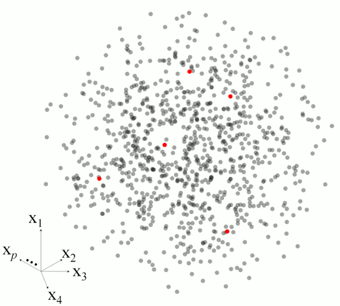

# `resemble` Memory-Based Learning in Spectral Chemometrics
<!-- badges: start -->

[](https://CRAN.R-project.org/package=resemble)
[](https://CRAN.R-project.org/package=resemble)


<!-- badges: end -->

_Last update: `r Sys.Date()`_


Version: `r paste(resemble:::pkg_info()[1:2], collapse =  " \U002D\U002D ")`

<em><p align="right"> Think Globally, Fit Locally (Saul and Roweis, 2003) </p></em>

## About
The `resemble` package provides high-performing functionality for 
data-driven modeling (including local modeling), nearest-neighbor search and 
orthogonal projections in spectral data.

## Vignette
A new vignette for `resemble` explaining its core functionality is available 
at: https://cran.r-project.org/package=resemble/vignettes/resemble.html

## Core functionality 

The core functionality of the package can be summarized into the following 
functions:
  
__`mbl`__: implements memory-based learning (MBL) for modeling and predicting 
continuous response variables. For example, it can be used to reproduce the 
famous LOCAL algorithm proposed by Shenk et al. (1997). In general, this 
function allows you to easily customize your own MBL regression-prediction 
method.

__`dissimilarity`__: Computes dissimilarity matrices based on various methods 
(e.g. Euclidean, Mahalanobis, cosine, correlation, moving correlation, 
Spectral information divergence, principal components dissimilarity and partial 
least squares dissimilarity).

__`ortho_projection`__: A function for dimensionality reduction using either 
principal component analysis or partial least squares (a.k.a projection to 
latent structures). 

__`search_neighbors`__: A function to efficiently retrieve from a reference set 
the k-nearest neighbors of another given data set.

## New version
During the recent lockdown we invested some of our free time to come up 
with a new version of our package. This new `resemble` 2.0 comes with MAJOR 
improvements and new functions! For these improvements major changes were 
required. The most evident changes are in the function and argument names.
These have been now adapted to properly follow the 
[tydiverse style guide](https://style.tidyverse.org/). A number of changes have 
been implemented for the sake of computational efficiency. These changes are 
documented in `inst\changes.md`.

New interesing functions and fucntionality are also available, for example, 
the `mbl()` function now allows sample spiking, where a 
set of reference observations can be forced to be included in the neighborhhoods 
of each sample to be predicted. The `serach_neighbors()` function efficiently 
retrieves from a refence set the k-nearest neighbors of another given dataset. 
The `dissimilarity()` function computes dissimilarity matrices based on various 
metrics. 

## Installation 
If you want to install the package and try its functionality, it is very simple,
just type the following line in your `R` console:

```
install.packages('resemble')
```

If you do not have the following packages installed, it might be good to 
update/install them first
```
install.packages('Rcpp')
install.packages('RcppArmadillo')
install.packages('foreach')
install.packages('iterators')
```
__Note__: Apart from these packages we stronly recommend to download and install 
Rtools [https://cran.r-project.org/bin/windows/Rtools/](https://cran.r-project.org/bin/windows/Rtools/)). 
This is important for obtaining the proper C++ toolchain that might be needed 
for `resemble`.

Then, install `resemble`

You can also install the development version of `resemble` directly from github 
using [`devtools`](https://CRAN.R-project.org/package=devtools):
  
```
devtools::install_github("l-ramirez-lopez/resemble")
```

NOTE: in some MAC Os it is still recommended to install `gfortran` and `clang`
from [here](https://cran.r-project.org/bin/macosx/tools/). Even for R >= 4.0. 
For more info, check this [issue](https://github.com/tidyverts/fable/issues/193).  


## Example

After installing `resemble` you should be also able to run the following lines:
  
```
library(resemble)
library(tidyr)
library(prospectr)
data(NIRsoil)

# Proprocess the data
NIRsoil <- NIRsoil[NIRsoil$CEC %>% complete.cases(),]
wavs <- as.numeric(colnames(NIRsoil$spc))

NIRsoil$spc_p <- NIRsoil$spc %>% 
  standardNormalVariate() %>% 
  resample(wavs, seq(min(wavs), max(wavs), by = 11)) %>% 
  savitzkyGolay(p = 1, w = 5, m = 1)

# split into calibration/training and test
train_x <- NIRsoil$spc_p[as.logical(NIRsoil$train), ]
train_y <- NIRsoil$CEC[as.logical(NIRsoil$train)]

test_x <- NIRsoil$spc_p[!as.logical(NIRsoil$train), ]
test_y <- NIRsoil$CEC[!as.logical(NIRsoil$train)]

# Use MBL as in Ramirez-Lopez et al. (2013)
sbl <- mbl(
  Xr = train_x, Yr = train_y, Xu = test_x,
  k = seq(50, 130, by = 20),
  method = local_fit_gpr(),
  control = mbl_control(validation_type = "NNv")
)
sbl
plot(sbl)
get_predictions(sbl)

````
<p align="center">

</p>
Figure 1. Standard plot of the results of the __`mbl`__ function.

[`resemble`](http://l-ramirez-lopez.github.io/resemble/) implements functions 
dedicated to non-linear modelling of complex visible and infrared spectral data 
based on memory-based learning (MBL, _a.k.a_ instance-based learning or local 
modelling in the chemometrics literature). The package also includes functions 
for: computing and evaluate spectral dissimilarity matrices, projecting the 
spectra onto low dimensional orthogonal variables, spectral neighbor search, etc. 

## Memory-based learning (MBL)

To expand a bit more the explanation on the `mbl` function, let's define 
first the basic input data:

* __Reference (training) set__: Dataset with *n* reference samples (e.g. spectral 
library) to be used in the calibration of spectral models. Xr represents the 
matrix of samples (containing the spectral predictor variables) and Yr represents 
a response variable corresponding to Xr.

* __Prediction set__ : Dataset with _m_ samples where the response variable (Yu) 
is unknown. However it can be predicted by applying a spectral model 
(calibrated by using Xr and Yr) on the spectra of these samples (Xu). 

To predict each value in Yu, the `mbl` function takes each sample in Xu 
and searches in Xr for its _k_-nearest neighbours (most spectrally similar 
samples). Then a (local) model is calibrated with these (reference) neighbours 
and it immediately predicts the correspondent value in Yu from Xu. In the 
function, the _k_-nearest neighbour search is performed by computing spectral 
dissimilarity matrices between observations. The `mbl` function offers the 
following regression options for calibrating the (local) models:

__`'gpr'`__:          Gaussian process with linear kernel.

__`'pls'`__:          Partial least squares.     

__`'wapls'`__:        Weighted average partial least squares (Shenk et al., 1997).

Figure 2 illustrates the basic steps in MBL for a set of five observations.

<p align="center">

</p>
Figure 2. Example of the main steps in memory-based learning for predicting a response variable in five different observations based on set of p-dimesnional variables.


## Citing the package
Simply type and you will get the info you need:
```
citation(package = "resemble")
```

## News: Memory based learnig (MBL) and `resemble`

* 2023.04: [Zhao et al., 2023](https://www.sciencedirect.com/science/article/abs/pii/S0167198723000855)
used  MBL (from `resemble`) to quantify soil properties relevant to soil organic carbon biogeochemical cycles using IR spectroscopy.

* [Sanderman et al., 2022](https://scholar.google.com/scholar?cluster=10278015497543765717&hl=en) used `resemble` to study the transferability of large IR spectral databases across instruments. 

* [Dangal et al., 2022](https://scholar.google.com/scholar?cluster=13081638448793373061&hl=en) used `resemble` in an study aiming at improving Soil Carbon Estimates.

* 2022.03: [Ng et al., 2022](https://www.sciencedirect.com/science/article/pii/S2667006222000107)
uses MBL (implemented in `resemble`) to asses the feasibility 
of quantifying a number of soil properties from IR spectra. They also show that
MBL achieved better accuracy than [Cubist regression](https://odsc.medium.com/balancing-interpretability-and-predictive-power-with-cubist-models-in-r-858d2c936b79).

* 2022.02: [Li et al., 2022](https://www.authorea.com/users/308848/articles/539538-strategy-of-efficient-estimation-of-soil-organic-content-at-the-local-scale-based-on-the-national-spectral-database?commit=e628e3487f23c8cc6fc19199e956dea9c5aae23c)
show how useful the combination of MBL and spiking (implemented in `resemble`) 
can be to accurately predict soil properties from NIR data in China.

* 2021.12: [Yu et al., 2022](https://www.mdpi.com/2072-4292/14/6/1303) uses MBL 
with External Parameter Orthogonalization to predict soil properties in in the 
field. 

* 2021.10: [In this paper](https://soil.copernicus.org/articles/7/693/2021/) we use MBL 
to predict soil properties in Africa. 

* 2020.08: Charlotte Rivard shows how to use MBL in IR spectroscopy 
[here](https://whrc.github.io/Soil-Predictions-MIR/).

* 2020.04: [Tsakiridis et al. (2020)](https://www.sciencedirect.com/science/article/abs/pii/S0016706119308870?via%3Dihub), 
used the optimal principal components dissimilarity method implemented in `resemble` in combination with convolutional neural networks for simultaneous prediction of soil properties from vis-NIR spectra.

* 2019-04: [Tziolas et al. (2019)](https://www.sciencedirect.com/science/article/abs/pii/S0016706118307006), used
`resemble` to investigate on improved MBL methods for quantitative predictions 
of soil properties using NIR spectroscopy and geographical information. 

* 2019.03,08: [Tsakiridis et al. (2019a)](https://www.sciencedirect.com/science/article/abs/pii/S0925231220300291) and [Tsakiridis et al. (2019b)](https://www.sciencedirect.com/science/article/abs/pii/S1568494619302741),
compared several machine learning methods for predictive soil spectroscopy and 
show that MBL `resemble` offers highly competive results.

* 2020.01: [Sanderman et al., (2020)](https://scholar.google.ch/scholar?cluster=8189603827145687468&hl=en&as_sdt=0,5&as_vis=1) used `resemble` for the prediction of soil health indicators in the United States.

* 2019-03: I published a [scientific paper](https://scholar.google.com/scholar?cluster=1892507175331927677&hl=en&as_sdt=2005&sciodt=0,5&as_ylo=2022) were we used memory-based learning (MBL) for digital soil mapping. Here we use MBL to remove 
local calibration outliers rather than using this approach to overcome the typical 
complexity of large spectral datasets. (Ramirez‐Lopez, L., Wadoux, A. C.,
Franceschini, M. H. D., Terra, F. S., Marques, K. P. P., Sayão, V. M., & 
Demattê, J. A. M. (2019). Robust soil mapping at the farm scale with vis–NIR 
spectroscopy. European Journal of Soil Science. 70, 378–393).

* 2019-01: [In this scientific paper](https://doi.org/10.3390/soilsystems3010011) 
we use `resemble` to model MIR spectra from a continental soil spectral library 
in United States. (Dangal, S.R., Sanderman, J., Wills, S. and Ramirez-Lopez, 
L., 2019. Accurate and Precise Prediction of Soil Properties from a Large
Mid-Infrared Spectral Library. Soil Systems, 3(1), p.11).

* 2019-03: [Jaconi et al. (2019)](https://www.sciencedirect.com/science/article/pii/S0016706118311340?via%3Dihub) implemented a memory-based learning algorithm (using `resemble`) to conduct 
accurate NIR predictions of soil texture at National scale in Germany. 
(Jaconi, A., Vos, C. and Don, A., 2019. Near infrared spectroscopy as an easy 
and precise method to estimate soil texture. Geoderma, 337, pp.906-913).

* 2018-12: [Chen, et al. (2018)](https://www.sciencedirect.com/science/article/pii/S0341816218304867) 
implemented a memory-based learning algorithm (using `resemble`) to improve the 
accuracy of NIR predictions of soil organic matter in China. 
(Hong, Y., Chen, S., Liu, Y., Zhang, Y., Yu, L., Chen, Y., Liu, Y., Cheng, H. 
and Liu, Y. 2019. Combination of fractional order derivative and memory-based learning 
algorithm to improve the estimation accuracy of soil organic matter by visible 
and near-infrared spectroscopy. Catena, 174, pp.104-116).

* 2018-11: In [this recent scientific paper](https://scholar.google.com/scholar?cluster=18203724019039095209&hl=en) the authors used `resemble` to predict the chemoical composition of Common Beans in 
Spain. (Rivera, A., Plans, M., Sabaté, J., Casañas, F., Casals, J., Rull, A., & 
Simó, J. (2018). The Spanish core collection of common beans (Phaseolus 
vulgaris L.): an important source of variability for breeding chemical 
composition. Frontiers in Plant Science, 9).

* 2018-07: Another use-case of `resemble` is presented by 
[Gholizadeh et al.(2018)](https://doi.org/10.3390/rs10081172) 
for a soil science application in Czech Republic. 
(Gholizadeh, A., Saberioon, M., Carmon, N., 
Boruvka, L. and Ben-Dor, E., 2018. Examining the Performance of PARACUDA-II 
Data-Mining Engine versus Selected Techniques to Model Soil Carbon from 
Reflectance Spectra. Remote Sensing, 10(8), p.1172).

* 2018-01: [Dotto, et al. (2018)](https://www.sciencedirect.com/science/article/abs/pii/S0016706117308571) have implemented memory-based learning with `resemble` to accurately 
predict soil organic Carbon at a region in Brazil. (Dotto, A. C., Dalmolin, 
R. S. D., ten Caten, A., & Grunwald, S. (2018). A systematic study on the 
application of scatter-corrective and spectral-derivative preprocessing for 
multivariate prediction of soil organic carbon by Vis-NIR spectra. Geoderma, 
314, 262-274).

* 2017-11: [Here](https://books.google.ch/books?hl=en&lr=&id=xlKODgAAQBAJ&oi=fnd&pg=PA129&dq=Evaluation+and+comparison+of+different+approaches+to+multi-product+brix+calibration+in+near-infrared+spectroscopy&ots=TGWzsRpP7X&sig=3u-pfuwkMZoxmhbfcx40eLiMOsY#v=onepage&q=Evaluation%20and%20comparison%20of%20different%20approaches%20to%20multi-product%20brix%20calibration%20in%20near-infrared%20spectroscopy&f=false) the authors predicted brix values in differet food products using memory-based learning implemented with `resemble`. 
(Kopf, M., Gruna, R., Längle, T. and Beyerer, J., 2017, March. Evaluation and 
comparison of different approaches to multi-product brix calibration in 
near-infrared spectroscopy. In OCM 2017-Optical Characterization of Materials-conference proceedings (p. 129). KIT Scientific Publishing).

* 2016-05: In [this scientific paper](https://www.sciencedirect.com/science/article/pii/S001670611630180X) the authors sucesfully used `resemble` to predict soil organic carbon content at 
national scale in France. (Clairotte, M., Grinand, C., Kouakoua, E., Thébault, A., 
Saby, N. P., Bernoux, M., & Barthès, B. G. (2016). National calibration of soil 
organic carbon concentration using diffuse infrared reflectance spectroscopy. 
Geoderma, 276, 41-52).

* 2016-04: [This paper](https://doi.org/10.3390/rs8040341) shows some 
interesting results on applying memory-based learning to predict soil properties.

* 2016-04: In some recent entries of [this blog](http://nir-quimiometria.blogspot.com/), 
the author shows some exmaples on the use `resemble`

* 2016-02: As promised, `resemble 1.2 (alma-de-coco)` is now available on  [CRAN](https://CRAN.R-project.org/package=resemble).
* 2016-01: The version 1.2 (alma-de-coco) has been submitted to CRAN and is 
available from the github repository!

* 2015-11: A pre-release of the version 1.2.0 (1.2.0.9000 alma-de-coco) is 
now available! `resemble` is now faster! Some critical functions (e.g. pls and 
gaussian process regressions were re-written in C++ using `Rcpp`. This time the 
new version will be available at CRAN very soon!.

* 2015-11 Well, the version 1.1.3 was never released on CRAN since we decided 
to carry out major improvements in terms of computational performance. 

* 2014-10: A pre-release of the version 1.1.3 of the package is already available 
at this website. We hope it will be available at CRAN very soon!

* 2014-06: Check  [this video](https://www.youtube.com/watch?v=7sCIEeNehgE&feature=youtu.be)
where a renowned NIR scientist talks about local calibrations.

* 2014-03: The package released on CRAN!

## Other R'elated stuff
* [Check our other project called `prospectr`.](https://github.com/l-ramirez-lopez/prospectr)
* [Check this presentation in which we used the resemble package to predict soil attributes from large scale soil spectral libraries.](https://www.fao.org/fileadmin/user_upload/GSP/docs/Spectroscopy_dec13/SSW2013_f.pdf)
            https://www.fao.org/fileadmin/user_upload/GSP/docs/Spectroscopy_dec13/SSW2013_f.pdf

## Bug report and development version

You can send an e-mail to the package maintainer (<ramirez.lopez.leo@gmail.com>) or create an [issue](https://github.com/l-ramirez-lopez/resemble/issues) on github. 

## References
Lobsey, C. R., Viscarra Rossel, R. A., Roudier, P., & Hedley, C. B. 2017. 
rs-local data-mines information from spectral libraries to improve local 
calibrations. European Journal of Soil Science, 68(6), 840-852.

Ramirez-Lopez, L., Behrens, T., Schmidt, K., Stevens, A., Dematte, J.A.M., 
Scholten, T. 2013. The spectrum-based learner: A new local approach for modeling 
soil vis-NIR spectra of complex data sets. Geoderma 195-196, 268-279.

Saul, L. K., & Roweis, S. T. 2003. Think globally, fit locally: unsupervised 
learning of low dimensional manifolds. Journal of machine learning research, 
4(Jun), 119-155.

Shenk, J., Westerhaus, M., and Berzaghi, P. 1997. Investigation of a LOCAL 
calibration procedure for near infrared instruments. Journal of Near Infrared 
Spectroscopy, 5, 223-232.

