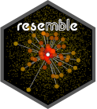
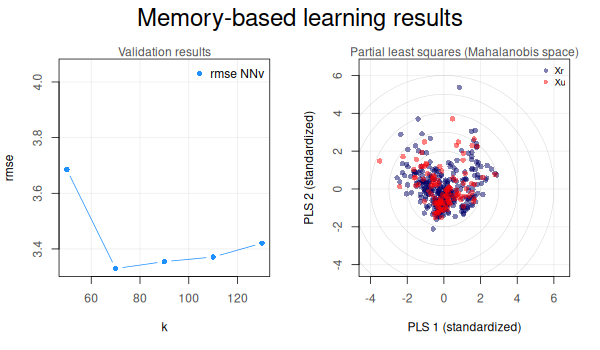

# `resemble` Sample Retrieval and Local Learning in Spectral Chemometrics

<!-- badges: start -->


[](https://app.codecov.io/gh/l-ramirez-lopez/resemble)
[](https://CRAN.R-project.org/package=resemble)
[](https://CRAN.R-project.org/package=resemble)



<!-- badges: end -->

*Last update: 2026-04-16*

Version: 3.0.0 – vortex

<em>
<p align="right">

Think Globally, Fit Locally (Saul and Roweis, 2003)
</p>

</em>

## About

The `resemble` package provides computationally efficient methods for
dissimilarity analysis and predictive modelling with complex spectral
data. Its core functionality includes memory-based learning (MBL),
evolutionary subset search and selection, and retrieval-based modelling
using pre-computed model libraries. The package is designed to support
local modelling, spectral library optimization, and model-based
prediction in large and heterogeneous spectral data sets.

## Documentation

The package includes comprehensive vignettes covering all major
functionality:

1.  **Essential concepts and setup**: Introduction, data preparation,
    and notation
2.  **Dimensionality reduction**: PCA and PLS projections with
    `ortho_projection()`
3.  **Estimating dissimilarity between spectra**: Dissimilarity methods
    and evaluation
4.  **Nearest neighbor search**: Finding similar spectra with
    `search_neighbors()`
5.  **Simple global models**: Global calibration with `model()`
6.  **Classical memory-based learning**: Per-query local modelling with
    `mbl()`
7.  **Evolutionary subset search**: Domain-adaptive calibration with
    `gesearch()`
8.  **Building a library of models**: Pre-computed experts with
    `liblex()`

## What’s new in version 3.0

Version 3.0 is a major release with a redesigned API, new modelling
functions, and improved computational efficiency.

**New modelling functions:**

- `liblex()`: Builds a library of reusable localized models (experts)
  that can be stored and reused for prediction without refitting. Based
  on Ramirez-Lopez et al. (2026b).

- `gesearch()`: Evolutionary algorithm for selecting optimal subsets
  from large spectral libraries to build context-specific calibrations.
  Based on Ramirez-Lopez et al. (2026a).

- `model()`: Fits global PLS or GPR calibration models with
  cross-validation.

**Redesigned dissimilarity interface:**

The dissimilarity system now uses constructor functions:

- `diss_pca()`, `diss_pls()`: Mahalanobis distance in projection space
- `diss_correlation()`: Correlation-based dissimilarity (including
  moving window)
- `diss_euclidean()`, `diss_mahalanobis()`, `diss_cosine()`: Distance
  metrics

Component selection via `ncomp_by_var()`, `ncomp_by_cumvar()`,
`ncomp_by_opc()`, or `ncomp_fixed()`.

**Redesigned neighbor and fitting interfaces:**

- `neighbors_k()`, `neighbors_diss()`: Neighbor selection constructors
- `fit_pls()`, `fit_wapls()`, `fit_gpr()`: Local fitting constructors
  (replace `local_fit_*()` functions)

**Breaking changes in `mbl()`:**

- `k`, `k_diss`, `k_range` replaced by `neighbors` argument
- `method` renamed to `fit_method`
- `center` and `scale` removed; now controlled within constructors

See `NEWS.md` for full details on deprecated and removed functions.

## Core functionality

**Dimensionality reduction:**

- `ortho_projection()`: PCA or PLS projection with multiple algorithms
  (SVD, NIPALS, SIMPLS)

**Computing dissimilarity matrices:**

- `dissimilarity()`: Main interface for dissimilarity computation
- `diss_pca()`, `diss_pls()`, `diss_correlation()`, `diss_euclidean()`,
  `diss_mahalanobis()`, `diss_cosine()`: Method constructors
- `diss_evaluate()`: Evaluate dissimilarity matrices using side
  information

**Neighbor search:**

- `search_neighbors()`: Efficient k-nearest neighbor retrieval

**Modelling spectral data:**

- `model()`: Global PLS or GPR calibration
- `mbl()`: Memory-based learning for per-query local modelling
- `gesearch()`: Evolutionary subset selection for domain-adaptive
  calibration
- `liblex()`: Pre-computed library of local experts for fast prediction

## Installation

Install from CRAN:

``` r
install.packages("resemble")
```

Or install the development version from GitHub:

``` r
# install.packages("devtools")
devtools::install_github("l-ramirez-lopez/resemble")
```

The package requires a C++ compiler. On Windows, install
[Rtools](https://cran.r-project.org/bin/windows/Rtools/). On macOS, you
may need to install `gfortran` and `clang` from [CRAN
tools](https://cran.r-project.org/bin/macosx/tools/).

## Example: Memory-based learning with `mbl()`

``` r
library(resemble)
library(prospectr)
data(NIRsoil)

# Preprocess spectra
NIRsoil$spc_pr <- savitzkyGolay(
 detrend(NIRsoil$spc, wav = as.numeric(colnames(NIRsoil$spc))),
 m = 1, p = 1, w = 7
)

# Split into training and test sets
train_x <- NIRsoil$spc_pr[NIRsoil$train == 1 & !is.na(NIRsoil$CEC), ]
train_y <- NIRsoil$CEC[NIRsoil$train == 1 & !is.na(NIRsoil$CEC)]
test_x <- NIRsoil$spc_pr[NIRsoil$train == 0 & !is.na(NIRsoil$CEC), ]
test_y <- NIRsoil$CEC[NIRsoil$train == 0 & !is.na(NIRsoil$CEC)]

# Memory-based learning with Gaussian process regression
sbl <- mbl(
 Xr = train_x,
 Yr = train_y,
 Xu = test_x,
 neighbors = neighbors_k(seq(50, 130, by = 20)),
 diss_method = diss_pca(ncomp = ncomp_by_opc(40)),
 fit_method = fit_gpr(),
 control = mbl_control(validation_type = "NNv")
)
sbl
plot(sbl)
get_predictions(sbl)
```

<p align="center">


</p>

## Example: Pre-computed model library with `liblex()`

`liblex()` builds a library of local experts that can be reused for
prediction without refitting:

``` r
# Build model library
model_lib <- liblex(
 Xr = train_x,
 Yr = train_y,
 neighbors = neighbors_k(c(40, 60, 80)),
 diss_method = diss_correlation(ws = 27, scale = TRUE),
 fit_method = fit_wapls(min_ncomp = 3, max_ncomp = 15, method = "mpls"),
 control = liblex_control(tune = TRUE)
)

# Predict new observations
predictions <- predict(model_lib, test_x)
```

## Example: Evolutionary subset selection with `gesearch()`

`gesearch()` selects optimal subsets from large spectral libraries:

``` r
# Search for optimal calibration subset
gs <- gesearch(
 Xr = train_x, 
 Yr = train_y,
 Xu = test_x,
 k = 50, 
 b = 100, 
 retain = 0.97,
 target_size = 200,
 fit_method = fit_pls(ncomp = 15, method = "mpls"),
 optimization = c("reconstruction", "similarity"),
 seed = 42
)

# Predict using selected subset
preds <- predict(gs, test_x)
plot(gs)
```

## Memory-based learning overview

Memory-based learning (MBL, a.k.a. instance-based learning or local
modelling) is a non-linear lazy learning approach. For each prediction,
the algorithm:

1.  Finds the k-nearest neighbors in the reference set
2.  Fits a local model using those neighbors
3.  Predicts the response for the target observation

The `mbl()` function offers three regression methods for local models:

- `fit_gpr()`: Gaussian process regression with linear kernel
- `fit_pls()`: Partial least squares
- `fit_wapls()`: Weighted average PLS (Shenk et al., 1997)

<p align="center">


</p>

## Citing the package

``` r
citation(package = "resemble")
```

## News: Memory-based learning and `resemble`

- **2026.05:** [van Leeuwen et al.,
  2026](https://doi.org/10.1016/j.geoderma.2026.117804)  
  used `resemble` for principal component Mahalanobis nearest-neighbour
  search to extract spectrally similar samples from the KSSL library for
  MIR model calibration in Dutch soils.

- **2026.04:** [Irving et al.,
  2026](https://doi.org/10.1016/j.seh.2026.100205)  
  used `resemble` in modelling workflows for infrared spectroscopy
  prediction of soil microbial properties across Australian soils.

- **2026.03:** [Shrestha et al.,
  2026](https://doi.org/10.1016/j.geodrs.2026.e01063)  
  used `resemble` in a hybrid localisation workflow to predict
  farm-scale soil cadmium from a regional spectral library; LOCAL models
  with MIR data performed best.

- **2025.10:** [Summerauer et al.,
  2025](https://doi.org/10.5194/egusphere-2025-4625) used `resemble` for
  MBL modelling of soil properties from infrared spectra across tropical
  hillslopes in Eastern Africa.

- **2025.05:** [Sun and Shi,
  2025](https://doi.org/10.1016/j.geoderma.2025.117298) combined
  spectral and geographical similarity for SOC prediction; local PLSR
  outperformed global models.

- **2025.03:** [Breure et al.,
  2025](https://doi.org/10.1038/s41467-025-57355-y)  
  used `resemble` for local VNIR modelling of soil carbon fractions (POC
  and MAOC) across European agricultural soils, published in *Nature
  Communications*.

- **2025.03:** [Purushothaman et al.,
  2025](https://doi.org/10.1109/TGRS.2025.3569059) applied MBL to
  AVIRIS-NG hyperspectral data for soil property prediction in India.

- **2025.01:** [Dai et al.,
  2025](https://doi.org/10.1016/j.still.2024.106297) used MBL for POC
  and MAOC prediction from VNIR in Guangdong.

- **2024.12:** [Asrat et al.,
  2024](https://doi.org/10.1016/j.geoderma.2024.117116) MBL for local
  calibration sample selection in the Moroccan Soil Spectral Library.

- **2024.09:** [Barbetti et al.,
  2024](https://doi.org/10.1109/TAFE.2024.3449215) MBL to detect SOC
  changes in long-term experiments using vis–NIR.

- **2023.11:** [Wang et al.,
  2023](https://doi.org/10.1016/j.geoderma.2023.116752) N-MBL (MBL + RF
  within local fitting) for regional vis–NIR models.

- **2022:** [Sanderman et al., 2022](https://doi.org/10.1002/saj2.20513)
  evaluated transferability of large MIR spectral databases across
  instruments.

- **2022.01:** [Ng et al.,
  2022](https://doi.org/10.1016/j.geoderma.2021.115501) showed that MBL
  yields better local SOC predictions than spiking approaches.

- **2021.10:** [Ramirez-Lopez et al.,
  2021](https://soil.copernicus.org/articles/7/693/2021/) MBL to predict
  soil properties in Africa.

- **2020.08:** Charlotte Rivard’s MIR MBL tutorial:
  <https://whrc.github.io/Soil-Predictions-MIR/>

- **2020.01:** [Sanderman et al.,
  2020](https://doi.org/10.1002/saj2.20009) MIR spectroscopy for
  prediction of soil health indicators; MBL and Cubist excelled.

- **2019.03:** [Ramirez-Lopez et al.,
  2019](https://doi.org/10.1111/ejss.12752) MBL in digital soil mapping
  at farm scale.

- **2019.03:** [Jaconi et al.,
  2019](https://doi.org/10.1016/j.geoderma.2018.11.042) MBL for
  national-scale NIR texture predictions in Germany.

- **2018.01:** [Dotto et al.,
  2018](https://doi.org/10.1016/j.geoderma.2017.11.028) MBL for SOC
  prediction in Brazil.

- **2016.04:** [Viscarra Rossel et al.,
  2016](https://doi.org/10.3390/rs8040341) memory-based learning for
  soil property prediction.

- **2014.03:** First CRAN release of `resemble`.

## Related packages

- [`prospectr`](https://github.com/l-ramirez-lopez/prospectr): Signal
  processing and chemometrics for spectroscopy

## Bug reports

Report issues at
[GitHub](https://github.com/l-ramirez-lopez/resemble/issues) or contact
the maintainer (<ramirez.lopez.leo@gmail.com>).

## References

Lobsey, C. R., Viscarra Rossel, R. A., Roudier, P., & Hedley, C. B.
2017. rs-local data-mines information from spectral libraries to improve
local calibrations. European Journal of Soil Science, 68(6), 840-852.

Ramirez-Lopez, L., Behrens, T., Schmidt, K., Stevens, A., Dematte,
J.A.M., Scholten, T. 2013. The spectrum-based learner: A new local
approach for modeling soil vis-NIR spectra of complex data sets.
Geoderma 195-196, 268-279.

Ramirez-Lopez, L., Viscarra Rossel, R., Behrens, T., Orellano, C.,
Perez-Fernandez, E., Kooijman, L., Wadoux, A. M. J.-C., Breure, T.,
Summerauer, L., Safanelli, J. L., & Plans, M. (2026a). When spectral
libraries are too complex to search: Evolutionary subset selection for
domain-adaptive calibration. Analytica Chimica Acta, under review.

Ramirez-Lopez, L., Metz, M., Lesnoff, M., Orellano, C., Perez-Fernandez,
E., Plans, M., Breure, T., Behrens, T., Viscarra Rossel, R., & Peng, Y.
(2026b). Rethinking local spectral modelling: From per-query refitting
to model libraries. Analytica Chimica Acta, under review.

Saul, L. K., & Roweis, S. T. 2003. Think globally, fit locally:
unsupervised learning of low dimensional manifolds. Journal of machine
learning research, 4(Jun), 119-155.

Shenk, J., Westerhaus, M., and Berzaghi, P. 1997. Investigation of a
LOCAL calibration procedure for near infrared instruments. Journal of
Near Infrared Spectroscopy, 5, 223-232.
