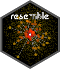

# `resemble` Memory-Based Learning in Spectral Chemometrics

<!-- badges: start -->

<!-- badges: end -->

*Last update: 2025-05-20*

Version: 2.2.4 – olbap

<em>

Think Globally, Fit Locally (Saul and Roweis, 2003)

</em>

## About

The `resemble` package provides high-performing functionality for
data-driven modeling (including local modeling), nearest-neighbor search
and orthogonal projections in spectral data.

## Vignette

A new vignette for `resemble` explaining its core functionality is
available at:
<https://cran.r-project.org/package=resemble/vignettes/resemble.html>

## Core functionality

The core functionality of the package can be summarized into the
following functions:

**`mbl`**: implements memory-based learning (MBL) for modeling and
predicting continuous response variables. For example, it can be used to
reproduce the famous LOCAL algorithm proposed by Shenk et al. (1997). In
general, this function allows you to easily customize your own MBL
regression-prediction method.

**`dissimilarity`**: Computes dissimilarity matrices based on various
methods (e.g. Euclidean, Mahalanobis, cosine, correlation, moving
correlation, Spectral information divergence, principal components
dissimilarity and partial least squares dissimilarity).

**`ortho_projection`**: A function for dimensionality reduction using
either principal component analysis or partial least squares (a.k.a
projection to latent structures).

**`search_neighbors`**: A function to efficiently retrieve from a
reference set the k-nearest neighbors of another given dataset.

## New version

During the recent lockdown we invested some of our free time to come up
with a new version of our package. This new `resemble` 2.0 comes with
MAJOR improvements and new functions! For these improvements major
changes were required. The most evident changes are in the function and
argument names. These have been now adapted to properly follow the
[tydiverse style guide](https://style.tidyverse.org/). A number of
changes have been implemented for the sake of computational efficiency.
These changes are documented in `inst\changes.md`.

New interesing functions and fucntionality are also available, for
example, the `mbl()` function now allows sample spiking, where a set of
reference observations can be forced to be included in the
neighborhhoods of each sample to be predicted. The `serach_neighbors()`
function efficiently retrieves from a refence set the k-nearest
neighbors of another given dataset. The `dissimilarity()` function
computes dissimilarity matrices based on various metrics.

## Installation

If you want to install the package and try its functionality, it is very
simple, just type the following line in your `R` console:

    install.packages('resemble')

If you do not have the following packages installed, it might be good to
update/install them first

    install.packages('Rcpp')
    install.packages('RcppArmadillo')
    install.packages('foreach')
    install.packages('iterators')

**Note**: Apart from these packages we stronly recommend to download and
install Rtools <https://cran.r-project.org/bin/windows/Rtools/>). This
is important for obtaining the proper C++ toolchain that might be needed
for `resemble`.

Then, install `resemble`

You can also install the development version of `resemble` directly from
github using [`devtools`](https://CRAN.R-project.org/package=devtools):

    devtools::install_github("l-ramirez-lopez/resemble")

NOTE: in some MAC Os it is still recommended to install `gfortran` and
`clang` from [here](https://cran.r-project.org/bin/macosx/tools/). Even
for R &gt;= 4.0. For more info, check this
[issue](https://github.com/tidyverts/fable/issues/193).

## Example

After installing `resemble` you should be also able to run the following
lines:

    library(resemble)
    library(tidyr)
    library(prospectr)
    data(NIRsoil)

    # Proprocess the data
    NIRsoil <- NIRsoil[NIRsoil$CEC %>% complete.cases(),]
    wavs <- as.numeric(colnames(NIRsoil$spc))

    NIRsoil$spc_p <- NIRsoil$spc %>% 
      standardNormalVariate() %>% 
      resample(wavs, seq(min(wavs), max(wavs), by = 11)) %>% 
      savitzkyGolay(p = 1, w = 5, m = 1)

    # split into calibration/training and test
    train_x <- NIRsoil$spc_p[as.logical(NIRsoil$train), ]
    train_y <- NIRsoil$CEC[as.logical(NIRsoil$train)]

    test_x <- NIRsoil$spc_p[!as.logical(NIRsoil$train), ]
    test_y <- NIRsoil$CEC[!as.logical(NIRsoil$train)]

    # Use MBL as in Ramirez-Lopez et al. (2013)
    sbl <- mbl(
      Xr = train_x, Yr = train_y, Xu = test_x,
      k = seq(50, 130, by = 20),
      method = local_fit_gpr(),
      control = mbl_control(validation_type = "NNv")
    )
    sbl
    plot(sbl)
    get_predictions(sbl)

Figure 1. Standard plot of the results of the **`mbl`** function.

[`resemble`](http://l-ramirez-lopez.github.io/resemble/) implements
functions dedicated to non-linear modelling of complex visible and
infrared spectral data based on memory-based learning (MBL, *a.k.a*
instance-based learning or local modelling in the chemometrics
literature). The package also includes functions for: computing and
evaluate spectral dissimilarity matrices, projecting the spectra onto
low dimensional orthogonal variables, spectral neighbor search, etc.

## Memory-based learning (MBL)

To expand a bit more the explanation on the `mbl` function, let’s define
first the basic input data:

-   **Reference (training) set**: Dataset with *n* reference samples
    (e.g. spectral library) to be used in the calibration of spectral
    models. Xr represents the matrix of samples (containing the spectral
    predictor variables) and Yr represents a response variable
    corresponding to Xr.

-   **Prediction set** : Dataset with *m* samples where the response
    variable (Yu) is unknown. However it can be predicted by applying a
    spectral model (calibrated by using Xr and Yr) on the spectra of
    these samples (Xu).

To predict each value in Yu, the `mbl` function takes each sample in Xu
and searches in Xr for its *k*-nearest neighbours (most spectrally
similar samples). Then a (local) model is calibrated with these
(reference) neighbours and it immediately predicts the correspondent
value in Yu from Xu. In the function, the *k*-nearest neighbour search
is performed by computing spectral dissimilarity matrices between
observations. The `mbl` function offers the following regression options
for calibrating the (local) models:

**`'gpr'`**: Gaussian process with linear kernel.

**`'pls'`**: Partial least squares.

**`'wapls'`**: Weighted average partial least squares (Shenk et al.,
1997).

Figure 2 illustrates the basic steps in MBL for a set of five
observations.

Figure 2. Example of the main steps in memory-based learning for
predicting a response variable in five different observations based on
set of p-dimesnional variables.

## Citing the package

Simply type and you will get the info you need:

    citation(package = "resemble")

## Bug report and development version

You can send an e-mail to the package maintainer
(<ramirez.lopez.leo@gmail.com>) or create an
[issue](https://github.com/l-ramirez-lopez/resemble/issues) on github.

## References

Lobsey, C. R., Viscarra Rossel, R. A., Roudier, P., & Hedley, C. B.
2017. rs-local data-mines information from spectral libraries to improve
local calibrations. European Journal of Soil Science, 68(6), 840-852.

Ramirez-Lopez, L., Behrens, T., Schmidt, K., Stevens, A., Dematte,
J.A.M., Scholten, T. 2013. The spectrum-based learner: A new local
approach for modeling soil vis-NIR spectra of complex data sets.
Geoderma 195-196, 268-279.

Saul, L. K., & Roweis, S. T. 2003. Think globally, fit locally:
unsupervised learning of low dimensional manifolds. Journal of machine
learning research, 4(Jun), 119-155.

Shenk, J., Westerhaus, M., and Berzaghi, P. 1997. Investigation of a
LOCAL calibration procedure for near infrared instruments. Journal of
Near Infrared Spectroscopy, 5, 223-232.
