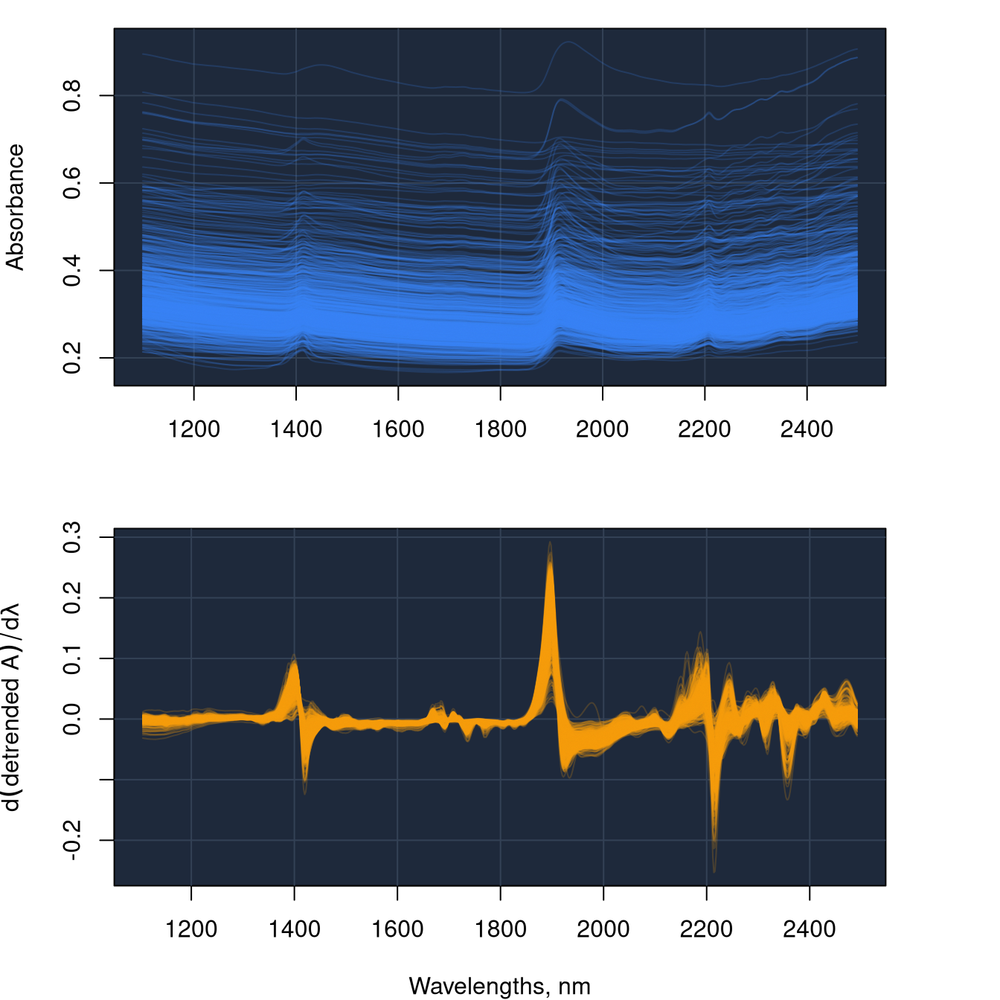

# Essential concepts and setup

> *Think Globally, Fit Locally* – ([Saul and Roweis,
> 2003](#ref-saul2003think))


## 1 Introduction

Spectroscopic data analysis plays a central role in many environmental,
agricultural, and food-related applications. Techniques such as
near-infrared (NIR), mid-infrared (IR), and other forms of diffuse
reflectance spectroscopy provide rapid, non-destructive, and
cost-efficient measurements that can be used to infer chemical,
physical, or biological properties of complex matrices, including soils,
plant materials, and food products. In quantitative applications, these
measurements are typically linked to reference laboratory values through
empirical calibration models.

As spectral databases grow in size and diversity, their effective use
becomes increasingly challenging. Large spectral libraries often contain
substantial heterogeneity, domain shifts, redundant observations, and
samples that are only locally informative for a given prediction
problem. Under these conditions, global modelling strategies are often
insufficient on their own, and methods based on dimensionality
reduction, dissimilarity analysis, neighbour retrieval, local modelling,
and targeted sample selection become essential.

The `resemble` package provides a framework for sample retrieval and
local learning in spectral chemometrics. It is designed to support the
analysis of large and complex spectral datasets through tools for
projection-based representation, dissimilarity computation,
neighbourhood search, memory-based learning, evolutionary subset search,
and retrieval-based modelling with pre-computed local models. The
package therefore supports both classical local modelling workflows and
newer strategies for exploiting spectral libraries as structured
resources for predictive modelling.

The functions presented here are implemented based on the methods
described in Ramirez-Lopez et al. ([2026b](#ref-ramirezlopez2026a)),
Ramirez-Lopez et al. ([2026a](#ref-ramirezlopez2026b)), and
Ramirez-Lopez et al. ([2013](#ref-ramirez2013spectrum)).

The main functionalities of `resemble` include:

- orthogonal projection of spectral data using principal component
  analyssis (PCA) and partial least squares (PLS) methods

- computation and evaluation of spectral dissimilarity measures

- nearest-neighbour search in spectral reference sets

- memory-based learning and local regression

- evolutionary sample search for context-specific calibration

- retrieval-based modelling using libraries of localised experts

## 2 Citing the package

Simply type and you will get the info you need:

``` r
citation(package = "resemble")
```

    To cite resemble in publications use:

      Ramirez-Lopez, L., and Stevens, A., and Orellano, C., (2026).
      resemble: Regression and similarity evaluation for memory-based
      learning in spectral chemometrics. R package Vignette R package
      version 3.0.1.

    A BibTeX entry for LaTeX users is

      @Manual{resemble-package,
        title = {resemble: Sample Retrieval and Local Learning in Spectral Chemometrics.},
        author = {Leonardo Ramirez-Lopez and Antoine Stevens and Claudio Orellano},
        publication = {R package Vignette},
        year = {2026},
        note = {R package version 3.0.1},
        url = {https://CRAN.R-project.org/package=resemble},
      }

## 3 Dataset used across the vignettes

The vignettes in `resemble` use the soil near-infrared (NIR) spectral
dataset provided in the
[`prospectr`](https://CRAN.R-project.org/package=prospectr) package
([Stevens and Ramirez-Lopez, 2024](#ref-stevens2020introduction)). This
dataset is used because soils are among the most complex matrices
analyzed by NIR spectroscopy. It was originally used in the
*Chimiométrie 2006* challenge ([Pierna and Dardenne,
2008](#ref-pierna2008soil)).

The dataset contains NIR absorbance spectra for 825 dried and sieved
soil samples collected from agricultural fields across the Walloon
region of Belgium. In `R`, the data are stored in a `data.frame` with
the following structure:

- **Response variables**:

  - **`Nt`**: total nitrogen (g/kg dry soil); available for 645 samples
    and missing for 180.

  - **`Ciso`**: carbon (g/100 g dry soil); available for 732 samples and
    missing for 93.

  - **`CEC`**: cation exchange capacity (meq/100 g dry soil); available
    for 447 samples and missing for 378.

- **Predictor variables (`spc`)**: the spectral predictors are stored in
  the matrix `NIRsoil$spc`, embedded within the data frame. These
  variables contain NIR absorbance spectra measured from 1100 to 2498 nm
  at 2 nm intervals. Each column name corresponds to a wavelength value
  (in nm).

- **Set indicator (`Set`)**: a binary variable indicating whether a
  sample belongs to the training set (`1`, 618 samples) or the test set
  (`0`, 207 samples).

Load the necessary packages and data:

``` r
library(resemble)
library(prospectr)
```

The dataset can be loaded into R as follows:

``` r
data(NIRsoil)
dim(NIRsoil)
str(NIRsoil)
```

## 4 Spectral preprocessing

Throughout the vignettes, the same preprocessing workflow is used to
improve the suitability of the spectra for quantitative analysis. In
particular, the goal is to reduce unwanted baseline variation and
enhance local spectral features that may be informative for modeling.
The preprocessing steps are implemented using the
[`prospectr`](https://CRAN.R-project.org/package=prospectr) package
([Stevens and Ramirez-Lopez, 2024](#ref-stevens2020introduction)).

The following steps are applied:

1.  **Detrending** is applied first to reduce broad baseline shifts and
    curvature effects across the spectra.

2.  A **first-order Savitzky–Golay derivative** ([Savitzky and Golay,
    1964](#ref-Savitzky1964)) is then computed to emphasize local
    spectral features and reduce remaining additive effects.

``` r
# obtain a numeric vector of the wavelengths at which spectra is recorded 
wavs <- as.numeric(colnames(NIRsoil$spc))

# pre-process the spectra:
# - use detrend
# - use first order derivative
diff_order <- 1
poly_order <- 1
window <- 7

# Preprocess spectra
NIRsoil$spc_pr <- savitzkyGolay(
  detrend(NIRsoil$spc, wav = wavs),
  m = diff_order, p = poly_order, w = window
)
```



Figure 1: Raw spectral absorbance data (top) and first derivative of the
absorbance spectra (bottom).

Both the raw absorbance spectra and the preprocessed spectra are shown
in [Figure 1](#fig-plotspectra). The preprocessed spectra, obtained as
the first derivative of detrended absorbance, are used as the predictor
variables in all examples throughout this document.

For illustration purposes, the `NIRsoil` data are divided into training
and test subsets. In the examples that require a response variable,
`Ciso` is used to demonstrate the functionality of the package.

``` r
train_x <- NIRsoil$spc_pr[NIRsoil$train == 1, ]
train_y <- NIRsoil$Ciso[NIRsoil$train == 1]

test_x  <- NIRsoil$spc_pr[NIRsoil$train == 0, ]
test_y  <- NIRsoil$Ciso[NIRsoil$train == 0]
```

The notation used throughout the `resemble` package for arguments
referring to training and test observations is as follows:

- **Training observations**:

  - `Xr` denotes the matrix of predictor variables in the
    reference/training set.

  - `Yr` denotes the response variable(s) in the reference/training set.
    In the context of this package, `Yr` may also be referred to as
    **side information**, that is, variables associated with the
    training observations that can support or guide optimization during
    modeling, even when they are not directly used as model inputs. For
    example, as shown in later sections, `Yr` can be used in principal
    component analysis to help determine the optimal number of
    components.

- **Test observations**:

  - `Xu` denotes the matrix of predictor variables in the unknown/test
    set.

  - `Yu` denotes the response variable(s) in the unknown/test set.

## References

Pierna, J.A.F., Dardenne, P., 2008. Soil parameter quantification by
NIRS as a chemometric challenge at “chimiométrie 2006.” Chemometrics and
intelligent laboratory systems 91, 94–98.

Ramirez-Lopez, L., Behrens, T., Schmidt, K., Stevens, A., Demattê, J.,
Scholten, T., 2013. The spectrum-based learner: A new local approach for
modeling soil vis–NIR spectra of complex datasets. Geoderma 195,
268–279.

Ramirez-Lopez, L., Metz, M., Lesnoff, M., Orellano, C., Perez-Fernandez,
E., Plans, M., Breure, T., Behrens, T., Viscarra Rossel, R., Peng, Y.,
2026a. Rethinking local spectral modelling: From per-query refitting to
model libraries. Analytica Chimica Acta.

Ramirez-Lopez, L., Viscarra Rossel, R., Behrens, T., Orellano, C.,
Perez-Fernandez, E., Kooijman, L., Wadoux, A.M.J.-C., Breure, T.,
Summerauer, L., Safanelli, J.L., Plans, M., 2026b. When spectral
libraries are too complex to search: Evolutionary subset selection for
domain-adaptive calibration. Analytica Chimica Acta.

Saul, L., Roweis, S., 2003. Think globally, fit locally: Unsupervised
learning of low dimensional manifolds. Journal of machine learning
research 4, 119–155.

Savitzky, A., Golay, M., 1964. Smoothing and differentiation of data by
simplified least squares procedures. Anal. Chem. 36, 1627–1639.

Stevens, A., Ramirez-Lopez, L., 2024. An introduction to the prospectr
package. R Package Vignette, Report No.: R Package Version 0.2.7 3.
