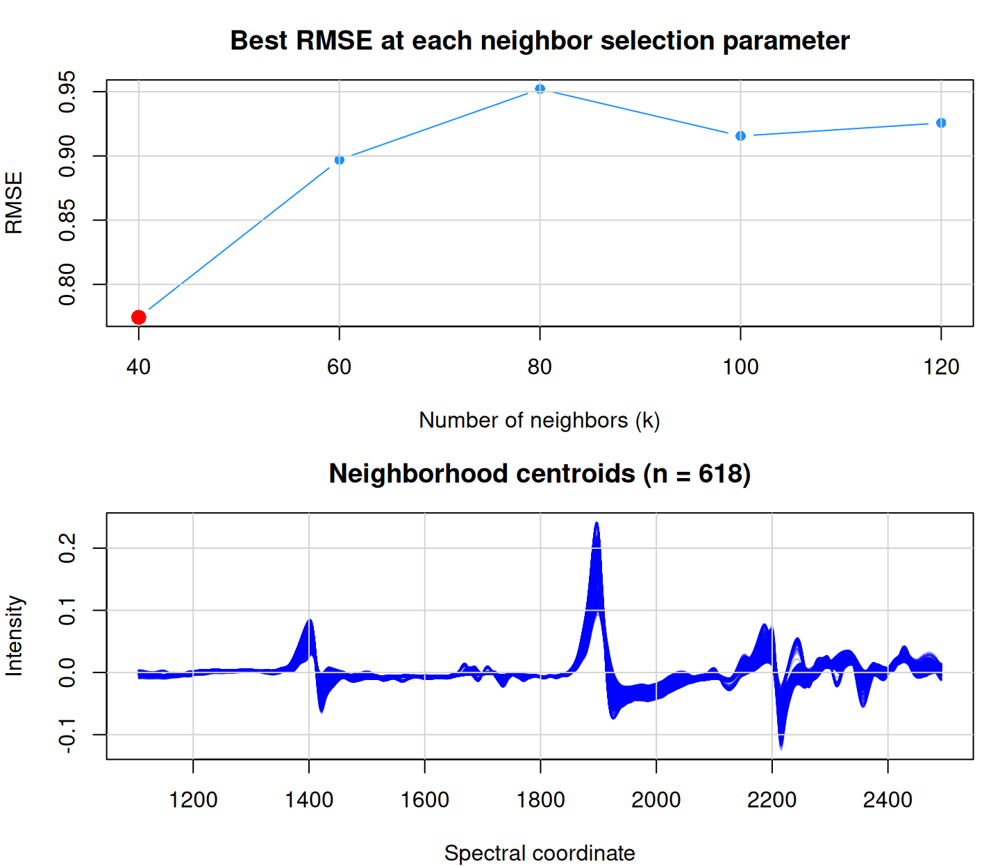
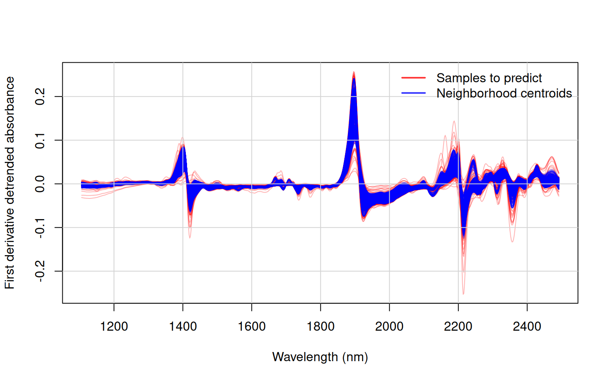
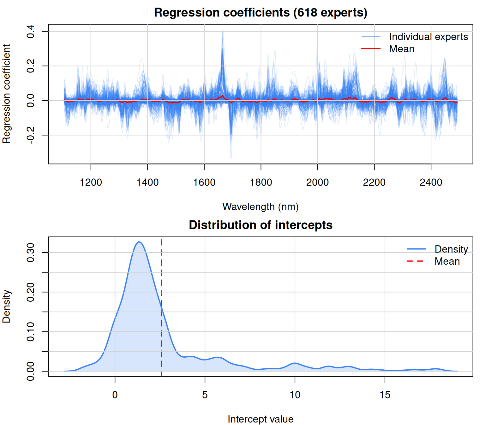
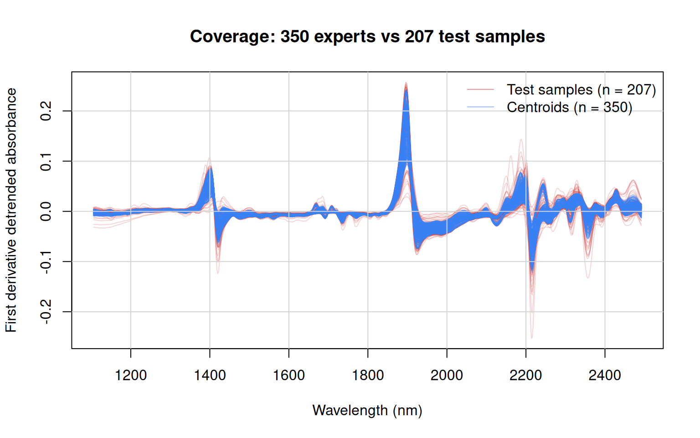
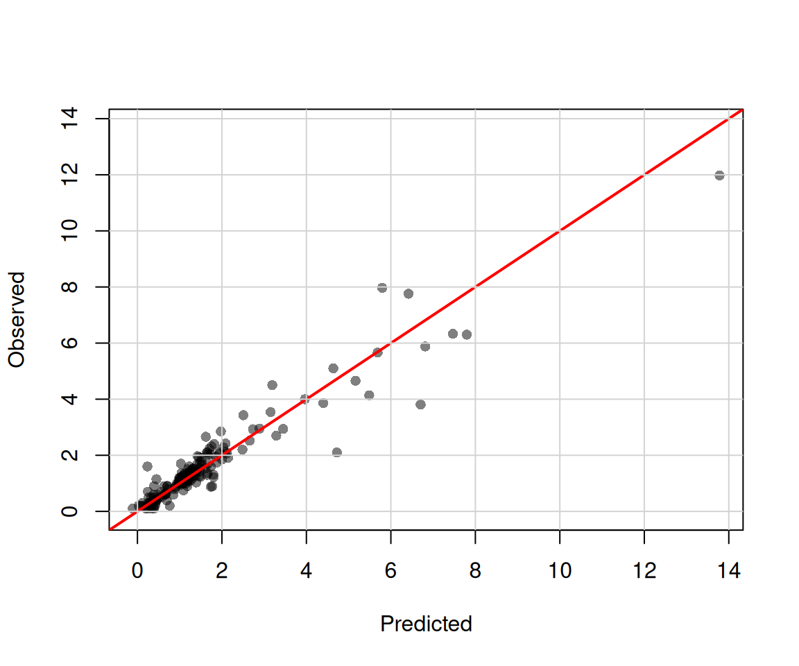

# Building a library of models with liblex

> *All models are wrong, but some are useful* – ([Box,
> 1976](#ref-box1976science))


## 1 Introduction

Traditional memory-based learning (MBL) methods fit a new local model
for each query observation. While effective, this per-query refitting
can be computationally expensive and requires access to the full
reference library at prediction time.

The
[`liblex()`](https://l-ramirez-lopez.github.io/resemble/reference/liblex.md)
function (*library of localised experts*) takes a different approach: it
pre-computes a library of local models during a build phase, then
retrieves and combines relevant experts at prediction time without
refitting. This design offers several advantages:

- **Computational efficiency**: Models are fitted once; prediction
  requires only retrieval and weighted averaging.
- **Privacy preservation**: Only model coefficients and centroids need
  to be stored (not the original training spectra).
- **Intrinsic uncertainty**: Disagreement among retrieved experts
  provides a natural measure of prediction uncertainty.
- **Interpretability**: Each expert retains its regression coefficients
  and variable importance, enabling inspection of local relationships.

The method is introduced and described in detail in Ramirez-Lopez et al.
([2026](#ref-ramirezlopez2026b)).

## 2 How liblex works

The `liblex` algorithm operates in two phases:

### 2.1 Build phase

1.  **Anchor selection**: A subset of reference observations (anchors)
    is selected. Each anchor will generate one local expert model. By
    default, all observations serve as anchors; for large datasets, a
    representative subset can be specified via `anchor_indices`.

2.  **Neighborhood construction**: For each anchor, the $k$ nearest
    neighbors are identified from the full reference set using a
    dissimilarity measure. Note that neighbors are drawn from all
    reference observations, not just anchors.

3.  **Local model fitting**: A partial least squares (PLS) regression
    model (or variant such as weigthed average PLS or modified PLS) is
    fitted within each neighborhood, producing regression coefficients.
    The neighborhood centroid is stored for use during prediction.

4.  **Validation** (optional): Nearest-neighbor cross-validation
    assesses performance and optimizes hyperparameters ($k$ and PLS
    component range).

### 2.2 Prediction phase

1.  **Expert retrieval**: For a new observation, dissimilarities to all
    stored centroids are computed, and the $k$ nearest experts are
    retrieved. The same optimal $k$ determined during fitting is used
    here, so the number of anchors should be at least as large as the
    maximum $k$ being evaluated.

2.  **Weighted combination**: Each retrieved expert generates a
    prediction. These predictions are combined via distance-based kernel
    weighting, with closer experts receiving higher weights.

3.  **Uncertainty estimation**: The weighted variance across expert
    predictions provides a per-sample uncertainty estimate, reflecting
    disagreement among retrieved experts.

## 3 Data preparation

``` r
library(resemble)
library(prospectr)

data(NIRsoil)

# Wavelengths
wavs <- as.numeric(colnames(NIRsoil$spc))

# Preprocess: detrend + first derivative
NIRsoil$spc_pr <- savitzkyGolay(
  detrend(NIRsoil$spc, wav = wavs),
  m = 1, p = 1, w = 7
)

# Split into training and test sets
# Note: missing values in the response are allowed in liblex
train_x <- NIRsoil$spc_pr[NIRsoil$train == 1, ]
train_y <- NIRsoil$Ciso[NIRsoil$train == 1]
test_x  <- NIRsoil$spc_pr[NIRsoil$train == 0, ]
test_y  <- NIRsoil$Ciso[NIRsoil$train == 0]

cat("Training set:", nrow(train_x), "observations\n")
```

    Training set: 618 observations

``` r
cat("Test set:", nrow(test_x), "observations\n")
```

    Test set: 207 observations

## 4 Core components

### 4.1 Neighbor selection

Neighborhood size is specified using
[`neighbors_k()`](https://l-ramirez-lopez.github.io/resemble/reference/neighbors.md)
for fixed-$k$ selection or
[`neighbors_diss()`](https://l-ramirez-lopez.github.io/resemble/reference/neighbors.md)
for threshold-based selection. Multiple values can be provided for
hyperparameter tuning.

``` r
# Fixed neighborhood sizes to evaluate
neighbors_k(k = seq(40, 120, by = 20))
```

    Neighbor selection: fixed k
      k : 40, 60, 80, 100, 120 

``` r
# Threshold-based selection with bounds
neighbors_diss(
  threshold = seq(0.05, 0.5, length.out = 10), 
  k_min = 40, 
  k_max = 150
)
```

    Neighbor selection: dissimilarity threshold
       threshold : 0.05, 0.1, 0.15, ..., 0.45, 0.5
       k_min     : 40
       k_max     : 150 

### 4.2 Dissimilarity methods

The dissimilarity measure determines how neighbors are identified.
Available methods include
[`diss_pca()`](https://l-ramirez-lopez.github.io/resemble/reference/diss_pca.md),
[`diss_pls()`](https://l-ramirez-lopez.github.io/resemble/reference/diss_pls.md),
[`diss_correlation()`](https://l-ramirez-lopez.github.io/resemble/reference/diss_correlation.md),
[`diss_cosine()`](https://l-ramirez-lopez.github.io/resemble/reference/diss_cosine.md),
etc (see the
[`dissimilarity()`](https://l-ramirez-lopez.github.io/resemble/reference/dissimilarity.md)
function for all methods). The moving-window correlation dissimilarity
is particularly effective for spectral data:

``` r
# Moving-window correlation dissimilarity (recommended for spectra)
diss_correlation(ws = 37, scale = TRUE)
```

    Dissimilarity method: correlation
       window size (ws) : 37
       center           : TRUE
       scale            : TRUE 

``` r
# PCA-based Mahalanobis distance with optimized components
diss_pca()
```

    Dissimilarity: PCA
      method            : pca
      ncomp             : var >= 0.01 (max: 40)
      center            : TRUE
      scale             : FALSE
      return_projection : FALSE 

### 4.3 Fitting method

The default method in the
[`liblex()`](https://l-ramirez-lopez.github.io/resemble/reference/liblex.md)
function to fit the local regressions is the weighted average PLS
(waPLS), which combines predictions from multiple PLS component counts.
The
[`fit_wapls()`](https://l-ramirez-lopez.github.io/resemble/reference/fit_methods.md)
constructor specifies the component range and algorithm:

``` r
# waPLS with modified PLS algorithm and scaling
fit_wapls(
  min_ncomp = 3, 
  max_ncomp = 15, 
  scale = TRUE, 
  method = "mpls"
)
```

    Fitting method: wapls
       min_ncomp : 3
       max_ncomp : 15
       method    : mpls
       scale     : TRUE
       max_iter  : 100
       tol       : 1e-06 

### 4.4 Control parameters

The
[`liblex_control()`](https://l-ramirez-lopez.github.io/resemble/reference/liblex_control.md)
function specifies operational settings:

| Parameter        | Description                                                         |
|------------------|---------------------------------------------------------------------|
| `mode`           | `"build"` (fit models) or `"validate"` (evaluate only)              |
| `tune`           | If `TRUE`, optimize hyperparameters via nearest-neighbor validation |
| `metric`         | Optimization metric: `"rmse"` or `"r2"`                             |
| `allow_parallel` | Enable parallel computation                                         |

``` r
# Build library with hyperparameter tuning
liblex_control(mode = "build", tune = TRUE)
```

## 5 Building a library of models

### 5.1 Using fixed neighborhood size(s)

The following example builds a library using fixed-$k$ neighbor
selection with moving-window correlation dissimilarity:

``` r
ciso_lib_k <- liblex(
  Xr = train_x, 
  Yr = train_y, 
  neighbors = neighbors_k(seq(40, 80, by = 20)),
  diss_method = diss_correlation(ws = 37, scale = TRUE),
  fit_method = fit_wapls(
    min_ncomp = 3,
    max_ncomp = 15,
    scale = TRUE,
    method = "mpls"
  ),
  control = liblex_control(tune = TRUE)
)

ciso_lib_k
```

    --- liblex model library ---
    Models:     618
    Predictors: 694
    _______________________________________________________
    Dissimilarity
    Dissimilarity method: correlation
       window size (ws) : 37
       center           : TRUE
       scale            : TRUE
    _______________________________________________________
    Local fit method
    Fitting method: wapls
       min_ncomp : 3
       max_ncomp : 15
       method    : mpls
       scale     : TRUE
       max_iter  : 100
       tol       : 1e-06
    _______________________________________________________
    Optimal parameters
      k:     40
      ncomp: 3 - 15
    _______________________________________________________
    Nearest-neighbor validation

    Best results per neighbor selection metric
      k min_ncomp max_ncomp    r2  rmse      me st_rmse
     40         3        15 0.841 0.774 -0.1220   0.729
     60        10        10 0.784 0.897 -0.0763   0.696
     80         3        15 0.750 0.952 -0.1100   0.635
    _______________________________________________________ 

The plot method for liblex objects visualizes the performance of the
fitted experts across different neighborhood sizes and shows the
centroids of the neighborhoods. [Figure 1](#fig-liblex) shows the
resulting plots for the library built with fixed neighborhood sizes. The
top panel compares the performance of the best model obtained for each
neighborhood size based on the RMSE, while the bottom panel displays the
centroids of the neighborhoods, which are used later in prediction to
select the models to be used.

``` r
plot(ciso_lib_k)
```



Figure 1: Top: Best model obtained for each neighborhood size (based on
the RMSE). Bottom: Centroids of the neighborhoods, usled later in
prediction to selet the models to be used.

The centroids in [Figure 1](#fig-liblex) represent the average spectra
of the neighbors for each expert. During prediction, the similarity
between the new observation and these centroids is used to determine
which experts to retrieve and how to weight their predictions.

### 5.2 Using dissimilarity thresholds

Alternatively, neighbors can be selected based on a dissimilarity
threshold. The `k_min` and `k_max` arguments ensure reasonable
neighborhood sizes:

    --- liblex model library ---
    Models:     618
    Predictors: 694
    _______________________________________________________
    Dissimilarity
    Dissimilarity method: correlation
       window size (ws) : 37
       center           : TRUE
       scale            : TRUE
    _______________________________________________________
    Local fit method
    Fitting method: wapls
       min_ncomp : 3
       max_ncomp : 15
       method    : mpls
       scale     : TRUE
       max_iter  : 100
       tol       : 1e-06
    _______________________________________________________
    Optimal parameters
      diss threshold:     0.05
      ncomp: 3 - 15
    _______________________________________________________
    Nearest-neighbor validation

    Best results per neighbor selection metric
     diss_threshold min_ncomp max_ncomp k_min k_max    r2  rmse      me st_rmse
              0.050         3        15    40   150 0.841 0.774 -0.1220   0.729
              0.162         3        15    40   150 0.841 0.775 -0.1280   0.696
              0.275         4        15    40   150 0.779 0.895 -0.1210   0.638
              0.388         5        15    40   150 0.751 0.933 -0.0812   0.610
              0.500        11        15    40   150 0.756 0.924 -0.0389   0.593
    _______________________________________________________ 

``` r
ciso_lib_thr <- liblex(
  Xr = train_x, 
  Yr = train_y, 
  neighbors = neighbors_diss(
    threshold = seq(0.05, 0.5, length.out = 5), 
    k_min = 40, 
    k_max = 150
  ),
  diss_method = diss_correlation(ws = 37, scale = TRUE),
  fit_method = fit_wapls(
    min_ncomp = 3,
    max_ncomp = 15,
    scale = TRUE,
    method = "mpls"
  ),
  control = liblex_control(tune = TRUE)
)

ciso_lib_thr
```

### 5.3 Visualizing neighborhood centroids

The stored neighborhood centroids can be compared against the spectra to
be predicted. Good coverage of the prediction space by the centroids
indicates that relevant experts are available:

``` r
wavs_pr <- as.numeric(colnames(ciso_lib_k$scaling$local_x_center))

matplot(
  wavs_pr,
  t(test_x),
  col = rgb(1, 0, 0, 0.3),
  lty = 1,
  type = "l",
  xlab = "Wavelength (nm)",
  ylab = "First derivative detrended absorbance"
)

matlines(
  wavs_pr,
  t(ciso_lib_k$scaling$local_x_center),
  col = rgb(0, 0, 1, 0.3),
  lty = 1
)

grid(lty = 1)

legend(
  "topright",
  legend = c("Samples to predict", "Neighborhood centroids"),
  col = c(rgb(1, 0, 0, 0.8), rgb(0, 0, 1, 0.8)),
  lty = 1,
  lwd = 2,
  bty = "n"
)
```



Figure 2: Neighborhood centroids (blue) compared to test spectra (red)

### 5.4 Visualizing the regression models

The stored regression coefficients provide insight into how different
spectral regions contribute to predictions across the library. Each
expert model has its own set of coefficients, reflecting the local
relationships learned within its neighborhood.
[Figure 3](#fig-regression-coefficients) shows an example of how the
regression models can be visualized.

``` r
par(mfrow = c(2, 1), mar = c(4, 4, 2, 1))

# Regression coefficients across wavelengths
models <- ciso_lib_k$coefficients

matplot(
  x = wavs_pr,
  y = t(models$B),
  type = "l",
  lty = 1,
  col = rgb(0.23, 0.51, 0.96, 0.15),
  xlab = "Wavelength (nm)",
  ylab = "Regression coefficient",
  main = paste0("Regression coefficients (", nrow(models$B), " experts)")
)

# Add mean coefficient profile
lines(wavs_pr, colMeans(models$B), col = "red", lwd = 2)
grid(lty = 1)
legend(
  "topright",
  legend = c("Individual experts", "Mean"),
  col = c(rgb(0.23, 0.51, 0.96, 0.6), "red"),
  lty = 1,
  lwd = c(1, 2),
  bty = "n"
)

# Distribution of intercepts
plot(
  density(models$B0, na.rm = TRUE),
  col = rgb(0.23, 0.51, 0.96),
  lwd = 2,
  xlab = "Intercept value",
  ylab = "Density",
  main = "Distribution of intercepts"
)
polygon(
  density(models$B0, na.rm = TRUE),
  col = rgb(0.23, 0.51, 0.96, 0.2),
  border = NA
)
abline(v = mean(models$B0, na.rm = TRUE), col = "red", lty = 2, lwd = 2)
grid(lty = 1)
legend(
  "topright",
  legend = c("Density", "Mean"),
  col = c(rgb(0.23, 0.51, 0.96), "red"),
  lty = c(1, 2),
  lwd = 2,
  bty = "n"
)

par(mfrow = c(1, 1))
```



Figure 3: Regression coefficients (top) and intercept distribution
(bottom) of the local experts

The top panel shows regression coefficients for each expert model across
the spectral range, with the mean profile highlighted in red. Regions
with high coefficient variability indicate wavelengths where local
relationships differ substantially across the reference set. The bottom
panel shows the distribution of intercepts, reflecting the range of
baseline predictions across experts.

## 6 Choosing anchor samples

For large libraries, building models for every observation may be
computationally prohibitive. The `anchor_indices` argument allows
specifying a subset of observations as anchors while still using the
full library for neighbor retrieval.

### 6.1 Using k-means sampling

The [`naes()`](https://rdrr.io/pkg/prospectr/man/naes.html) function
from the `prospectr` package implements the *k*-means sampling
algorithm, which is a reasonable approach for selecting representative
anchor samples:

``` r
# Select 350 representative anchors using k-means sampling
# on the first 20 principal components
set.seed(1124)
kms <- naes(
  train_x, 
  k = 350, 
  pc = 20, 
  iter.max = 100,
  .center = TRUE, 
  .scale = TRUE
)

anchor_km <- kms$model

cat("Selected", length(anchor_km), "anchors via k-means\n")
```

    Selected 350 anchors via k-means

### 6.2 Building the library with selected anchors

    --- liblex model library ---
    Models:     350
    Predictors: 694
    _______________________________________________________
    Dissimilarity
    Dissimilarity method: correlation
       window size (ws) : 37
       center           : TRUE
       scale            : TRUE
    _______________________________________________________
    Local fit method
    Fitting method: wapls
       min_ncomp : 3
       max_ncomp : 15
       method    : mpls
       scale     : TRUE
       max_iter  : 100
       tol       : 1e-06
    _______________________________________________________
    Optimal parameters
      k:     40
      ncomp: 3 - 15
    _______________________________________________________
    Nearest-neighbor validation

    Best results per neighbor selection metric
      k min_ncomp max_ncomp    r2  rmse     me st_rmse
     40         3        15 0.816 0.868 -0.166   0.812
     60        10        10 0.761 0.991 -0.108   0.763
     80         3        15 0.717 1.060 -0.143   0.686
    _______________________________________________________ 

``` r
ciso_lib_anchored <- liblex(
  Xr = train_x, 
  Yr = train_y, 
  neighbors = neighbors_k(seq(40, 80, by = 20)),
  diss_method = diss_correlation(ws = 37, scale = TRUE),
  fit_method = fit_wapls(
    min_ncomp = 3,
    max_ncomp = 15,
    scale = TRUE,
    method = "mpls"
  ),
  anchor_indices = anchor_km,
  control = liblex_control(tune = TRUE)
)

ciso_lib_anchored
```

the final number of models here can be verifyied by looking at the
number of rows in the `ciso_lib_anchored$coefficients$B` matrix, which
contains regression coefficients for each expert.

``` r
# Number of experts in the anchored library
n_experts <- nrow(ciso_lib_anchored$coefficients$B)
cat("Number of experts in the anchored library:", n_experts, "\n")
```

    Number of experts in the anchored library: 350 

Is good practice to compare the spectra of the samples to be predicted
against the centroids of the models stored in the library.
[Figure 4](#fig-centroids-anchored) shows the centroids of the anchored
library compared to the test spectra. This visualization helps assess
whether the selected anchors provide good coverage of the spectral space
of the test samples, which is crucial for reliable predictions.

``` r
wavs_pr <- as.numeric(colnames(ciso_lib_anchored$scaling$local_x_center))
n_experts <- nrow(ciso_lib_anchored$scaling$local_x_center)
n_test <- nrow(test_x)

# Plot test spectra first (background)
matplot(
  wavs_pr,
  t(test_x),
  col = rgb(0.8, 0.2, 0.2, 0.2),
  lty = 1,
  type = "l",
  xlab = "Wavelength (nm)",
  ylab = "First derivative detrended absorbance",
  main = paste0("Coverage: ", n_experts, " experts vs ", n_test, " test samples")
)

# Overlay centroids
matlines(
  wavs_pr,
  t(ciso_lib_anchored$scaling$local_x_center),
  col = rgb(0.23, 0.51, 0.96, 0.3),
  lty = 1
)
grid(lty = 1)

legend(
  "topright",
  legend = c(
    paste0("Test samples (n = ", n_test, ")"),
    paste0("Centroids (n = ", n_experts, ")")
  ),
  col = c(
    rgb(0.8, 0.2, 0.2, 0.5),
    rgb(0.23, 0.51, 0.96, 0.5)
  ),
  lty = 1,
  lwd = c(1, 1, 2, 2),
  bty = "n"
)
```



Figure 4: Neighborhood centroids from anchored library compared to test
spectra

## 7 Prediction

The [`predict()`](https://rdrr.io/r/stats/predict.html) method retrieves
relevant experts for each new observation and combines their
predictions:

``` r
ciso_pred <- predict(ciso_lib_k, newdata = test_x, verbose = FALSE)

# Prediction output structure
names(ciso_pred)
```

    [1] "predictions"        "neighbors"          "expert_predictions"

``` r
# Main predictions with uncertainty
head(ciso_pred$predictions)
```

             pred    pred_sd          q5       q25       q50       q75       q95
    619 0.3856244 0.19534744  0.06028928 0.2479403 0.4291209 0.4855056 0.7145855
    620 0.6936664 0.70140718 -1.95561730 0.9527322 0.9787370 0.9853943 1.1206657
    621 1.1331650 0.18555775  0.81484841 1.0048035 1.1124210 1.2856018 1.4211193
    622 1.4141111 0.06891127  1.29355804 1.3610080 1.4031863 1.4623839 1.5159899
    623 0.8500144 0.05597980  0.76986805 0.8140432 0.8614580 0.8834105 0.8858314
    624 1.3267730 0.24224839  0.92933949 1.1718196 1.3035218 1.4743276 1.6997474
               gh min_yr max_yr below_min above_max
    619 2.3028909  0.100  2.551     FALSE     FALSE
    620 0.5641504  0.190 10.856     FALSE     FALSE
    621 0.3717648  0.763  5.034     FALSE     FALSE
    622 0.3241581  0.890  2.230     FALSE     FALSE
    623 1.1158321  0.643  3.468     FALSE     FALSE
    624 0.4121674  0.753  3.869     FALSE     FALSE

### 7.1 Prediction output

The prediction result contains:

| Component                | Description                                     |
|--------------------------|-------------------------------------------------|
| `pred`                   | Weighted mean prediction                        |
| `pred_sd`                | Weighted standard deviation (uncertainty proxy) |
| `pred_q*`                | Weighted quantiles of expert predictions        |
| `gh`                     | GH distance (Mahalanobis distance in PLS space) |
| `min_yr`, `max_yr`       | Response range in the neighborhood              |
| `below_min`, `above_max` | Flags for extrapolation                         |

### 7.2 Weighting options

The `weighting` argument controls how expert predictions are combined:

``` r
# Gaussian kernel (default)
predict(ciso_lib_k, newdata = test_x, weighting = "gaussian")

# Tricubic kernel (similar to LOCAL algorithm)
predict(ciso_lib_k, newdata = test_x, weighting = "tricube")

# Equal weights
predict(ciso_lib_k, newdata = test_x, weighting = "none")
```

Available kernels include `"gaussian"`, `"tricube"`, `"triweight"`,
`"triangular"`, `"quartic"`, `"parabolic"`, and `"cauchy"`.

### 7.3 Enforcing specific experts

The `enforce_indices` argument ensures certain experts are always
included in the prediction neighborhood. This is useful when some
anchors are known to be from the same domain as the target observations.

``` r
# Always include specific experts in predictions
predict(ciso_lib_k, newdata = test_x, enforce_indices = c(1, 5, 10))
```

## 8 Validation and performance

### 8.1 Evaluation metrics

``` r
pred_values <- ciso_pred$predictions$pred
pred_sd <- ciso_pred$predictions$pred_sd

# Performance metrics (excluding missing values)
complete <- !is.na(test_y)
r2 <- cor(pred_values[complete], test_y[complete])^2
rmse <- sqrt(mean((pred_values[complete] - test_y[complete])^2))

cat("R²:  ", round(r2, 3), "\n")
```

    R²:   0.903 

``` r
cat("RMSE:", round(rmse, 3), "\n")
```

    RMSE: 0.514 

### 8.2 Uncertainty as a quality filter

The prediction standard deviation (`pred_sd`) reflects disagreement
among experts and can be used to identify unreliable predictions:

``` r
# Filter predictions by uncertainty threshold
unc_threshold <- quantile(pred_sd[complete], 0.75)
reliable <- complete & (pred_sd < unc_threshold)

r2_filtered <- cor(pred_values[reliable], test_y[reliable])^2
rmse_filtered <- sqrt(mean((pred_values[reliable] - test_y[reliable])^2))

cat("After filtering high-uncertainty predictions:\n")
```

    After filtering high-uncertainty predictions:

``` r
cat("  Retained:", sum(reliable), "/", sum(complete), "observations\n")
```

      Retained: 138 / 184 observations

``` r
cat("  R²:      ", round(r2_filtered, 3), "\n")
```

      R²:       0.936 

``` r
cat("  RMSE:    ", round(rmse_filtered, 3), "\n")
```

      RMSE:     0.19 

### 8.3 Visualization

``` r
lims <- range(pred_values[complete], test_y[complete], na.rm = TRUE)

plot(
  pred_values[complete],
  test_y[complete],
  pch = 16,
  col = rgb(0, 0, 0, 0.5),
  xlab = "Predicted",
  ylab = "Observed",
  xlim = lims,
  ylim = lims
)

abline(0, 1, col = "red", lwd = 2)
grid(lty = 1)
```



Figure 5: Predicted versus observed values

## 9 Comparison with classical MBL

The key difference between
[`liblex()`](https://l-ramirez-lopez.github.io/resemble/reference/liblex.md)
and
[`mbl()`](https://l-ramirez-lopez.github.io/resemble/reference/mbl.md)
is when models are fitted:

| Aspect        | [`mbl()`](https://l-ramirez-lopez.github.io/resemble/reference/mbl.md) | [`liblex()`](https://l-ramirez-lopez.github.io/resemble/reference/liblex.md) |
|---------------|------------------------------------------------------------------------|------------------------------------------------------------------------------|
| Model fitting | Per query (on demand)                                                  | Once (build phase)                                                           |
| Prediction    | Fit + predict                                                          | Retrieve + combine                                                           |
| Storage       | Reference library                                                      | Coefficients + centroids                                                     |
| Uncertainty   | Typically requires resampling                                          | Intrinsic (expert dispersion)                                                |

For applications requiring repeated predictions on new data,
[`liblex()`](https://l-ramirez-lopez.github.io/resemble/reference/liblex.md)
offers computational advantages once the library is built.

## 10 Parallel processing

> **Note**
>
> These functions support parallel execution via the `foreach` and
> `doParallel` packages. However, parallel execution is only beneficial
> when the workload per iteration is large enough to outweigh the
> overhead of spawning worker processes and serialising data between
> them. In practice this means large prediction or reference sets
> (typically hundreds of observations or more), large neighbourhoods,
> and many PLS components. For small datasets, sequential execution is
> invariably faster. When in doubt, benchmark both before committing to
> a parallel workflow.

The following example may not be faster than sequential execution due to
the relatively small size of the dataset, but it illustrates how to set
up parallel processing for
[`liblex()`](https://l-ramirez-lopez.github.io/resemble/reference/liblex.md):

``` r
library(doParallel)

# Register parallel backend
n_cores <- min(parallel::detectCores() - 1, 4)
cl <- makeCluster(n_cores)
registerDoParallel(cl)

# Build library with parallel processing
ciso_lib_parallel <- liblex(
  Xr = train_x, 
  Yr = train_y, 
  neighbors = neighbors_k(seq(40, 120, by = 20)),
  diss_method = diss_correlation(ws = 37, scale = TRUE),
  fit_method = fit_wapls(
    min_ncomp = 3,
    max_ncomp = 15,
    scale = TRUE,
    method = "mpls"
  ),
  control = liblex_control(
    tune = TRUE,
    allow_parallel = TRUE,
    chunk_size = 10
  )
)

# Clean up
stopCluster(cl)
registerDoSEQ()
```

The `chunk_size` parameter in
[`liblex_control()`](https://l-ramirez-lopez.github.io/resemble/reference/liblex_control.md)
controls how many models are processed per parallel task. Larger values
reduce scheduling overhead but may cause load imbalance.

## 11 Summary

The
[`liblex()`](https://l-ramirez-lopez.github.io/resemble/reference/liblex.md)
function provides a retrieval-based approach to memory-based learning
that separates model building from prediction. Key features include:

- Pre-computed library of local waPLS experts
- Retrieval-gated prediction via centroid similarity
- Intrinsic uncertainty quantification through expert dispersion
- Support for anchor subsampling to handle large libraries (e.g., via
  [`naes()`](https://rdrr.io/pkg/prospectr/man/naes.html))
- Flexible weighting schemes for combining expert predictions

For large spectral libraries where predictions need to be made
repeatedly, this approach offers efficiency and interpretability
advantages over traditional per-query refitting methods.

## References

Box, G.E., 1976. Science and statistics. Journal of the American
Statistical Association 71, 791–799.

Ramirez-Lopez, L., Metz, M., Lesnoff, M., Orellano, C., Perez-Fernandez,
E., Plans, M., Breure, T., Behrens, T., Viscarra Rossel, R., Peng, Y.,
2026. Rethinking local spectral modelling: From per-query refitting to
model libraries. Analytica Chimica Acta.
