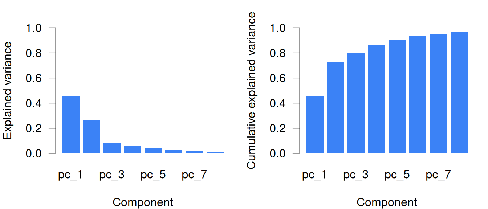
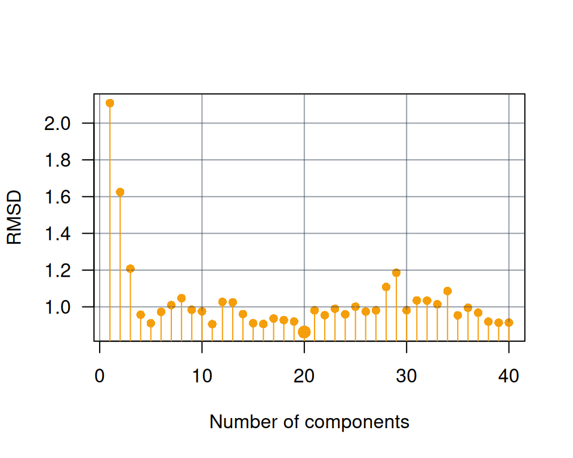
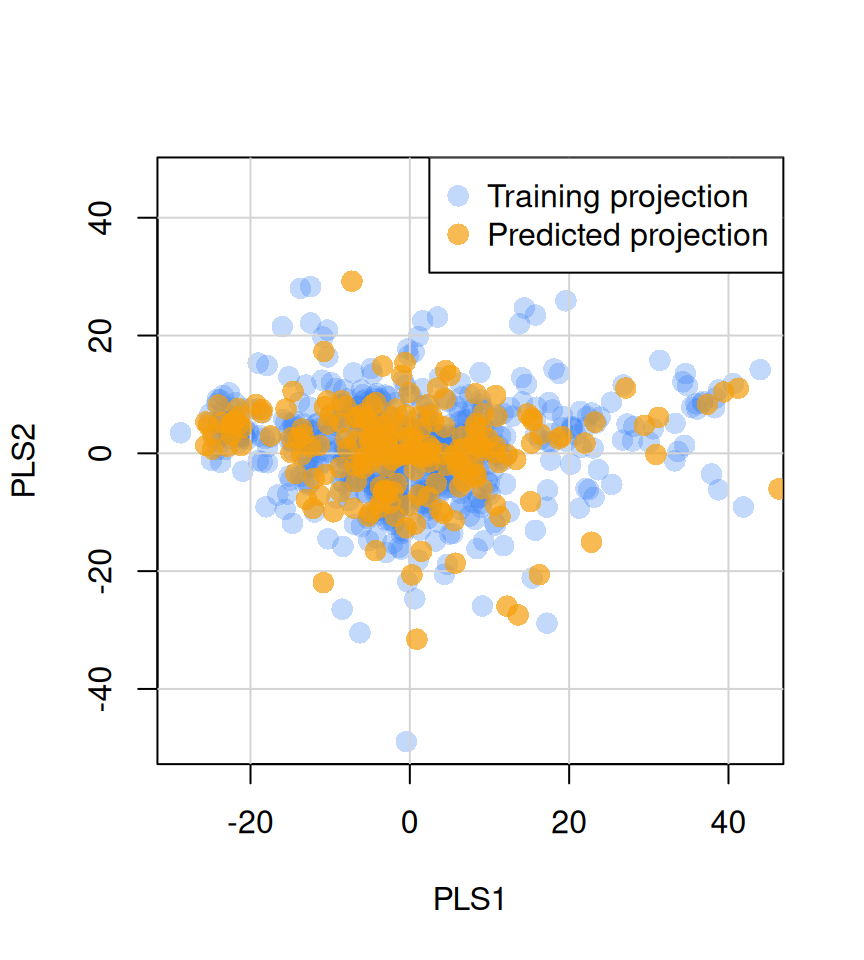

# Dimensionality reduction of spectral data

> *Probability mass concentrates near regions that have a much smaller
> dimensionality than the original space where the data lives* –
> ([Bengio et al., 2013](#ref-bengio2013representation))


## 1 Introduction

Exploratory analysis of spectral data is often affected by the curse of
dimensionality. In near-infrared (NIR) spectroscopy, for example, a
single spectrum may contain measurements at hundreds to thousands of
highly correlated wavelengths. Tasks such as pattern detection,
similarity assessment, and outlier detection therefore often require
reducing the dimensionality of the spectra while retaining the most
relevant information.

Principal component analysis (PCA) and partial least squares (PLS) are
among the most widely used methods for dimensionality reduction in
spectroscopic analysis. Both methods are based on the idea that the
meaningful structure of spectral data lies in a lower-dimensional
subspace. They seek to construct a projection that transforms the
original variables into a smaller set of latent variables that provides
a more compact representation of the data while preserving its dominant
structure.

The main difference between PCA and PLS lies in the criterion used to
define the latent variables. In PCA, the objective is to obtain
orthogonal components that explain as much variation in the predictor
matrix as possible. In PLS, the objective is to obtain latent variables
that maximize the covariance between the predictor matrix and one or
more external variables, such as response variables or side information.

In PCA and PLS, the input spectra ($X$, of dimensions $n \times d$) are
decomposed into a score matrix ($T$) and a loading matrix ($P$), such
that

$$X = TP^{\top} + E$$

where the dimensions of $T$ and $P$ are $n \times o$ and $d \times o$,
respectively, $o$ is the number of retained components, and $E$ is the
residual matrix (reconstruction error). In PCA, the columns of $P$ are
orthonormal ($P^{\top}P = I$), which allows new observations to be
projected directly onto the latent space. For centered data, the maximum
number of components that can be retained is ${\min}(n - 1,d)$.

Once a projection model has been estimated, new observations can be
projected onto the same latent space. If $X_{new}$ denotes a matrix of
new spectra preprocessed in the same way as the original data, their
scores can be obtained as

$$T_{new} = X_{new}P$$

where $P$ contains the loading vectors defining the projection space.

The `resemble` package provides the function
[`ortho_projection()`](https://l-ramirez-lopez.github.io/resemble/reference/ortho_projection.md)
to compute orthogonal projections of spectral data using PCA- and
PLS-based methods. These projections can be used for exploratory
analysis, visualization, dissimilarity analysis, neighbor search, and
predictive modeling.

## 2 Methods available in the `resemble` package

In the `resemble` package, orthogonal projections based on PCA and PLS
are computed with the
[`ortho_projection()`](https://l-ramirez-lopez.github.io/resemble/reference/ortho_projection.md)
function.

The function provides the following algorithms for PCA:

- `"pca"`: standard PCA computed by singular value decomposition (SVD).

- `"pca_nipals"`: PCA computed with the nonlinear iterative partial
  least squares (NIPALS) algorithm ([Wold, 1975](#ref-wold1975soft)).

For PLS, the available algorithms are:

- `"pls"`: standard partial least squares decomposition computed with
  the NIPALS algorithm. The projection is guided by external variables
  provided in `Yr`, so that the latent variables maximize the covariance
  between the spectral predictors and the side information.

- `"mpls"`: modified partial least squares, also computed with the
  NIPALS algorithm. Unlike standard PLS, which derives weights from
  covariances, this method uses correlations between `Xr` and `Yr`,
  reducing the influence of predictor variance on the projection ([Shenk
  and Westerhaus, 1991](#ref-shenk1991populations)).

- `"simpls"`: partial least squares computed with the SIMPLS algorithm
  ([De Jong, 1993](#ref-de1993simpls)), which is often computationally
  more efficient than NIPALS for high-dimensional data.

## 3 Selecting the number of components

One of the critical decisions in dimensionality reduction is determining
how many latent variables to extract. Retaining too few components risks
discarding meaningful information, while retaining too many may
introduce noise or lead to overfitting in subsequent modeling steps.

The `resemble` package provides a set of constructor functions for
specifying component selection criteria. These functions return
specification objects that are passed to the `ncomp` argument of
[`ortho_projection()`](https://l-ramirez-lopez.github.io/resemble/reference/ortho_projection.md)
and related functions:

| Function                                                                                       | Criterion                                         |
|------------------------------------------------------------------------------------------------|---------------------------------------------------|
| [`ncomp_by_var()`](https://l-ramirez-lopez.github.io/resemble/reference/ncomp_selection.md)    | Individual variance threshold                     |
| [`ncomp_by_cumvar()`](https://l-ramirez-lopez.github.io/resemble/reference/ncomp_selection.md) | Cumulative variance threshold                     |
| [`ncomp_by_opc()`](https://l-ramirez-lopez.github.io/resemble/reference/ncomp_selection.md)    | Optimal selection via nearest-neighbor evaluation |
| [`ncomp_fixed()`](https://l-ramirez-lopez.github.io/resemble/reference/ncomp_selection.md)     | Fixed number of components                        |

Alternatively, passing a positive integer directly to `ncomp` is
equivalent to using
[`ncomp_fixed()`](https://l-ramirez-lopez.github.io/resemble/reference/ncomp_selection.md).

### 3.1 Variance-based selection

The simplest approach is to retain components based on the amount of
variance they explain.

#### 3.1.1 Individual variance threshold (`ncomp_by_var()`)

Retains all components that individually explain at least a specified
proportion of the total variance:

``` r
library(resemble)
library(prospectr)

# obtain a numeric vector of the wavelengths at which spectra is recorded 
wavs <- as.numeric(colnames(NIRsoil$spc))

# pre-process the spectra:
# - use detrend
# - use first order derivative
diff_order <- 1
poly_order <- 1
window <- 7

# Preprocess spectra
NIRsoil$spc_pr <- savitzkyGolay(
  detrend(NIRsoil$spc, wav = wavs),
  m = diff_order, p = poly_order, w = window
)
train_x <- NIRsoil$spc_pr[NIRsoil$train == 1, ]
train_y <- NIRsoil$Ciso[NIRsoil$train == 1]

test_x  <- NIRsoil$spc_pr[NIRsoil$train == 0, ]
test_y  <- NIRsoil$Ciso[NIRsoil$train == 0]
```

In the following examples, the default method (PCA with SVD) is used to
compute the projection, but the same component selection criteria can be
applied to any of the available methods.

``` r
# Retain components that individually explain at least 1% of variance
proj_var <- ortho_projection(train_x, ncomp = ncomp_by_var(0.01))
proj_var
```

     Method:  pca
     Number of components retained:  8
     Number of observations and number of original variables:  618 694
     Original variance in Xr: 43.499

     Explained variances, ratio of explained variance, cumulative explained variance:

     Explained variance in Xr:
                               pc_1   pc_2   pc_3   pc_4   pc_5   pc_6  pc_7   pc_8
    var                      19.919 11.602 3.3862 2.7444 1.7983 1.2423 0.825 0.5364
    explained_var             0.458  0.267 0.0778 0.0631 0.0413 0.0286 0.019 0.0123
    cumulative_explained_var  0.458  0.725 0.8025 0.8656 0.9069 0.9355 0.954 0.9668

The above configuration of `ncomp_by_var(0.01)` retained a total of 8
components which are the ones that individually explain at least 1% of
the total variance in the data.

#### 3.1.2 Cumulative variance threshold (`ncomp_by_cumvar()`)

Retains the minimum number of components needed to reach a specified
cumulative proportion of explained variance:

``` r
# Retain enough components to explain at least 99% of variance
proj_cumvar <- ortho_projection(train_x, ncomp = ncomp_by_cumvar(0.99))
proj_cumvar
```

     Method:  pca
     Number of components retained:  14
     Number of observations and number of original variables:  618 694
     Original variance in Xr: 43.499

     Explained variances, ratio of explained variance, cumulative explained variance:

     Explained variance in Xr:
                               pc_1   pc_2   pc_3   pc_4   pc_5   pc_6  pc_7   pc_8
    var                      19.919 11.602 3.3862 2.7444 1.7983 1.2423 0.825 0.5364
    explained_var             0.458  0.267 0.0778 0.0631 0.0413 0.0286 0.019 0.0123
    cumulative_explained_var  0.458  0.725 0.8025 0.8656 0.9069 0.9355 0.954 0.9668
                                pc_9   pc_10   pc_11   pc_12   pc_13   pc_14
    var                      0.27659 0.21380 0.18978 0.15322 0.09713 0.08964
    explained_var            0.00636 0.00492 0.00436 0.00352 0.00223 0.00206
    cumulative_explained_var 0.97314 0.97806 0.98242 0.98594 0.98818 0.99024

The above configuration of `ncomp_by_cumvar(0.99)` retained a total of
14 components which are the minimum number of components needed to
explain at least 99% of the total variance in the data.

### 3.2 Optimal component selection (`ncomp_by_opc()`)

Variance-based criteria consider only the structure of the predictor
matrix. However, in supervised contexts, the goal is often to retain
components that are relevant for capturing information realted to a
response variable. The *optimal component selection* method (“opc”)
addresses this by incorporating side information.

The method is based on the assumption that if two observations are
similar in the spectral space, they should also be similar in terms of
their *side information* ([Ramirez-Lopez et al.,
2013](#ref-ramirez2013spectrum)). For a sequence of retained components
$o = 1,2,\ldots,k$, the function computes a dissimilarity matrix at each
step and identifies the nearest spectral neighbor for each observation.
The side information values of each observation are then compared with
those of its nearest neighbor.

For continuous side information, the root mean squared difference (RMSD)
is computed:

$$j(i) = {NN}(x_{r_{i}},X_{r}^{\{-i\}})$$

$${RMSD} = \sqrt{\frac{1}{m}\sum\limits_{i = 1}^{m}(y_{i} - y_{j(i)})^{2}}$$

where $j(i)$ is the index of the nearest neighbor of observation $i$
(excluding itself), $y_{i}$ is the side information value for
observation $i$, $y_{j(i)}$ is the side information value for the
nearest neighbor, and $m$ is the total number of observations.

For categorical side information, the kappa index is used instead of
RMSD.

The optimal number of components is the one that minimizes RMSD (or
maximizes kappa). Note that in this case, the side information is
represented by the response variable (`Ciso` in the `NIRSoil` dataset):

``` r
# Optimal component selection using side information
# using default max_ncomp which is 40
proj_opc <- ortho_projection(train_x, Yr = train_y, ncomp = ncomp_by_opc())
proj_opc
```

     Method:  pca
     Number of components retained:  20
     Number of observations and number of original variables:  618 694
     Original variance in Xr: 43.499

     Explained variances, ratio of explained variance, cumulative explained variance:

     Explained variance in Xr:
                               pc_1   pc_2   pc_3   pc_4   pc_5   pc_6  pc_7   pc_8
    var                      19.919 11.602 3.3862 2.7444 1.7983 1.2423 0.825 0.5364
    explained_var             0.458  0.267 0.0778 0.0631 0.0413 0.0286 0.019 0.0123
    cumulative_explained_var  0.458  0.725 0.8025 0.8656 0.9069 0.9355 0.954 0.9668
                                pc_9   pc_10   pc_11   pc_12   pc_13   pc_14
    var                      0.27659 0.21380 0.18978 0.15322 0.09713 0.08964
    explained_var            0.00636 0.00492 0.00436 0.00352 0.00223 0.00206
    cumulative_explained_var 0.97314 0.97806 0.98242 0.98594 0.98818 0.99024
                               pc_15   pc_16    pc_17   pc_18    pc_19    pc_20
    var                      0.06180 0.05757 0.038582 0.03610 0.029538 0.027219
    explained_var            0.00142 0.00132 0.000887 0.00083 0.000679 0.000626
    cumulative_explained_var 0.99166 0.99298 0.993868 0.99470 0.995377 0.996002

Using the OPC method, the optimal number of components is 20. Although
this may appear large, these components are required to adequately
represent similarities among observations in terms of the side
information (here, the `Ciso` variable). In this sense, OPC provides a
semi-supervised approach for extracting meaningful latent variables,
where the side information is used only to determine the optimal number
of components.

The “opc” method is particularly useful because it selects latent
variables that are genuinely informative with respect to the response
variable. By contrast, standard component-selection methods often
underestimate the number of components needed to preserve similarities
among observations in terms of the response.

Note that this method can take multiple variables as side information.

By default, up to 40 latent variables are evaluated. If fewer than 40
spectral variables are supplied to
[`ortho_projection()`](https://l-ramirez-lopez.github.io/resemble/reference/ortho_projection.md),
the number of spectral variables is used as the upper limit for the
number of latent variables to test.

If fewer than 40 latent variables are to be evaluated, the
[`ncomp_by_opc()`](https://l-ramirez-lopez.github.io/resemble/reference/ncomp_selection.md)
method can be used to set a smaller upper limit. For example:

``` r
# this needs to be passed to the ncomp argument in ortho_projection()
ncomp_by_opc(max_ncomp = 15)
```

    Component selection: by OPC (max: 15) 

### 3.3 Fixed number of components

When the number of components is known in advance, it can be specified
directly:

``` r
# Using ncomp_fixed()
proj_fixed <- ortho_projection(train_x, ncomp = ncomp_fixed(10))

# Equivalent: passing an integer directly
proj_fixed <- ortho_projection(train_x, ncomp = 10)
```

## 4 Dimentionality reduction methods in `ortho_projection()`

The
[`ortho_projection()`](https://l-ramirez-lopez.github.io/resemble/reference/ortho_projection.md)
function computes orthogonal projections based on PCA and PLS.

### 4.1 Available methods

The function provides the following algorithms for PCA:

- `"pca"`: standard PCA computed by singular value decomposition (SVD).
- `"pca_nipals"`: PCA computed with the nonlinear iterative partial
  least squares (NIPALS) algorithm ([Wold, 1975](#ref-wold1975soft)).

For PLS, the available algorithms are:

- `"pls"`: standard partial least squares decomposition computed with
  the NIPALS algorithm. The projection is guided by external variables
  provided in `Yr`, so that the latent variables maximize the covariance
  between the spectral predictors and the side information.
- `"mpls"`: modified partial least squares, computed with the NIPALS
  algorithm. Weights are derived from correlations rather than
  covariances between `Xr` and `Yr`, giving equal influence to all
  predictors regardless of variance ([**Shenk1991?**](#ref-Shenk1991)).
- `"simpls"`: partial least squares computed with the SIMPLS algorithm
  ([**deJong1993?**](#ref-deJong1993)), which is often computationally
  more efficient than NIPALS for high-dimensional data.

### 4.2 Example: PCA projection

``` r
# PCA with default component selection (ncomp_by_var(0.01))
pca_train <- ortho_projection(train_x, method = "pca")
pca_train
```

``` r
plot(pca_train)
```



Figure 1: Individual contribution to the explained variance for each
component (left) and cumulative variance explained by the principal
components (right).

In this dataset, 8 components are required to explain approximately 97%
of the original variance in the spectra ([Figure 1](#fig-pca-variance)).

The NIPALS algorithm provides an alternative to SVD and can be faster
when only a few components are required:

``` r
# PCA using NIPALS
pca_nipals_train <- ortho_projection(train_x, method = "pca_nipals")
```

### 4.3 Example: PLS projection

For PLS methods, side information (`Yr`) must be provided:

``` r
# PLS using SIMPLS with 10 components
pls_train <- ortho_projection(
  train_x,
  Yr = train_y,
  method = "simpls",
  ncomp = 10
)
pls_train
```

Observations with missing values in `Yr` are held out during model
fitting, then projected using the resulting projection matrix and pooled
with the results.

### 4.4 Example: Optimal component selection

``` r
# PCA with optimal component selection
pca_opc <- ortho_projection(
  train_x,
  Yr = train_y,
  method = "pca",
  ncomp = ncomp_by_opc(40)
)
pca_opc
```

``` r
plot(pca_opc, col = "#F59E0B")
```



Figure 2: RMSD between observations and their nearest neighbors as a
function of the number of principal components.

In this example, 20 components minimize the RMSD for Total Carbon
([Figure 2](#fig-pca-opc)).

## 5 Projecting new data

Both PCA and PLS generate projection matrices that can be used to
project new observations onto the latent space. Use the
[`predict()`](https://rdrr.io/r/stats/predict.html) method:

``` r
# Fit PLS projection model
pls_model <- ortho_projection(
  train_x,
  Yr = train_y,
  method = "simpls",
  ncomp = ncomp_by_opc(40),
  scale = TRUE
)

# Project test data
pls_test_scores <- predict(pls_model, newdata = test_x)
```

``` r
plot(
  pls_model$scores[, 1:2], 
  col = rgb(0.231, 0.51, 0.965, 0.3), 
  pch = 16, cex = 1.5,
  xlab = "PLS1", ylab = "PLS2"
)
grid(lty = 1)
points(
  pls_test_scores[, 1:2], 
  col = rgb(0.961, 0.620, 0.043, 0.7), 
  pch = 16, cex = 1.5
)
legend(
  "topright",
  legend = c("Training projection", "Predicted projection"),
  col = c(
    rgb(0.231, 0.51, 0.965, 0.3),
    rgb(0.961, 0.620, 0.043, 0.7)
  ),
  pch = 16,
  pt.cex = 1.5,
  box.col = "black"
)
```



Figure 3: Projection of the training observations in the first two PLS
components (blue) and projection of the test observations onto the same
latent space (red).

Alternatively, training and test data can be projected in a single call
by passing the test data to `Xu`:

``` r
# Project training and test data simultaneously
pca_both <- ortho_projection(
  train_x,
  Xu = test_x,
  Yr = train_y,
  method = "pca",
  ncomp = ncomp_by_opc(40),
  scale = TRUE
)
```

For PCA, the training and test data are pooled, projected jointly, and
then split for the final results. For
[`ncomp_by_opc()`](https://l-ramirez-lopez.github.io/resemble/reference/ncomp_selection.md),
dissimilarity matrices are computed only on the training data with
available side information.

## 6 Multivariate side information

The
[`ortho_projection()`](https://l-ramirez-lopez.github.io/resemble/reference/ortho_projection.md)
function accepts multiple variables as side information:

``` r
train_y2 <- NIRsoil$Nt[NIRsoil$train == 1]
train_y3 <- NIRsoil$CEC[NIRsoil$train == 1]

# PLS with multivariate side information
pls_multi <- ortho_projection(
  train_x,
  Xu = test_x,
  Yr = cbind(train_y, train_y2, train_y3),
  method = "pca",
  ncomp = ncomp_by_opc(40),
  scale = TRUE
)

plot(pls_multi)
```

When multiple variables are provided, the PLS2 algorithm is used ([Wold
et al., 1983](#ref-wold1983multivariate)). For optimal component
selection, the RMSD is computed for each variable, standardized, and
averaged. The evaluation results for each variable are accessible via
`$opc_evaluation`.

For categorical side information, the kappa index is used instead of
RMSD.

## References

Bengio, Y., Courville, A., Vincent, P., 2013. Representation learning: A
review and new perspectives. IEEE transactions on pattern analysis and
machine intelligence 35, 1798–1828.

De Jong, S., 1993. SIMPLS: An alternative approach to partial least
squares regression. Chemometrics and intelligent laboratory systems 18,
251–263.

Ramirez-Lopez, L., Behrens, T., Schmidt, K., Stevens, A., Demattê, J.,
Scholten, T., 2013. The spectrum-based learner: A new local approach for
modeling soil vis–NIR spectra of complex datasets. Geoderma 195,
268–279.

Shenk, J.S., Westerhaus, M.O., 1991. Populations structuring of near
infrared spectra and modified partial least squares regression. Crop
science 31, 1548–1555.

Wold, H., 1975. Soft modelling by latent variables: The non-linear
iterative partial least squares (NIPALS) approach. Journal of Applied
Probability 12, 117–142.

Wold, S., Martens, H., Wold, H., Ruhe, A., Kagstrom, B., 1983. The
multivariate calibration method in chemistry solved by the PLS model,
in: Proc. Conf. Matrix Pencils, Lecture Notes in Mathematics.
Springer-Verlag Heidelberg, pp. 286–293.
