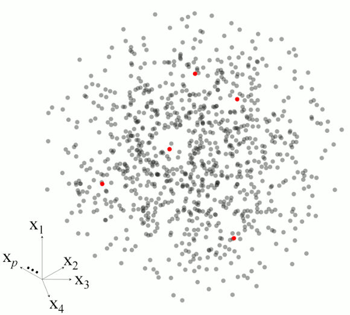

```{r}
#| echo: false
options(cli.num_colors = 1)
```

:::: {.columns}
::: {.column width="70%"}
> *Think Globally, Fit Locally* -- [@saul2003think]
:::
::: {.column width="30%"}

:::
::::


```{r}
#| message: false
#| echo: false
library(resemble)
```


# Memory-based learning

Memory-based learning (MBL) describes a family of local learning methods that
are well suited to complex and heterogeneous spectral datasets
[@ramirez2013spectrum]. In MBL, instead of fitting a single global regression
function, a local regression model is fitted for each target observation using
its nearest neighbors identified in a calibration or reference set. Although
the global relationship between $X$ and $Y$ may be complex, MBL approximates it
through a collection of simpler local models, each assumed to be valid within a
restricted region of the predictor space [@mitchell1997machine].

For a set of $m$ observations requiring prediction, this can be expressed as

$$
\hat{y}_i = \hat{f}_i(x_i; \theta_i), \qquad i = 1, \ldots, m
$$

where $\hat{f}_i$ denotes the local prediction function fitted for observation
$i$, and $\theta_i$ represents the corresponding model parameters, such as the
number of latent variables in a local PLS model.

In this sense, MBL can be viewed as a collection of local prediction functions,

$$
\hat{f} = \{\hat{f}_1, \ldots, \hat{f}_m\},
$$

constructed on demand for the observations to be predicted. The @fig-mbl illustrates the basic steps in MBL for a set of five observations ($m = 5$).

::: {#fig-mbl fig-align="center"}
{width="65%"}

Example of the main steps in memory-based learning for predicting a response variable for five observations in a $p$-dimensional space.
:::


There are four basic elements that must be specified in any MBL algorithm:

1. **A dissimilarity measure**: This is required for neighbor search. Ideally, the dissimilarity measure should also reflect differences that are relevant to the response variable for which local models are to be built. For example, in soil NIR spectroscopy, spectral dissimilarities between soil samples should reflect, at least to some extent, their compositional differences. If the dissimilarity measure fails to capture this relevant notion of similarity, the resulting MBL models are more likely to show poor predictive performance.

2. **How many neighbors to use**: The neighborhood size used to fit the local models must be chosen carefully. Very small neighborhoods may be overly sensitive to noise and outliers, which can reduce model robustness [@ramirez2013spectrum]. They may also contain insufficient variability to adequately capture the relationship between predictors and response. In contrast, overly large neighborhoods may include observations from more heterogeneous regions of the predictor space, which can introduce more complex relationships and reduce local model accuracy.

3. **How to use the dissimilarity information**: Dissimilarity information can be used in different ways:
   - *Ignored*, in which case it is used only to retrieve neighbors [e.g., the LOCAL algorithm, @shenk1997investigation].
   - *Used to weight the training observations* according to their dissimilarity to the target observation [e.g., locally weighted PLS regression, @naes1990locally].
   - *Used as a source of additional predictors* [@ramirez2013spectrum]. In this case, the pairwise dissimilarity matrix among the $k$ neighbors is also included in the local predictor matrix. This $k \times k$ matrix is combined with the original $p$ predictor variables, resulting in a final predictor matrix of dimensions $k \times (k + p)$. For prediction of the target observation, the $p$ spectral variables are combined with the vector of dissimilarities between the target observation and its neighbors. In some cases, this strategy can improve predictive performance. The combined predictor matrix for the neighborhood can be represented as:

$$
\begin{bmatrix}
0_{1,1} & d_{1,2} & \cdots & d_{1,k} & x_{1,1} & x_{1,2} & \cdots & x_{1,p} \\
d_{2,1} & 0_{2,2} & \cdots & d_{2,k} & x_{2,1} & x_{2,2} & \cdots & x_{2,p} \\
\vdots  & \vdots  & \ddots & \vdots  & \vdots  & \vdots  & \ddots & \vdots \\
d_{k,1} & d_{k,2} & \cdots & 0_{k,k} & x_{k,1} & x_{k,2} & \cdots & x_{k,p}
\end{bmatrix}
$$

   where $d_{i,j}$ represents the dissimilarity between the $i$th and $j$th neighbors.

4. **How to fit the local models**: This is determined by the regression method used within each neighborhood. In many spectroscopic applications, these local models are linear, because the relationship between predictors and response is often assumed to be approximately linear within a restricted local region.

In the literature, MBL is often referred to as *local modeling*. However, local modeling also includes other strategies, such as cluster-based modeling or geographically segmented modeling. In this sense, MBL can be regarded as one particular type of local modeling [@ramirez2013spectrum].

The `mbl()` function in the `resemble` package provides a flexible framework for building customized memory-based learners. It allows the user to choose among different dissimilarity measures, neighborhood-selection methods, ways of using dissimilarity information, and regression methods for fitting the local models.

Readers are encouraged to review the sections on dissimilarity measures and k-nearest neighbor search first, as they provide the basis for the examples presented in this section.

The `mbl()` function can be described in terms of the four basic elements introduced above:

1. *The dissimilarity measure*: This is controlled by the `diss_method` argument of `mbl()`. The available methods are the same as those described in the dissimilarity section and are specified through constructor functions such as `diss_pca()`, `diss_pls()`, and `diss_correlation()`.

2. *How many neighbors to use*: This is controlled by the `neighbors` argument, which accepts either `neighbors_k()` for fixed neighborhood sizes or `neighbors_diss()` for threshold-based selection. Multiple neighborhood sizes can be passed to `neighbors_k()`, and multiple dissimilarity thresholds can be passed to `neighbors_diss()`, allowing several settings to be evaluated in a single run. For `neighbors_diss()`, the `k_min` and `k_max` arguments define the minimum and maximum allowed neighborhood sizes.

3. *How to use the dissimilarity information*: This is controlled by the `diss_usage` argument. If `"none"` is used, the dissimilarity information is used only for neighbor retrieval. If `"weights"` is used, the neighbors are weighted according to their dissimilarity to the target observation using a tricubic weighting function. If `"predictors"` is used, the dissimilarity information is incorporated as an additional set of predictors.

4. *How to fit the local models*: This is controlled by the `fit_method` argument, which takes a fitting-method object specifying the regression method and its parameters. Three methods are currently available: partial least squares (PLS) regression, weighted average partial least squares regression (WAPLS) [@shenk1997investigation], and Gaussian process regression (GPR) with a dot-product covariance function. 

# Fitting methods and constructors

The regressions available for fitting the local models in `mbl()` are specified through fitting-method objects. These objects are created using constructor functions such as `fit_pls()`, `fit_wapls()`, and `fit_gpr()`. Each of these functions accepts specific arguments that control the parameters of the corresponding regression method. For example, `fit_pls()` accepts the `ncomp` argument to specify the number of latent variables in the PLS model, while `fit_wapls()` accepts `min_ncomp` and `max_ncomp` to define a range of latent variable numbers for optimization. The following examples illustrate how to construct these fitting-method objects:

```{r}
#| label: fit-methods
#| eval: true

# Creates an object with instructions to build PLS models
my_pls <- fit_pls(ncomp = 15)
my_pls

# Creates an object with instructions to build WAPLS models
my_wapls <- fit_wapls(min_ncomp = 3, max_ncomp = 20)
my_wapls

# Creates an object with instructions to build GPR models
my_gpr <- fit_gpr()
my_gpr
```

# The `mbl_control()` function and validation types

The `mbl_control()` function is used to create control objects that define
validation settings and selected optimization options for `mbl()`. In
particular, the `validation_type` argument specifies how local model
performance is evaluated.

Two validation methods are available:

- **Leave-nearest-neighbor-out validation (`"NNv"`)**: For each target
  observation, its nearest neighbor within the selected neighborhood is
  excluded, a local model is fitted using the remaining neighbors, and the
  excluded neighbor is then predicted. The predicted values obtained for these
  excluded nearest neighbors are compared with their observed reference values.

- **Local leave-group-out cross-validation (`"local_cv"`)**: For each local
  neighborhood, observations are repeatedly split into calibration and
  validation subsets. At each iteration, a local model is fitted to the
  calibration subset and used to predict the validation subset, from which a
  local root mean squared error is computed. This procedure is repeated
  multiple times, and the final local error is calculated as the average of the
  root mean squared errors across iterations. In `mbl_control()`, the number of
  iterations is controlled by the `number` argument, while `p` defines the
  proportion of observations retained in each calibration subset.

The following examples illustrate how to create control objects for validation
in `mbl()`:

```{r}
#| label: validation-control
#| eval: true
# Create an object with instructions to conduct both validation types
# "NNv" and "local_cv"
two_val_control <- mbl_control(
  validation_type = c("NNv", "local_cv"),
  number = 10,
  p = 0.75
)
```

The object `two_val_control` stores the settings for both validation methods,
`"NNv"` and `"local_cv"`. For `"local_cv"`, the number of iterations is set to
`r two_val_control$number`, and the proportion of neighbors retained in each
local calibration subset is `r 100 * two_val_control$p`%.

# Model fitting and prediction

With the main components of `mbl()` now defined, the function can be used to
predict response values for the observations in `test_x` using `train_x` as the
reference set. The following configuration reproduces the LOCAL algorithm
[@shenk1997investigation]:

```{r}
#| message: false
library(resemble)
library(prospectr)

# obtain a numeric vector of the wavelengths at which spectra is recorded 
wavs <- as.numeric(colnames(NIRsoil$spc))

# pre-process the spectra:
# - use detrend
# - use first order derivative
diff_order <- 1
poly_order <- 1
window <- 7

# Preprocess spectra
NIRsoil$spc_pr <- savitzkyGolay(
  detrend(NIRsoil$spc, wav = wavs),
  m = diff_order, p = poly_order, w = window
)
train_x <- NIRsoil$spc_pr[NIRsoil$train == 1, ]
train_y <- NIRsoil$Ciso[NIRsoil$train == 1]

test_x  <- NIRsoil$spc_pr[NIRsoil$train == 0, ]
test_y  <- NIRsoil$Ciso[NIRsoil$train == 0]
```

```{r}
#| label: mbl-local
#| eval: true
#| results: "hide"
# Define the neighborhood sizes to test
my_ks <- seq(80, 160, by = 40)

# Define how to use the dissimilarity information (ignore it)
ignore_diss <- "none"

# Define the regression method to be used at each neighborhood
my_wapls <- fit_wapls(min_ncomp = 3, max_ncomp = 25, scale = TRUE)

# For the moment use only "NNv" validation (faster)
nnv_val_control <- mbl_control()

# Predict Total Carbon
# (remove missing values)
local_ciso <- mbl(
  Xr = train_x[!is.na(train_y), ],
  Yr = train_y[!is.na(train_y)],
  Xu = test_x,
  neighbors = neighbors_k(my_ks),
  diss_method = diss_correlation(center = FALSE),
  diss_usage = ignore_diss,
  fit_method = my_wapls,
  gh = TRUE,
  control = nnv_val_control
)
```

In the above code, the arguments `Xr`, `Yr` are used to specify the reference or training set of predictors variables and the reponse while `Xu` is used to specify the target or test set. The argument `Yu` (not yet introduced here) is also available to specify the response values for the target set, which can be used for validation purposes. 

The subscript $u$ denotes the target domain (partially "unknown"), whereas $r$ denotes the reference library. 


The `local_ciso` object can now be examined:

```{r}
#| label: fig-localresultsciso
#| fig-cap: "MBL results for Total Carbon predictions using the LOCAL algorithm. NNv: nearest-neighbor cross-validation."
#| fig-align: "center"
#| fig-width: 7.5
#| fig-height: 4
plot(local_ciso, main = "")
local_ciso
```

```{r}
#| label: bestk
#| eval: true
#| echo: false
#| results: "hide"
bestk <- which.min(local_ciso$validation_results$nearest_neighbor_validation$rmse)
bestk <- local_ciso$validation_results$nearest_neighbor_validation$k[bestk]
```

According to the results of the previous example, the neighborhood size that minimizes the root mean squared error (RMSE) under nearest-neighbor validation is `r bestk`. The corresponding LOCAL model can now be used to generate predictions for the `test_x` dataset:

```{r}
#| label: get-predictions
#| eval: true
#| results: "hide"
#| fig-show: "hide"
bki <- which.min(local_ciso$validation_results$nearest_neighbor_validation$rmse)
bk <- local_ciso$validation_results$nearest_neighbor_validation$k[bki]

# All the prediction results are stored in:
local_ciso$results

# The get_predictions function makes easier to retrieve the
# predictions from the previous object
ciso_hat <- as.matrix(get_predictions(local_ciso))[, bki]
```

@fig-plot-predictions shows the predicted values for Total Carbon obtained with the LOCAL algorithm using the best neighborhood size according to nearest-neighbor validation, plotted against the reference values in `test_y`. 

```{r}
#| label: fig-plot-predictions
#| fig-cap: "Predicted vs reference values for Total Carbon using the LOCAL algorithm with the best neighborhood size according to nearest-neighbor validation."
#| eval: true
#| fig-width: 5
#| fig-height: 5
# Plot predicted vs reference
rng <- range(ciso_hat, test_y, na.rm = TRUE)
plot(ciso_hat, test_y,
     xlim = rng,
     ylim = rng,
     xlab = "Predicted Total Carbon, %",
     ylab = "Total Carbon, %",
     main = "LOCAL using a fixed k", 
     cex = 1.5,
     pch = 16, col = rgb(0.5, 0.5, 0.5, 0.6))
grid(lty = 1)
abline(0, 1, col = "red")
```

The prediction root mean squared error is then:

```{r}
#| eval: true
# Prediction RMSE:
sqrt(mean((ciso_hat - test_y)^2, na.rm = TRUE))

# Squared R
cor(ciso_hat, test_y, use = "complete.obs")^2
```

Similar results are obtained when the optimization of the neighborhoods is based on distance thresholds:

```{r}
#| label: mbl-diss-threshold
#| eval: true
#| results: "hide"
#| fig-show: "hide"
# Create a vector of dissimilarity thresholds to evaluate
# since the correlation dissimilarity will be used
# these thresholds need to be > 0 and <= 1
dths <- seq(0.025, 0.15, by = 0.025)

# Indicate the minimum and maximum sizes allowed for the neighborhood
k_min <- 30
k_max <- 150

local_ciso_diss <- mbl(
  Xr = train_x[!is.na(train_y), ],
  Yr = train_y[!is.na(train_y)],
  Xu = test_x,
  neighbors = neighbors_diss(threshold = dths, k_min = k_min, k_max = k_max),
  diss_method = diss_correlation(center = FALSE),
  diss_usage = ignore_diss,
  fit_method = my_wapls,
  control = nnv_val_control
)
```

```{r}
#| label: plot-diss-results
#| eval: false
plot(local_ciso_diss)
```

```{r}
#| label: bestd
#| eval: true
#| echo: false
#| results: "hide"
bestd <- which.min(local_ciso_diss$validation_results$nearest_neighbor_validation$rmse)
bestd <- local_ciso_diss$validation_results$nearest_neighbor_validation$k_diss[bestd]
```

```{r}
#| label: show-diss-results
#| eval: true
local_ciso_diss
```

The best correlation dissimilarity threshold is `r bestd`. The column "p_bounded" in the table of validation results, indicates the percentage of neighborhoods for which the size was reset either to the `k_min` or `k_max` values in the `neighbors` object passed to the `neighbors` argument. The final validation lot is shown in @fig-diss-predictions.

```{r}
#| label: diss-predictions
#| eval: true
#| results: "hide"
#| fig-show: "hide"
# Best distance threshold
bdi <- which.min(local_ciso_diss$validation_results$nearest_neighbor_validation$rmse)
bd <- local_ciso_diss$validation_results$nearest_neighbor_validation$k_diss[bdi]

# Predictions for the best distance
ciso_diss_hat <- as.matrix(get_predictions(local_ciso_diss))[, bdi]
```

```{r}
#| label: fig-diss-predictions
#| fig-cap: "Predicted vs reference values for Total Carbon using the LOCAL algorithm with the best neighborhood size according to nearest-neighbor validation and distance thresholds."
#| eval: true
# Plot predicted vs reference
plot(ciso_diss_hat, test_y,
     xlim = rng,
     ylim = rng,
     xlab = "Predicted Total Carbon, %",
     ylab = "Total Carbon, %",
     main = "LOCAL using a distance threshold \nfor neighbor retrieval", 
     cex = 1.5,
     pch = 16, col = rgb(0.5, 0.5, 0.5, 0.6))
grid()
abline(0, 1, col = "red")
```
```{r}
# RMSE
sqrt(mean((ciso_diss_hat - test_y)^2, na.rm = TRUE))

# Squared R
cor(ciso_diss_hat, test_y, use = "complete.obs")^2
```

## Additional examples

Here we provide few additional examples of some MBL configurations where we make use of another response variable available in the dataset: soil cation exchange capacity (CEC). This variable is perhaps more challenging to predict in comparison to Total Carbon. @tbl-addexamples provides a summary of the configurations tested in the following code examples.


| Abbreviation | Dissimilarity method | Dissimilarity usage | Local regression |
|:-------------|:---------------------|:--------------------|:-----------------|
| `mbl_cor` (LOCAL) | Correlation | None | Weighted average PLS |
| `mbl_pc` | optimized PC | Source of predictors | Weighted average PLS |
| `mbl_pls` | optimized PLS | None | Weighted average PLS |
| `mbl_gpr` | optimized PC | Source of predictors | Gaussian process |
: Basic description of the different MBL configurations in the examples to predict Cation Exchange Capacity (CEC). {#tbl-addexamples}

```{r}
train_x <- NIRsoil$spc_pr[NIRsoil$train == 1, ]
train_cec <- NIRsoil$CEC[NIRsoil$train == 1]

test_x  <- NIRsoil$spc_pr[NIRsoil$train == 0, ]
test_cec  <- NIRsoil$CEC[NIRsoil$train == 0]
```


```{r}
#| label: cec-examples
#| results: hide
#| eval: true
#| fig-show: hide
# Define the WAPLS fitting method
my_wapls <- fit_wapls(min_ncomp = 2, max_ncomp = 25, scale = FALSE)

# mbl_cor: LOCAL algorithm with correlation dissimilarity
dth_cor <- seq(0.01, 0.3, by = 0.08)
mbl_cor <- mbl(
  Xr = train_x[!is.na(train_cec), ],
  Yr = train_cec[!is.na(train_cec)],
  Xu = test_x,
  neighbors = neighbors_diss(threshold = dth_cor, k_min = 80, k_max = 150),
  diss_method = diss_correlation(),
  diss_usage = "none",
  fit_method = my_wapls,
  control = nnv_val_control
)

# mbl_pc: PCA dissimilarity with dissimilarity matrix as predictors
dth_pc <- seq(0.05, 1, by = 0.4)
mbl_pc <- mbl(
  Xr = train_x[!is.na(train_cec), ],
  Yr = train_cec[!is.na(train_cec)],
  Xu = test_x,
  neighbors = neighbors_diss(threshold = dth_pc, k_min = 80, k_max = 150),
  diss_method = diss_pca(ncomp = ncomp_by_opc(), scale = TRUE),
  diss_usage = "predictors",
  fit_method = my_wapls,
  control = nnv_val_control
)

# mbl_pls: PLS dissimilarity without dissimilarity predictors
mbl_pls <- mbl(
  Xr = train_x[!is.na(train_cec), ],
  Yr = train_cec[!is.na(train_cec)],
  Xu = test_x,
  Yu = test_cec,
  neighbors = neighbors_diss(threshold = dth_pc, k_min = 80, k_max = 150),
  diss_method = diss_pls(ncomp = ncomp_by_opc(), scale = TRUE),
  diss_usage = "none",
  fit_method = my_wapls,
  control = nnv_val_control
)

# mbl_gpr: Gaussian process regression with PCA dissimilarity as predictors
mbl_gpr <- mbl(
  Xr = train_x[!is.na(train_cec), ],
  Yr = train_cec[!is.na(train_cec)],
  Xu = test_x,
  neighbors = neighbors_diss(threshold = dth_pc, k_min = 80, k_max = 150),
  diss_method = diss_pca(ncomp = ncomp_by_opc(), scale = TRUE),
  diss_usage = "predictors",
  fit_method = fit_gpr(),
  control = nnv_val_control
)
```

Collect the predictions for each configuration:

```{r}
#| label: collect-predictions
#| eval: true
#| fig-show: hide
# Get the indices of the best results according to
# nearest neighbor validation statistics
c_val_name <- "validation_results"
c_nn_val_name <- "nearest_neighbor_validation"

bi_cor <- which.min(mbl_cor[[c_val_name]][[c_nn_val_name]]$rmse)
bi_pc  <- which.min(mbl_pc[[c_val_name]][[c_nn_val_name]]$rmse)
bi_pls <- which.min(mbl_pls[[c_val_name]][[c_nn_val_name]]$rmse)
bi_gpr <- which.min(mbl_gpr[[c_val_name]][[c_nn_val_name]]$rmse)

preds <- cbind(
  get_predictions(mbl_cor)[, bi_cor],
  get_predictions(mbl_pc)[, bi_pc],
  get_predictions(mbl_pls)[, bi_pls],
  get_predictions(mbl_gpr)[, bi_gpr]
)

colnames(preds) <- c("mbl_cor", "mbl_pc", "mbl_pls", "mbl_gpr")
preds <- as.matrix(preds)

# R2s
cor(test_cec, preds, use = "complete.obs")^2

# RMSEs
colMeans((preds - test_cec)^2, na.rm = TRUE)^0.5
```

@fig-mblcomparisons illustrate the prediction results obtained for CEC with each of the MBL configurations tested.

```{r}
#| label: cec-plots-code
#| eval: false
#| fig-show: hide
old_par <- par("mfrow", "mar")
par(mfrow = c(2, 2))

plot(test_cec, preds[, "mbl_cor"],
     xlab = "CEC, meq/100g",
     ylab = "Predicted CEC, meq/100g", 
     main = "mbl_cor (LOCAL)")
abline(0, 1, col = "red")

plot(test_cec, preds[, "mbl_pc"],
     xlab = "CEC, meq/100g",
     ylab = "Predicted CEC, meq/100g", 
     main = "mbl_pc")
abline(0, 1, col = "red")

plot(test_cec, preds[, "mbl_pls"],
     xlab = "CEC, meq/100g",
     ylab = "Predicted CEC, meq/100g", 
     main = "mbl_pls")
abline(0, 1, col = "red")

plot(test_cec, preds[, "mbl_gpr"],
     xlab = "CEC, meq/100g",
     ylab = "Predicted CEC, meq/100g", 
     main = "mbl_gpr")
abline(0, 1, col = "red")

par(old_par)
```

```{r}
#| label: fig-mblcomparisons
#| fig-cap: "CEC prediction results for the different MBL configurations tested"
#| fig-align: center
#| fig-width: 8
#| fig-height: 8
#| echo: false
old_par <- par("mfrow", "mar")
par(mfrow = c(2, 2), pch = 16, mar = c(4, 4, 4, 4))

my_cols <- c(
  "mbl_cor" = "#D42B08CC",
  "mbl_pc"  = "#750E3380",
  "mbl_pls" = "#EFBF4780",
  "mbl_gpr" = "#5177A180"
)

# R2s
r2s <- drop(round(cor(test_cec, preds, use = "complete.obs")^2, 2))

# RMSEs
rmses <- round(colMeans((preds - test_cec)^2, na.rm = TRUE)^0.5, 2)

plot_titles <- c(
  "mbl_cor" = "mbl_cor (LOCAL)",
  "mbl_pc"  = "mbl_pc",
  "mbl_pls" = "mbl_pls",
  "mbl_gpr" = "mbl_gpr"
)

p <- sapply(
  colnames(preds),
  FUN = function(label, y, yhats, cols, rsq, rmse, titles) {
    plot(
      x = y,
      y = yhats[, label],
      xlim = range(y, na.rm = TRUE),
      ylim = range(y, na.rm = TRUE),
      xlab = "CEC, meq/100g",
      ylab = "Predicted CEC, meq/100g",
      col = cols[label]
    )
    title(titles[label])
    title(paste0("\n\n\n RMSE: ", rmse[label], "; R²: ", rsq[label]), cex.main = 1)
    grid(col = "#80808080", lty = 1)
    abline(0, 1, col = "#FF1A0080")
  },
  y = test_cec,
  yhats = preds,
  cols = my_cols,
  rsq = r2s,
  rmse = rmses,
  titles = plot_titles
)

par(old_par)
```

## Using `Yu` argument

If response values for the prediction set are available, the `Yu` argument can be used to directly validate the predictions produced by `mbl()`. These values are used only for validation and are not involved in any optimization or modeling step. The argument can be used as follows:

```{r}
#| label: yu-argument
#| eval: true
# Use Yu argument to validate the predictions
pc_pred_cec_yu <- mbl(
  Xr = train_x[!is.na(train_cec), ],
  Yr = train_cec[!is.na(train_cec)],
  Xu = test_x,
  Yu = test_cec,
  neighbors = neighbors_k(80),
  diss_method = diss_pca(scale = TRUE),
  diss_usage = "none",
  verbose = FALSE,
  control = mbl_control()
)

pc_pred_cec_yu
```

# Supported parallel processing

The `mbl()` function uses `foreach()` from the [foreach package](https://CRAN.R-project.org/package=foreach) to iterate over the rows in `Xu`. In the example below, the [doParallel package](https://CRAN.R-project.org/package=doParallel) is used to register the cores for parallel execution. The [doSNOW package](https://CRAN.R-project.org/package=doSNOW) can also be used. This example uses parallel processing to predict CEC.

::: {.callout-note}
These functions support parallel execution via the `foreach` and `doParallel`
packages. However, parallel execution is only beneficial when the workload per
iteration is large enough to outweigh the overhead of spawning worker processes
and serialising data between them. In practice this means large prediction or
reference sets (typically hundreds of observations or more), large
neighbourhoods, and many PLS components. For small datasets, sequential
execution is invariably faster. When in doubt, benchmark both before committing
to a parallel workflow.
:::

The following example may not be faster than sequential execution due to the relatively small size of the dataset, but it illustrates how to set up parallel processing for `mbl()`:

```{r}
#| label: parallel-example
#| eval: false
# Running the mbl function using multiple cores

# Execute with two cores, if available, ...
n_cores <- 2

# ... if not then go with 1 core
if (parallel::detectCores() < 2) {
  n_cores <- 1
}

# Set the number of cores
library(doParallel)
clust <- makeCluster(n_cores)
registerDoParallel(clust)

# Alternatively:
# library(doSNOW)
# clust <- makeCluster(n_cores, type = "SOCK")
# registerDoSNOW(clust)
# getDoParWorkers()

pc_pred_cec <- mbl(
  Xr = train_x[!is.na(train_cec), ],
  Yr = train_cec[!is.na(train_cec)],
  Xu = test_x,
  neighbors = neighbors_k(seq(40, 100, by = 10)),
  diss_method = diss_pca(ncomp = ncomp_by_opc(), scale = TRUE),
  diss_usage = "none",
  control = mbl_control()
)

# Go back to sequential processing
registerDoSEQ()
try(stopCluster(clust))

pc_pred_cec
```


# References {-} 

