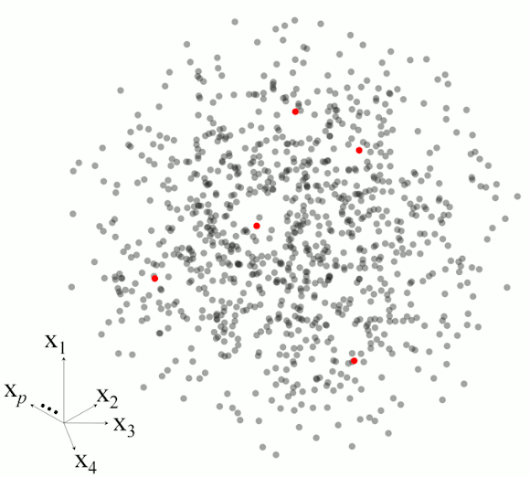

```{r setup, include = FALSE}
library(formatR)
knitr::opts_chunk$set(
  collapse = TRUE, eval.after = "fig.cap"
)
```

<em><p align="right"> Think Globally, Fit Locally [@saul2003think] </p></em>
```{r classdiagram, echo = FALSE, out.width = '20%', fig.align = 'right'}

```

# Introduction

Modeling spectral data has garnered wide interest in the last four decades. 
Spectroscopy is the study of the spectral response of a matrix (e.g. soil, 
plant material, seeds, etc.) when it interacts with electromagnetic radiation. 
This spectral response directly or indirectly relates to a wide range of 
compositional characteristics (chemical, physical or biological) of the matrix. 
Therefore, it is possible to develop empirical models that can accurately 
quantify properties of different matrices. In this respect, quantitative 
spectroscopy techniques are usually fast, non-destructive and cost-efficient in 
comparison to conventional laboratory methods used in the analyses of such 
matrices.  This has resulted in the development of comprehensive 
spectral databases for several agricultural products comprising large amounts 
of observations. The size of such databases increases *de facto* their 
complexity. To analyze large and complex spectral data, one must then resort to
numerical and statistical tools and methods such as dimensionality reduction, 
and local spectroscopic modeling based on spectral dissimilarity concepts.    

The aim of the `resemble` package is to provide tools to efficiently and 
accurately extract meaningful quantitative information from large and complex 
spectral databases. The core functionalities of the package include: 


* dimensionality reduction
* computation of dissimilarity measures
* evaluation of dissimilarity matrices
* spectral neighbour search
* fitting and predicting local spectroscopic models

# Citing the package
Simply type and you will get the info you need:
```{r eval = TRUE}
citation(package = "resemble")
```


# Example dataset

This vignette uses the soil Near-Infrared (NIR) spectral dataset provided in the 
[package `prospectr`](https://CRAN.R-project.org/package=prospectr)
package [@stevens2020introduction]. The reason why we use this dataset is because 
soils are one of the most complex matrices analyzed with NIR spectroscopy. This 
spectral dataset/library was used in the \sQuote{Chimiometrie 2006} challenge by 
@pierna2008soil. The library contains NIR absorbance spectra of dried and sieved
825 soil observations/samples. These samples originate from agricultural fields 
collected from all over the Walloon region in Belgium. The data are in an `R` 
`data.frame` object which is organized as follows:
 
* __Response variables__: 
  
  * ___Nt___ (Total Nitrogen in g/kg of dry soil): a numerical variable (values 
      are available for 645 samples and missing for 180 samples).
  
  * ___Ciso___ (Carbon in g/100 g of dry soil): a numerical 
      variable (values are available for 732 and missing for 93 samples).
  
  * ___CEC___ (Cation Exchange Capacity in meq/100 g of dry soil): A numerical 
      variable (values are available for 447 and missing for 378 samples).
      
* __Predictor variables__: the predictor variables are in a matrix embedded in 
  the data frame, which can be accessed via `NIRsoil$spc`. These variables 
  contain the NIR absorbance spectra of the samples recorded between the 
  1100 nm and 2498 nm of the electromagnetic spectrum at 2 nm interval. Each 
  column name in the matrix of spectra represents a specific wavelength (in nm).
  
* __Set__: a binary variable that indicates whether the samples belong to the 
  training subset (represented by 1, 618 samples) or to the test 
  subset (represented by 0, 207 samples).

Load the necessary packages and data: 
```{r libraries, tidy = TRUE, message = FALSE}
library(resemble)
library(prospectr)
library(magrittr)
```

The dataset can be loaded into R as follows: 
```{r, tidy = FALSE, message = FALSE, results = 'hide'}
data(NIRsoil)
dim(NIRsoil)
str(NIRsoil)
```

# Spectra pre-processing
This step aims at improving the signal quality of the spectra for quantitative
analysis. In this respect, the following standard methods are applied using the 
[package `prospectr`](https://CRAN.R-project.org/package=prospectr) [@stevens2020introduction]: 

1. Resampling from a resolution of 2 nm to a resolution of 5 nm.
2. First derivative using Savitsky-Golay filtering [@Savitzky1964]. 

```{r NIRsoil, tidy = FALSE, message = FALSE}
# obtain a numeric vector of the wavelengths at which spectra is recorded 
wavs <- NIRsoil$spc %>% colnames() %>% as.numeric()

# pre-process the spectra:
# - resample it to a resolution of 6 nm
# - use first order derivative
new_res <- 5
poly_order <- 1
window <- 5
diff_order <- 1

NIRsoil$spc_p <- NIRsoil$spc %>% 
  resample(wav = wavs, new.wav = seq(min(wavs), max(wavs), by = new_res)) %>% 
  savitzkyGolay(p = poly_order, w = window, m = diff_order)
```
```{r plotspectra, fig.cap = "Raw spectral absorbance data (top) and first derivative of the absorbance spectra (bottom).",  fig.cap.style = "Image Caption", fig.align = "center", fig.width = 7, fig.height = 7, echo = FALSE, fig.retina = 0.85}
old_par <- par("mfrow", "mar")
par(mfrow = c(2, 1), mar = c(4, 4, 1, 4))

new_wavs <- as.matrix(as.numeric(colnames(NIRsoil$spc_p)))
plot(range(wavs), range(NIRsoil$spc), col = NA,
     xlab = "",
     ylab = "Absorbance")
rect(par("usr")[1], par("usr")[3], par("usr")[2], par("usr")[4], col = "#EFBF4780")
grid(lty = 1, col = "#E47C4E80")
matlines(x = wavs, y = t(NIRsoil$spc), 
         lty = 1, col = "#5177A133")

plot(range(new_wavs), range(NIRsoil$spc_p), col = NA,
     xlab = "Wavelengths, nm",
     ylab = "1st derivative")
rect(par("usr")[1], par("usr")[3], par("usr")[2], par("usr")[4], col = "#EFBF4780")
grid(lty = 1, col = "#E47C4E80")
matlines(x = new_wavs, y = t(NIRsoil$spc_p), 
        lty = 1, col = "#5177A133")
par(old_par)
```

```{r eval = FALSE}
new_wavs <- as.matrix(as.numeric(colnames(NIRsoil$spc_p)))

matplot(x = wavs, y = t(NIRsoil$spc), 
        xlab = "Wavelengths, nm",
        ylab = "Absorbance",
        type = "l", lty = 1, col = "#5177A133")

matplot(x = new_wavs, y = t(NIRsoil$spc_p), 
        xlab = "Wavelengths, nm",
        ylab = "1st derivative",
        type = "l", lty = 1, col = "#5177A133")
```

Both the raw absorbance spectra and the first derivative spectra are shown in 
Figure \@ref(fig:plotspectra). The first derivative spectra represents the 
explanatory variables that will be used for all the examples throughout this 
document. 

For more explicit examples, the `NIRsoil` data is split into training and 
testing subsets: 

```{r}
# training dataset
training  <- NIRsoil[NIRsoil$train == 1, ]
# testing dataset
testing  <- NIRsoil[NIRsoil$train == 0, ]
```

In the resemble package we use the following notation (@ramirez2013spectrum): 

* __Training observations__:

  * `Xr` stands for the matrix of predictor variables in the reference/training 
set (spectral data for calibration).

  * `Yr` stands for the response variable(s) in the reference/training set 
(dependent variable for calibration). In the context of this package, `Yr` is 
also referred as to "___side information___", which is a variable or set of 
variables that are associated to the training observations that can also be used 
to support or guide optimization during modeling, but that not necessarily are 
part of the input of such models. For example, we will see in latter sections 
that `Yr` can be used in Principal Component Analysis to help on deciding how 
many components are optimal.


* __Testing observations__:

  * `Xu` stands for the matrix of predictor variables in the unknown/test 
set (spectral data for validation/testing).

  * `Yu` stands for the response variable(s) in the unknown/test set (dependent 
variable for testing).

# Dimensionality reduction
When conducting exploratory analysis of spectral data, we face the curse of 
dimensionality. It is such that we may be dealing with (using NIR spectra data 
as an example) hundreds to thousands of individual wavelengths for each 
spectrum. When one wants to find patterns in the data, spectral similarities and 
differences, or detect spectral outliers, it is necessary to reduce the 
dimension of the spectra while retaining important information. 

Principal Component (PC) analysis and Partial Least Squares (PLS) decomposition 
methods assume that the meaningful structure the data intrinsically lies on 
a lower dimensional space. Both methods attempt to find a projection matrix 
that projects the original variables onto a less complex 
space represented by new few variables. These new variables mimic the original 
variability across observations. These two methods can be considered as the 
standard ones for dimensionality reduction in many fields of spectroscopic 
analysis. 

The difference between PC and PLS is that in PC the objective is to 
find few new variables (which are orthogonal) that capture as much of the 
original data variance while in the latter the objective is to find few new 
variables that maximize their variance with respect to a set of one or more 
external variables (e.g. response variables or side information variables). 

## Methods
In the `resemble` package, PC analysis and PLS decomposition are available 
through the `ortho_projection()` function which offers the following algorithms:

* `"pca"`: the standard method for PC analysis based on the singular value 
decomposition algorithm.

* `"pca.nipals"`: this algorithm uses the non-linear iterative partial 
least squares algorithm [NIPALS, @wold1975soft] for the purpose of PC analysis.

* `"pls"`: Here, PLS decomposition also uses the NIPALS algorithm, but in this 
case it makes use of ___side information___, which can be a variable or set of 
variables that are __associated to the training observations__ and that are used to
project the data. In this case, the variance between the projected variables and 
the ___side information___ variable(s) is maximized. 

The PC analysis of the training spectra can be executed as follows:
```{r, results = 'hide'}
# principal component (pc) analysis with the default 
# method (singular value decomposition) 
pca_tr <- ortho_projection(Xr = training$spc_p, method = "pca")

pca_tr
```

Plot the `ortho_projection` object:

```{r plotpcsvariance, fig.cap = "Individual contribution to the explained variance for each component (left) and cumulative variance explained by the principal components (right).",  fig.cap.style = "Image Caption", fig.align = "center", fig.width = 7, fig.height = 3, fig.retina = 0.85}
plot(pca_tr, col = "#D42B08CC")
```

The code above shows that in this dataset, `r pca_tr$n_components` components 
are required to explain around `r round(100 * sum(pca_tr$variance[2,]), 0)`% of 
the original variance found in the spectra (Figure \@ref(fig:plotpcsvariance)).

Equivalent results can be obtained with the NIPALS algorithm:
```{r, results = 'hide'}
# principal component (pc) analysis with the default 
# NIPALS algorithm
pca_nipals_tr <- ortho_projection(Xr = training$spc_p,
                                  method = "pca.nipals")

pca_nipals_tr
```

The advantage of the NIPALS algorithm is that it can be faster than SVD when 
only few components are required.

For a PLS decomposition the `method` argument is set to `"pls"`. In this case, 
side information (`Yr`) is required. In the following example, the side 
information used is the Total Carbon (`Ciso`):
```{r, results = 'hide', eval = FALSE}
# Partial Least Squares decomposition using 
# Total carbon as side information
# (this might take some seconds)
pls_tr <- ortho_projection(Xr = training$spc_p,
                           Yr = training$Ciso,
                           method = "pls")
pls_tr
```

Note that in the previous code, for PLS projection the observations with missing 
`training$Ciso` are hold out, and then the projection takes place. The 
missing observations are projected with the resulting projection matrix and
pooled together with the initial results.

By default the `ortho_projection()` function retains all the first components 
that, alone, account for at least 1% of the original variance of data. In 
the following section we will see that the function also offers additional 
options that might be more convenient for choosing the number of components.

## Selection of the components/dimensions

Those options can be specified using the 
`pc_selection` argument. The following options are all the ones available for 
that purpose:

### _Single component explained variance-based selection_, `"var"` (default option): 
Those components that alone explain more than a given amount of the original 
spectral variance are retained. Example:

```{r, results = 'hide', eval = FALSE}
# This retains components that alone explain at least 5% of the original
# variation in training$spc_p
var_sel <-  list(method = "var", value = 0.05)
pca_tr_minvar5 <- ortho_projection(Xr = training$spc_p,
                                   method = "pca", 
                                   pc_selection = var_sel)

pca_tr_minvar5
```


### _Cumulative variance-based selection_, `"cumvar"`: 
Only the first components that together explain at least a given amount of the 
original variance are retained. Example:
```{r, results = 'hide', eval = FALSE}
# This retains components that together explain at least 90% of the original
# variation in training$spc_p
cumvar_sel <-  list(method = "cumvar", value = 0.90)

pca_tr_cumvar90 <- ortho_projection(Xr = training$spc_p,
                                    method = "pca", 
                                    pc_selection = cumvar_sel)

pca_tr_cumvar90
```

### _Optimal component selection_ `"opc"`: 
This is a more sophisticated method in which the selection of the components is 
based on the side information concept presented in @ramirez2013spectrum. First 
let $P$ be a sequence of retained components (so that $P = 1, 2, ...,k$). At 
each iteration, the function computes a dissimilarity matrix retaining $p_i$ 
components. The values in this side information variable are compared against 
the side information values of their most spectrally similar observations.
The optimal number of components retrieved by the function is the one that 
minimizes the root mean squared differences (RMSD) in the case of continuous
variables, or maximizes the kappa index in the case of categorical variables.
The RMSD is calucated as follows:

\begin{equation}
j(i) = NN(xr_i, Xr^{\{-i\}})
\end{equation}

\begin{equation}
RMSD = \sqrt{\frac{1}{m} \sum_{i=1}^m {(y_i - y_{j(i)})^2}}
\end{equation}

where $j(i) = NN(xr_i, Xr^{\{-i\}})$ represents a function to obtain the index 
of the nearest neighbor observation found in $Xr$ (excluding the $i$th 
observation) for $xr_i$, $y_i$ is the value of the side variable of the $i$th 
observation, $y_{j(i)}$ is the value of the side variable of the nearest 
neighbor of the $i$th observation and $m$ is the total number of observations. 
Note that for the `"opc"` method `Yr` is required (i.e. the side information of 
the observations). Type `help(sim_eval)` in the `R` console to get more details 
on how the RMSD and kappa are calculated in the function.

The rationale behind the `"opc"` method is based on the assumption that the 
closer two observations are in terms of their explanatory variables (`Xr`), the 
closer they may be in terms of their side information (`Yr`). 


```{r, results = 'hide'}
# This uses optimal component selection
# variation in training$spc_p
optimal_sel <-  list(method = "opc", value = 40)
pca_tr_opc <- ortho_projection(Xr = training$spc_p,
                               Yr = training$Ciso,
                               method = "pca", 
                               pc_selection = optimal_sel)
pca_tr_opc
```
In the example above, `r pca_tr_opc$n_components` components are required to 
represent the space in which the overall Total Carbon difference between each 
sample and its corresponding nearest neighbor is minimized. The following graph 
shows how the RMSD varies as a function of the number of components 
(Figure \@ref(fig:pcrmsd)):
```{r pcrmsd, fig.cap = "Root mean squared difference between the samples and their corresponding nearest neighbors (for Total Carbon as side finormation) found by using dissimilarity matrices computed with different number of PCs.", fig.id = "plot_pcs_opc", fig.cap.style = "Image Caption", fig.align = "center", fig.width = 5, fig.height = 4, fig.retina = 0.85}
plot(pca_tr_opc, col = "#FF1A00CC")
```

The following code exemplifies how the RMSD is calculated (only for the `r pca_tr_opc$n_components`th component, Figure \@ref(fig:rmsdscatter)): 
```{r rmsdscatter, fig.cap = paste("Comparison between each sample and its corresponding nearest neighbor (in terms of  Total Carbon) when ", pca_tr_opc$n_components, "are used for dissimilarity matrix computations."), fig.id = "plot_pcs_opc2", fig.cap.style = "Image Caption", fig.align = "center", fig.width = 4, fig.height = 4, fig.retina = 0.85}
# compute the dissimilarity matrix using all the retained scores
pc_diss <- f_diss(pca_tr_opc$scores, diss_method = "mahalanobis")
# get the nearest neighbor for each sample
nearest_n <- apply(pc_diss, MARGIN = 1, FUN = function(x) order(x)[2])
# compute the RMSD
rmsd <- sqrt(mean((training$Ciso - training$Ciso[nearest_n])^2, na.rm = TRUE))
rmsd
# the RSMD for all the components is already available in 
# ...$opc_evaluation
pca_tr_opc$opc_evaluation[pca_tr_opc$n_components, , drop = FALSE]
plot(training$Ciso[nearest_n], 
     training$Ciso, 
     ylab = "Ciso of the nearest neighbor, %", xlab = "Ciso, %",
     col = "#D19C17CC", pch = 16)
grid()
```

### _Manual selection_, `"manual"`: 
The user explicitly defines how many components to retrieve. Example:

```{r, results = 'hide'}
# This uses manual component selection 
manual_sel <-  list(method = "manual", value = 9)
# PC
pca_tr_manual <- ortho_projection(Xr = training$spc_p,
                                  method = "pca", 
                                  pc_selection = manual_sel)
pca_tr_manual

# PLS
pls_tr_manual <- ortho_projection(Xr = training$spc_p,
                                  Yr = training$Ciso,
                                  method = "pls", 
                                  pc_selection = manual_sel)
pls_tr_manual
```


## Using projection/dimension reduction models on new data

Both PC and PLS methods generate projection matrices that can be used to project 
new observations onto the new lower dimensional score space they were built for. 
In the case of PC analysis this projection matrix is equivalent to the transposed 
matrix of loadings. The `predict` method along with a projection model can be 
used to project new data:

```{r, results = 'hide'}
optimal_sel <-  list(method = "opc", value = 40)
# PLS
pls_tr_opc <- ortho_projection(Xr = training$spc_p,
                               Yr = training$Ciso,
                               method = "pls", 
                               pc_selection = optimal_sel,
                               scale = TRUE)
# the pls projection matrix
pls_tr_opc$projection_mat

pls_projected <- predict(pls_tr_opc, newdata = testing$spc_p)

# PC
pca_tr_opc <- ortho_projection(Xr = training$spc_p,
                               Yr = training$Ciso,
                               method = "pca", 
                               pc_selection = optimal_sel,
                               scale = TRUE)
# the pca projection matrix
t(pca_tr_opc$X_loadings)

pca_projected <- predict(pca_tr_opc, newdata = testing$spc_p)
```

## Projecting two separate datasets in one single run

The `ortho_projection()`function allows to project two separate datasets in one 
run. For example, training and testing data can be passed to the function as 
follows:
```{r, results = 'hide', eval = FALSE}
optimal_sel <-  list(method = "opc", value = 40)
pca_tr_ts <- ortho_projection(Xr = training$spc_p,
                              Xu = testing$spc_p,
                              Yr = training$Ciso,
                              method = "pca", 
                              pc_selection = optimal_sel,
                              scale = TRUE)
plot(pca_tr_ts)
```
In the above code for PC analyisis, `training` and `testing` datasets are pooled 
together and then projected and split back for presenting the final results. 
For the `opc` selection method, the dissimilarity 
matrices are built only for the `training` data and for the observations with 
available side information (Total Carbon). These dissimilarity matrices are used 
only to find the optimal number of PCs. Note that `Xr` and `Yr` refer to the 
same observations. Also note that the optimal number of PCs might not be the same 
as when `testing` is not passed to the `Xu` argument since the PC projection 
model is built from a different pool of observations.

In the case of PLS, the observations used for projection necessarily have to 
have side information available, therefore the missing values in `Yr` are hold 
out during the projection model building. For these samples, the final projection 
matrix is use to project them into the PLS space. 

```{r, results = 'hide', eval = FALSE}
optimal_sel <-  list(method = "opc", value = 40)
pls_tr_ts <- ortho_projection(Xr = training$spc_p,
                              Xu = testing$spc_p,
                              Yr = training$Ciso,
                              method = "pls", 
                              pc_selection = optimal_sel,
                              scale = TRUE)

# the same PLS projection model can be obtained with:
pls_tr_ts2 <- ortho_projection(Xr = training$spc_p[!is.na(training$Ciso),],
                               Yr = training$Ciso[!is.na(training$Ciso)],
                               method = "pls", 
                               pc_selection = optimal_sel,
                               scale = TRUE)

identical(pls_tr_ts$projection_mat, pls_tr_ts2$projection_mat)
```

## Using more than one variable as side information
The `ortho_projection()`function allows to pass more than one variable to `Yr` 
(side information):

```{r, results = 'hide', eval = FALSE}
optimal_sel <-  list(method = "opc", value = 40)
pls_multi_yr <- ortho_projection(Xr = training$spc_p,
                                 Xu = testing$spc_p,
                                 Yr = training[, c("Ciso", "Nt", "CEC")],
                                 method = "pls", 
                                 pc_selection = optimal_sel,
                                 scale = TRUE)
plot(pls_multi_yr)
```

In the above code for PLS projections using multivariate side information, the
PLS2 method (based on the NIPALS algorithm) is used [see @wold1983multivariate]. 
The optimal component selection (`opc`) also uses the multiple variables passed 
to `Yr`, the RMSD is computed for each of the variables. Each RMSD is then 
standardized and the final RMSD used for optimization is their average. 
For the example above, this data can be accessed as follows:

```{r, results = 'hide', eval = FALSE}
pls_multi_yr$opc_evaluation
```

For PC analysis multivariate side information is also allowed for the `opc`
method. Alternatively, a categorical variable can also be used as side 
information for the `opc`. In that case, the kappa index is used instead of the 
RMSD. 

# Computing dissimilarity matrices
Similarity/dissimilarity measures between objects are often estimated by means 
of distance measurements, the closer two objects are to one another, the higher 
the similarity between them. Dissimilarity or distance measures are useful for 
a number of applications, for example for outlier detection and nearest neighbors 
search. 

The `dissimilarity()` function is the main function for measuring dissimilarities 
between observations. It is basically a wrapper to other existing dissimilarity 
functions within the package (see `f_diss()`, `cor_diss()`, `sid()` and 
`ortho_diss()`). It allows to compute dissimilarities between:

 * all the observations in a single matrix.
 
 * observations in a matrix against observations in a second matrix.

The dissimilarity methods available in `dissimilarity()` are as follows (see 
`diss_method` argument):

* `"pca"`: Mahalanobis distance computed on the matrix of scores of a PC projection of 
`Xr` (and `Xu` if provided). PC projection is done using the singular value 
decomposition (SVD) algorithm. Type `help(ortho_diss)` for more details on the 
function called by this method.

* `"pca.nipals"`: Mahalanobis distance computed on the matrix of scores of a 
PC projection of `Xr` (and `Xu` if provided). PC projection is done 
using the non-linear iterative partial least squares (NIPALS) algorithm. 
Type `help(ortho_diss)` in the `R` console for more details on the function 
called by this method.

* `"pls"`: Mahalanobis distance computed on the matrix of scores of a partial 
least squares projection of `Xr` (and `Xu` if provided). In this case, `Yr` is 
always required. Type `help(ortho_diss)` in the `R` console for more details on 
the function called by this method.

* `"cor"`: correlation dissimilarity which is based on the coefficient between 
observations. Type `help(cor_diss)` in the `R` console for more details on the 
function called by this method.

* `"euclid"`: Euclidean distance between observations. Type `help(f_diss)` in 
the `R` console for more details on the function called by this method.

* `"cosine"`: Cosine distance between observations. Type `help(f_diss)` in the 
`R` console for more details on the function called by this method.

* `"sid"`: spectral information divergence between observations. Type 
`help(sid)` in the `R` console for more details on the function called by this 
method.

## Dissimilarity measured on orthogonal spaces
In this package, the orthogonal space dissimilarities refer to dissimilarity 
measures performed either in the PC space or in the PLS space. 

Since we can assume that the meaningful structure the data lies on a lower 
dimensional space, we can also assume that this lower dimensional space is 
optimal to measure the dissimilarity between observations [@ramirez2013distance].

To measure the dissimilarity between observations ($x_i$ and $x_j$), the 
Mahalanobis distance is computed on their corresponding projected score vectors 
($t_i$ and $t_j$) found in the matrix of scores ($\mathrm T$):

$$d(x_i,x_j) = d(t_i,t_j) = \sqrt{\frac{1}{z}\sum(t_i - t_j) C^{-1}(t_i - t_j)'}$$
where $z$ is the number of components used, $C^{-1}$ is the inverse of the 
covariance matrix computed from the matrix of projected variables for all 
the observations $\mathrm T$. Since the projected variables are 
orthogonal to each other, the resulting $C^{-1}$ would be equivalent to a
diagonal matrix with the variance of each $\mathrm T$ column in its main 
diagonal. Therefore, for this case of orthogonal spaces, the Mahalanobis 
distance is equivalent to the Euclidean distance applied on the variance-scaled 
$\mathrm T$ [@de2000mahalanobis].

To compute orthogonal dissimilarities in the `resemble` package, the 
`dissimilarity()` function can be used as follows:
```{r, results = 'hide', eval = FALSE}
# for PC dissimilarity using the default settings
pcd <- dissimilarity(Xr = training$spc_p,
                     diss_method = "pca")
dim(pcd$dissimilarity)

# for PC dissimilarity using the optimized component selection method
pcd2 <- dissimilarity(Xr = training$spc_p,
                      diss_method = "pca.nipals",
                      Yr = training$Ciso,
                      pc_selection = list("opc", 20),
                      return_projection = TRUE)
dim(pcd2$dissimilarity)
pcd2$dissimilarity
pcd2$projection # the projection used to compute the dissimilarity matrix

# for PLS dissimilarity
plsd <- dissimilarity(Xr = training$spc_p,
                      diss_method = "pls",
                      Yr = training$Ciso,
                      pc_selection = list("opc", 20),
                      return_projection = TRUE)
dim(plsd$dissimilarity)
plsd$dissimilarity
plsd$projection # the projection used to compute the dissimilarity matrix
```

To compute the correlation dissimilarity between training and testing 
observations:
```{r, results = 'hide', eval = TRUE}
# For PC dissimilarity using the optimized component selection method
pcd_tr_ts <- dissimilarity(Xr = training$spc_p,
                           Xu = testing$spc_p,
                           diss_method = "pca.nipals",
                           Yr = training$Ciso,
                           pc_selection = list("opc", 20))
dim(pcd_tr_ts$dissimilarity)

# For PLS dissimilarity
plsd_tr_ts <- dissimilarity(Xr = training$spc_p,
                            Xu = testing$spc_p,
                            diss_method = "pls",
                            Yr = training$Ciso,
                            pc_selection = list("opc", 20))
dim(plsd_tr_ts$dissimilarity)
```
In the last two examples, matrices of `r nrow(plsd_tr_ts$dissimilarity)` rows 
and `r ncol(plsd_tr_ts$dissimilarity)` columns are retrieved. The number of rows 
is the same as in the training dataset while the number of columns is the same as 
in the testing dataset. The dissimilarity between the $i$th observation in 
the training dataset and the $j$th observation in the testing dataset is stored 
in the $i$th row and the $j$th column of the resulting dissimilarity matrices.


### Combine k-nearest neighbors and dissimilarity measures in the orthogonal space

It is also possible to measure the dissimilarity between observations in a 
localized fashion. In this case, first a global dissimilarity matrix is 
computed. Then, by using this matrix for each target observation, a given set of 
k-nearest neighbors are identified. These neighbors (together with the target 
observation) are projected (from the original data space) onto a (local) 
orthogonal space (using the same parameters specified in the function). In this 
projected space the Mahalanobis distance between the target observation and its 
neighbors is recomputed. A missing value is assigned to the observations that do 
not belong to this set of neighbors (non-neighbor observations). In this case 
the dissimilarity matrix cannot be considered as a distance metric since it does 
not necessarily satisfies the symmetry condition for distance matrices 
(i.e. given two observations $x_i$ and $x_j$, the local
dissimilarity, $d$, between them is relative since generally
$d(x_i, x_j) \neq d(x_j, x_i)$). 

For computing this type of localized dissimilarity matrix, two arguments need to 
be passed to the `dissimilarity()` function: `.local` and `pre_k`. These are 
not formal arguments of the function, however, they are passed to 
the `ortho_diss()`function which is used by the `dissimilarity()` function for 
computing the dissimilarities in the orthogonal spaces. 

Here are two examples on how to perform localized dissimilarity 
computations: 

```{r localdiss, eval = TRUE}
# for localized PC dissimilarity using the optimized component selection method
# set the number of neighbors to retain
knn <- 200
local_pcd_tr_ts <- dissimilarity(Xr = training$spc_p,
                                 Xu = testing$spc_p,
                                 diss_method = "pca",
                                 Yr = training$Ciso,
                                 pc_selection = list("opc", 20),
                                 .local = TRUE, 
                                 pre_k = knn)
dim(local_pcd_tr_ts$dissimilarity)

# For PLS dissimilarity
local_plsd_tr_ts <- dissimilarity(Xr = training$spc_p,
                                  Xu = testing$spc_p,
                                  diss_method = "pls",
                                  Yr = training$Ciso,
                                  pc_selection = list("opc", 20),
                                  .local = TRUE, 
                                  pre_k = knn)
dim(local_plsd_tr_ts$dissimilarity)

# check the dissimilarity scores between the first two 
# observations in the testing dataset and the first 10 
# observations in the training dataset
local_plsd_tr_ts$dissimilarity[1:10, 1:2]

```

## Correlation dissimilarity 
Correlation dissimilarity is based on the Pearson's $\rho$ correlation coefficient 
between observations. The value of Pearson's $\rho$ varies between -1 and 1. A 
correlation of 1 between two observations would indicate that they are perfectly 
correlated and might have identical characteristics (i.e. they are can be 
considered as highly similar). A value of -1, conversely, would indicate that 
the two observations are perfectly negatively correlated (i.e. the two 
observations are highly dissimilar). The correlation dissimilarity implemented 
in the package scales the values between 0 (highest dissimilarity) and 1 
(highest similarity). To measure $d$ between two observations $x_i$ and $x_j$ 
based on the correlation dissimilarity the following equation is applied:

$$d(x_i, x_j) = \frac{1}{2} (1 - \rho(x_i, x_j))$$

Note that $d$ cannot be considered as a distance metric since it does not 
satisfy the axiom of identity of indiscernibles. Therefore we prefer the use of 
the term dissimilarity.

The following code demonstrates how to compute the correlation dissimilarity 
between all observations in the training dataset:
```{r, results = 'hide', eval = FALSE}
cd_tr <- dissimilarity(Xr = training$spc_p, diss_method = "cor")
dim(cd_tr$dissimilarity)
cd_tr$dissimilarity
```

To compute the correlation dissimilarity between training and testing 
observations:
```{r, results = 'hide', eval = TRUE}
cd_tr_ts <- dissimilarity(Xr = training$spc_p,
                          Xu = testing$spc_p,
                          diss_method = "cor")
dim(cd_tr_ts$dissimilarity)
cd_tr_ts$dissimilarity
```

Alternatively, the correlation dissimilarity can be computed using a moving 
window. In this respect, a window size term $w$ is introduced to the original 
equation:

$$d(x_i, x_j; w) = \frac{1}{2 w}\sum_{k=1}^{p-w}1 - \rho(x_{i,\{k:k+w\}}, x_{j,\{k:k+w\}})$$

In this case, the correlation dissimilarity is computed by averaging 
the moving window correlation measures. The introduction of the window term
increases the computational cost in comparison to the simple correlation 
dissimilarity. The moving window correlation dissimilarity can be computed by 
setting the `diss_method` argument to `"cor"` and passing a window size value to 
the `ws` argument as follows:

```{r, results = 'hide', eval = FALSE}
# a moving window correlation dissimilarity between training and testing
# using a window size of 19 spectral data points (equivalent to 95 nm)
cd_mw <- dissimilarity(Xr = training$spc_p,
                       Xu = testing$spc_p,
                       diss_method = "cor",
                       ws = 19)
cd_mw$dissimilarity
```


## Euclidean dissimilarity 

In the computation of the Euclidean dissimilarity, each feature has equal 
significance. Hence, correlated variables which may represent irrelevant 
features, may have a disproportional influence on the final dissimilarity 
measurement [@brereton2003chemometrics]. Therefore, it is not recommended to 
use this measure directly on the raw data. To compute the dissimilarity between 
two observations/vectors $x_i$ and $x_j$ the package uses the following equation:

$$d(x_i,x_j) = \sqrt{\frac{1}{p} \sum(x_i - x_j) (x_i - x_j)'}$$
where $p$ represents the number of variables. 

With the `dissimilarity()` function the Euclidean dissimilarity can be computed
as follows:
```{r, results = 'hide', eval = FALSE}
# compute the dissimilarity between all the training observations 
ed <- dissimilarity(Xr = training$spc_p, diss_method = "euclid")
ed$dissimilarity
```

The `dist()` function in the `R` package `stats` can also be used to compute 
Euclidean distances, however the `resemble` implementation tends to be faster 
(especially for very large matrices):
```{r, results = 'hide', eval = FALSE}
# compute the dissimilarity between all the training observations 
pre_time_resemble <- proc.time()
ed_resemble <- dissimilarity(Xr = training$spc_p, diss_method = "euclid")
post_time_resemble <- proc.time()
post_time_resemble - pre_time_resemble

pre_time_stats <- proc.time()
ed_stats <- dist(training$spc_p, method = "euclid")
post_time_stats <- proc.time()
post_time_stats - pre_time_stats

# scale the results of dist() based on the number of input columns
ed_stats_tr <- sqrt((as.matrix(ed_stats)^2)/ncol(training$spc_p))
ed_stats_tr[1:2, 1:3]

# compare resemble and R stats results of Euclidean distances
ed_resemble$dissimilarity[1:2, 1:3]
```
In the above code it can be seen that the results of the `dist()` require 
scaling based on the number of input variables. This means that, by default, 
the values output by `dist()` increase with the number of input 
variables. This is an effect that is already accounted for in the implementation 
of the Euclidean (and also Mahalanobis) dissimilarity implementation
of `resemble`.

Another advantage of the Euclidean dissimilarity in `resemble` over the one in 
`R` `stats` is that the one in `resemble` allows the computation of the 
dissimilarities between observations in two matrices:

```{r, results = 'hide', eval = FALSE}
# compute the dissimilarity between the training and testing observations 
ed_tr_ts <- dissimilarity(Xr = training$spc_p,
                          Xu = testing$spc_p, 
                          diss_method = "euclid")
```


## Cosine dissimilarity 
This dissimilarity metric is also known as the "Spectral Angle Mapper" which has 
been extensively applied in remote sensing as a tool for unsupervised 
classification and spectral similarity analysis. The cosine dissimilarity
between two observations ($x_i$ and $x_j$) is calculated as:

$$d (x_i, x_j) = cos^{-1} \tfrac{\sum_{k=1}^{p} x_{i,k} x_{j,k} } {\sqrt{\sum_{k=1}^{p} x_{i,k}^2} \sqrt{\sum_{k=1}^{p} x_{j,k}^2}}$$
where $p$ is the number of variables. 

With the `dissimilarity()` function the Euclidean dissimilarity can be computed
as follows:
```{r, results = 'hide', eval = FALSE}
# compute the dissimilarity between the training and testing observations 
cosine_tr_ts <- dissimilarity(Xr = training$spc_p,
                              Xu = testing$spc_p, 
                              diss_method = "cosine")
dim(cosine_tr_ts$dissimilarity)
cosine_tr_ts$dissimilarity
```

## Spectral information divergence
The spectral information divergence [SID, @chang2000information] indicates how 
dissimilar are two observations based on their probability distributions. To 
account for the discrepancy between the distributions of two observations 
($x_i$ and $x_j$), the SID method uses the Kullback-Leibler divergence [$kl$, @kullback1951information] measure. Since the $kl$ is a non-symmetric measure, 
i.e. $kl (x_i, x_j) \neq kl(x_j, x_i)$, the dissimilarity between $x_i$ and 
$x_j$ based on this method is computed as:

$$d(x_i, x_j) = kl (x_i, x_j) + kl (x_j, x_i)$$

The following code can be used to compute the SID between the training and 
testing observations:
```{r, results = 'hide', eval = FALSE}
sid_tr_ts <- dissimilarity(Xr = training$spc_p,
                           Xu = testing$spc_p, 
                           diss_method = "sid")
dim(sid_tr_ts$dissimilarity)
sid_tr_ts$dissimilarity
```
See the `sid()` function in the `resemble` package for more details. 

## How to know if a dissimilarity method is reliable?

Usually, dissimilarity assessment is disregarded and the decision on what method 
to use is sometimes arbitrary. However, if the estimations of 
similarity/dissimilarity between observations from its predictor/explanatory 
variables fail to reflect the real or main similarity/dissimilarity, these 
estimations can be seen as useless for further analyses.

The package `resemble` offers functionality for assessing dissimilarity matrices.
These assestments are based on first nearest neighbor search (1-NN). In this 
section, the different methods to measure dissimilarity between spectra are 
compared in terms of their ability to retrieve 1-NNs observations with 
similar Total Carbon ("Ciso"). This indicates how well the spectral similarity 
between observations reflect their compositional similarity.

Compute a dissimilarty matrix for `training$spc_p` using the different methods:
```{r, results = 'hide', eval = TRUE}
# PC dissimilarity with default settings (variance-based 
# of components)
pcad <- dissimilarity(training$spc_p, diss_method = "pca", scale = TRUE)

# PLS dissimilarity with default settings (variance-based 
# of components)
plsd <- dissimilarity(training$spc_p, diss_method = "pls", Yr = training$Ciso,
                      scale = TRUE)

# PC dissimilarity with optimal selection of components
opc_sel <- list("opc", 30)
o_pcad <- dissimilarity(training$spc_p,
                        diss_method = "pca",
                        Yr = training$Ciso,
                        pc_selection = opc_sel, 
                        scale = TRUE)

# PLS dissimilarity with optimal selection of components
o_plsd <- dissimilarity(training$spc_p,
                        diss_method = "pls",
                        Yr = training$Ciso,
                        pc_selection = opc_sel, 
                        scale = TRUE)

# Correlation dissimilarity 
cd <- dissimilarity(training$spc_p, diss_method = "cor", scale = TRUE)

# Moving window correlation dissimilarity 
mcd <- dissimilarity(training$spc_p, diss_method = "cor", ws = 51, scale = TRUE)

# Euclidean dissimilarity 
ed <- dissimilarity(training$spc_p, diss_method = "euclid", scale = TRUE)

# Cosine dissimilarity 
cosd <- dissimilarity(training$spc_p, diss_method = "cosine", scale = TRUE)

# Spectral information divergence/dissimilarity 
sinfd <- dissimilarity(training$spc_p, diss_method = "sid", scale = TRUE)
```


Use the `sim_eval()`function with each dissimilarity matrix to find the closest 
observation  to each observation and compare them in terms of the `Ciso` 
variable:

```{r, results = 'hide', eval = TRUE}
Ciso <- as.matrix(training$Ciso)
ev <- NULL
ev[["pcad"]] <- sim_eval(pcad$dissimilarity, side_info = Ciso)
ev[["plsd"]] <- sim_eval(plsd$dissimilarity, side_info = Ciso)
ev[["o_pcad"]] <- sim_eval(o_pcad$dissimilarity, side_info = Ciso)
ev[["o_plsd"]] <- sim_eval(o_plsd$dissimilarity, side_info = Ciso)
ev[["cd"]] <- sim_eval(cd$dissimilarity, side_info = Ciso)
ev[["mcd"]] <- sim_eval(mcd$dissimilarity, side_info = Ciso)
ev[["ed"]] <- sim_eval(ed$dissimilarity, side_info = Ciso)
ev[["cosd"]] <- sim_eval(cosd$dissimilarity, side_info = Ciso)
ev[["sinfd"]] <- sim_eval(sinfd$dissimilarity, side_info = Ciso)
```


```{r, results = 'hide', eval = TRUE, echo = FALSE}
fig_cap <- paste("Comparison between observations and their corresponding 
                 nearest neighbor (1-NN)","observation in terms of Tocal Carbon (Ciso). The 1-NNs",
                 "are retrieved with the", 
                 "following dissimilarity merics:",
                 "pcad: PC dissimilarity with default settings (variance-based of components);",
                 "plsd: PLS dissimilarity with default settings (variance-based of components);",
                 "o_pcad: PC dissimilarity with optimal selection of components;",  
                 "o_plsd: PLS dissimilarity with optimal selection of components;",  
                 "cd: Correlation dissimilarity;",  
                 "mcd: Moving window correlation dissimilarity;",  
                 "ed: Euclidean dissimilarity;",  
                 "sinfd: Spectral information divergence/dissimilarity.")
```
Table \@ref(tab:tcomparisons) and Figure \@ref(fig:pcomparisons) show the 
results of the comparisons (for the training dataset) between the Total Carbon 
of the observations and the Total Carbon of their most similar samples (1-NN) 
according to the dissimilarity method used. In the example, the spectral 
dissimilarity matrices that best reflect the compositions similarity are those 
built with the 
_pls with optimized component selection_ (`o_plsd`) and 
_pca with optimized component selection_ (`o_pcad`).

```{r results = 'hide', eval = TRUE, echo = FALSE}
comparisons <- lapply(names(ev), 
                      FUN = function(x, label) {
                        irmsd <- round(x[[label]]$eval[1], 2)
                        ir <- round(x[[label]]$eval[2], 2)
                        if (label %in% c("o_pcad", "o_plsd")) {
                          label <- paste0("**", label, "**")
                          irmsd <- paste0("**", irmsd, "**")
                          ir <- paste0("**", ir, "**")
                        }
                        
                        data.frame(Measure = label, 
                                   RMSD = irmsd, 
                                   r =  ir)
                      },
                      x = ev)
comparisons
```


```{r eval = FALSE, echo = TRUE}
comparisons <- lapply(names(ev), 
                      FUN = function(x, label) {
                        irmsd <- x[[label]]$eval[1]
                        ir <- x[[label]]$eval[2]
                        data.frame(Measure = label, 
                                   RMSD = irmsd, 
                                   r =  ir)
                      },
                      x = ev)
comparisons
```

```{r tcomparisons, eval = TRUE, echo = FALSE}
knitr::kable(do.call("rbind", comparisons), 
             caption = paste("Root mean squared difference (RMSD)",
                             "and correlation coefficients",
                             "for between the observations and their", 
                             "corrresponding closest observations", 
                             "retrieved with the different dissimilarity 
                             methods."), 
             format = "simple", digits = 2, align = "l", padding = 2)
```

```{r eval = FALSE}
old_par <- par("mfrow")
par(mfrow = c(3, 3))
p <- sapply(names(ev), 
            FUN = function(x, label, labs = c("Ciso (1-NN), %", "Ciso, %")) {
              xy <- x[[label]]$first_nn[,2:1]
              plot(xy, xlab = labs[1], ylab = labs[2], col = "red")
              title(label)
              grid()
              abline(0, 1)
              
            },
            x = ev)
par(old_par)
```

```{r pcomparisons, fig.cap = paste(fig_cap), fig.cap.style = "Image Caption", fig.align = "center", fig.width = 8, fig.height = 8, echo = FALSE, fig.retina = 0.85}
old_par <- par("mfrow", "mar")

par(mfrow = c(3, 3), pch = 16, mar = c(4,4,4,4))
my_cols <- c("#750E3380", 
             "#C3BC6180", 
             "#FFE64F80", 
             "#EFBF4780", 
             "#E47C4E80", 
             "#F1A07380", 
             "#A1CFC480", 
             "#6B8EB580", 
             "#5177A180")
names(my_cols) <- sample(names(ev))
p <- sapply(names(ev), 
            FUN = function(x, 
                           label, 
                           labs = c("Ciso (1-NN), %", "Ciso, %"),
                           cols) {
              xy <- x[[label]]$first_nn[,2:1]
              plot(xy, xlab = labs[1], ylab = labs[2], col = cols[label])
              title(label)
              grid(col= "#80808080", lty = 1)
              abline(0, 1, col = "#FF1A0080")
            },
            x = ev,
            cols = my_cols)
par(old_par)
```


# k-Nearest Neighbors (k-NN) search
In the package, the k-NN search aims at finding in a given reference set of 
observations a group of spectrally similar observations for another given set of 
observations. For an observation, its most similar observations are known as
nearest neighbors and they are usually found by using dissimilairty metrics. 

In `resemble`, the k-nearest neighbor search is implemented in the 
function `search_neighbors()`. This function uses the `dissimilarity()` function
to compute the dissimilarity matrix that serves in the identification of the 
neighbors. These neighbors can be retained in two ways: _i_. by providing a 
specific number of neighbors or _ii_. by setting a dissimilarity 
threshold ($d_{th}$).

We encourage readers to go through the section 
[where we discuss about dissimilarity measures][Computing dissimilarity matrices],
which serves as the  basis for the examples presented in this section. 

## Using a specific number of neighbors
This means that the neighboring observations are retained regardless their 
dissimilarity/distance to the target observation. Each target observation for 
which its neighbors are to be found ends up with the same neighborhood size 
($k$). A drawback of this approach is that observations that are in fact 
largely dissimilar to the target observation might end up in its neighborhood. 
This is because the requirement for building the neighborhood is based on its 
size and not on the similarity of the retained observations to the target one. 
In the `dissimilarity()` function, the neighborhood size is controlled by
the argument `k`. 

Here is an example that demonstrates how `search_neighbors` can be used to 
search in the `training` set the spectral neighbors of the `testing` set:
```{r, results = 'hide', eval = TRUE}
knn_pc <- search_neighbors(Xr = training$spc_p, 
                           Xu = testing$spc_p, 
                           diss_method = "pca.nipals",
                           k = 50)

# matrix of neighbors
knn_pc$neighbors

# matrix of neighbor distances (dissimilarity scores)
knn_pc$neighbors_diss

# the index (in the training set) of the first two closest neighbors found in 
# training for the first observation in testing:
knn_pc$neighbors[1:2, 1, drop = FALSE]

# the distances of the two closest neighbors found in 
# training for the first observation in testing:
knn_pc$neighbors_diss[1:2, 1, drop = FALSE]

# the indices in training that fall in any of the 
# neighborhoods of testing
knn_pc$unique_neighbors
```

In the above code, `knn_pc$neighbors` is a matrix showing the results of the 
neighbors found. This is a matrix of neighbor indices where every column 
represents an observarion in the testing set while every row represents the 
neighbor index (in descending order). Every entry represents the index of the 
neighbor observation in the training set. The `knn_pc$neighbors_diss` matrix
shows the dissimilarity scores corresponding to the neighbors found. For example, 
for the first observation in `testing` its closest observation found in 
`training` corresponds to the one with index `r knn_pc$neighbors[1]` 
(`knn_pc$neighbors[1]`) which has a dissimilarity score of 
`r round(knn_pc$neighbors_diss[1], 2)` (`knn_pc$neighbors_diss[1]`).

Neighbor search can also be conducted with all the dissimilarity measures
described in previous sections. The neighbors retrieved will then depend on the 
dissimilarity method used. Thus, it is recommended to evaluate carefully what 
dissimilarity metric to use before neighbor search.

Here are other examples of neighbor search based on other dissimilarity 
measures:
```{r, results = 'hide', eval = FALSE}
# using PC dissimilarity with optimal selection of components
knn_opc <- search_neighbors(Xr = training$spc_p, 
                            Xu = testing$spc_p, 
                            diss_method = "pca.nipals",
                            Yr = training$Ciso,
                            k = 50,
                            pc_selection = list("opc", 20),
                            scale = TRUE)

# using PLS dissimilarity with optimal selection of components
knn_pls <- search_neighbors(Xr = training$spc_p, 
                            Xu = testing$spc_p, 
                            diss_method = "pls",
                            Yr = training$Ciso,
                            k = 50,
                            pc_selection = list("opc", 20),
                            scale = TRUE)

# using correlation dissimilarity
knn_c <- search_neighbors(Xr = training$spc_p, 
                          Xu = testing$spc_p, 
                          diss_method = "cor",
                          k = 50, scale = TRUE)

# using moving window correlation dissimilarity
knn_mwc <- search_neighbors(Xr = training$spc_p, 
                            Xu = testing$spc_p, 
                            diss_method = "cor",
                            k = 50, 
                            ws = 51, scale = TRUE)
```

Another example with localized PC and PLS dissimilarity measures:
```{r, results = 'hide', eval = FALSE}
# using localized PC dissimilarity with optimal selection of components
knn_local_opc <- search_neighbors(Xr = training$spc_p, 
                                  Xu = testing$spc_p, 
                                  diss_method = "pca.nipals",
                                  Yr = training$Ciso,
                                  k = 50,
                                  pc_selection = list("opc", 20),
                                  scale = TRUE,
                                  .local = TRUE,
                                  pre_k = 250)

# using localized PLS dissimilarity with optimal selection of components
knn_local_opc <- search_neighbors(Xr = training$spc_p, 
                                  Xu = testing$spc_p, 
                                  diss_method = "pls",
                                  Yr = training$Ciso,
                                  k = 50,
                                  pc_selection = list("opc", 20),
                                  scale = TRUE,
                                  .local = TRUE,
                                  pre_k = 250)
```

## Using a dissimilarity threshold
Here, the neighboring observations to be retained must have a dissimilarity 
score less or equal to a given dissimilarity threshold ($d_{th}$). Therefore, 
the neighborhood size of the target observations is not constant. A drawback 
with this approach is that choosing a meaningful $d_{th}$ can be difficult, 
especially because its value is largely influenced by the dissimilarity method 
used. Furthermore, some neighborhoods retrieved by certain thresholds might be 
of a very small size or even empty, which constraints any type of analysis 
within such neighborhoods. On the other hand, some neighborhood might end up 
with large sizes which might include either redundant observations or in some 
other cases where $d_{th}$ is too large the complexity in the neighborhood might 
be large. In the `dissimilarity()` function, $d_{th}$ is controlled by the 
argument `k_diss`. This argument is accompanied by the argument `k_range` which 
is used to control the maximum and minimum neighborhood sizes. For example, if 
a neighborhood size is below the minimum size $k_{min}$ specified in `k_range`, 
the function automatically ignores $d_{th}$ and retrieves the $k_{min}$ closest 
observations. Similarly, if the neighborhood size is above the maximum size 
$k_{max}$ specified in `k_range` the function automatically ignores $d_{th}$ and 
retrieves only a maximum of $k_{max}$ neighbors. 

In the package, we can use `search_neighbors()` to find in the `training` set 
the neighbors of the `testing` set which dissimilarity scores are less or equal 
to a user-defined threshold:
```{r, results = 'hide', eval = TRUE}
# a dissimilarity threshold
d_th <- 1

# the minimum number of observations required in each neighborhood
k_min <- 20

# the maximum number of observations allowed in each neighborhood
k_max <- 300

dnn_pc <- search_neighbors(Xr = training$spc_p, 
                           Xu = testing$spc_p, 
                           diss_method = "pca.nipals",
                           k_diss = d_th,
                           k_range = c(k_min, k_max), 
                           scale = TRUE)

# matrix of neighbors. The minimum number of indices is 20 (given by k_min)
# and the maximum number of indices is 300 (given by k_max).
# NAs indicate "not a neighbor"
dnn_pc$neighbors

# this reports how many neighbors were found for each observation in 
# testing using the input distance threshold (column n_k) and how 
# many were finally selected (column final_n_k)
dnn_pc$k_diss_info

# matrix of neighbor distances
dnn_pc$neighbors_diss

# the indices in training that fall in any of the 
# neighborhoods of testing
dnn_pc$unique_neighbors
```

In the code above, the size of the neighborhoods is not constant, the size 
variability can be easily visualized with a histogram on 
`dnn_pc$k_diss_info$n_k`. Figure \@ref(fig:knnhist), shows that many  
neighborhoods were reset to a size of `r k_min` or to a size of `r k_max`. 

```{r, knnhist, fig.cap = "Histogram of the original neighborhood sizes", fig.cap.style = "Image Caption", fig.align = "center", fig.width = 5, fig.height = 4, fig.retina = 0.80}
hist(dnn_pc$k_diss_info$final_n_k, 
     breaks = k_min,
     xlab = "Final neighborhood size", 
     main = "", col = "#EFBF47CC")
```

## _Spiking_ the neighborhoods
In the package, _spiking_ refers to forcing specific observations to be included 
in the neighborhoods. For example, if we are searching in the `training` set 
the neighbors of the `testing` set, and if we want to force certain observations 
in `training` to be included in the neighborhood of each observation in 
`tetsing`, we can use the `spike` argument in `search_neighbors()`. For that, 
in this argument we will need to pass the indices of `training` that we will 
be forced into the neighborhoods. The following example demonstrates how to do 
that:
measures:
```{r, results = 'hide', eval = FALSE}
# the indices of the observations that we want to "invite" to every neighborhood
forced_guests <- c(1, 5, 8, 9)

# using PC dissimilarity with optimal selection of components
knn_spiked <- search_neighbors(Xr = training$spc_p, 
                               Xu = testing$spc_p, 
                               diss_method = "pca.nipals",
                               Yr = training$Ciso,
                               k = 50,
                               spike = forced_guests,
                               pc_selection = list("opc", 20))

# check the first 8 neighbors found in training for the 
# first 2 observations in testing
knn_spiked$neighbors[1:8, 1:2]
```
The previous code shows that the indices specified in `forced_guests` are always 
selected as part of every neighborhood. 

Spiking might be useful when there is a prior knowledge of the similarity 
between certain observations that cannot be easily pick up by the data. 


# Regression 
## Memory-based learning
Memory-based learning (MBL) describes a family of (non-linear) machine learning 
methods designed to deal with complex spectral datasets [@ramirez2013spectrum]. 
In MBL, instead of deriving a general or global regression function, a specific 
regression model is built for each observation requiring a prediction of a 
response. Each model is fitted using the nearest neighbors of the target 
observation found in a calibration or reference set [\@ref(fig:mblgif)]. While a 
global function may be very complex, MBL can describe the target function as a 
collection of less complex local (or locally stable) approximations 
[@mitchell1997machine]. For example, for predicting the response variable $Y$ of 
a set of $m$ observations from their explanatory variables $X$, a set of $m$ 
functions are required to be fitted. This can be described as:

$$\hat{y}_i = \hat{f}_i(x_i;\theta_i) + \varepsilon_{i} \; \forall \; i = \{1, ..., m\}$$
where $\theta_{i}$ represents a set of particular parameters required to 
fit $\hat{f}_i$ (e.g. number of factors in a PLS model), and $\varepsilon_{i}$ 
is a residual error term from the fitting of $\hat{y}_{i}$ in the $i$th 
neighborhood. Therefore, MBL in the above example can be described broadly as:

$$\hat{f} = \{\hat{f}_1,...,\hat{f}_m\}$$
Figure \@ref(fig:mblgif) illustrates the basic steps in MBL for a set of five 
observations ($m = 5$).

```{r mblgif, fig.cap =  "Example of the main steps in memory-based learning for predicting a response variable in five different observations based on set of p-dimensional space.", echo = FALSE, out.width = '65%', fig.align = 'center', fig.retina = 0.85}

```

There are four basic aspects behind the steps in Figure \@ref(fig:mblgif) that 
must be defined for any MBL algorithm:
  
  1. ___A dissimilarity metric___: It is required for neighbor search. The 
  dissimilarity metric used must be capable also to reflect the dissimilarity in 
  terms of the response variable for which models are to be built. For example, 
  in soil NIR spectroscopy, the spectral dissisimilarity values of soil samples 
  must be capable of reflecting the compositional dissisimilarity between them. 
  Dissimilarity methods that poorly reflect this general sample dissimilarity 
  are prone to lead to MBL models with poor predictive performance. 
  
  
  2. ___How many neighbors to look at?___: It is important to optimize the 
  neighborhood size to be used for fitting the local models. Neighborhoods which 
  are too small might be too sensitive to noise and outliers affecting the 
  robustness of the models [@ramirez2013spectrum]. Small neighborhoods might 
  also lack of enough variance to properly capture the relationships between 
  the predictors and the response. On the other hand, large size neighborhoods 
  might introduce complex non-linear relationships between predictors and 
  response which might decrease the accuracy of the models.
  
  
  3. ___How to use the dissimilarity information?___: The dissimilarity information 
  can be:
      - _Ignored_, this means is only used to retrieve neighbors [e.g. the LOCAL 
      algorithm, @shenk1997investigation].
      
      - _Used to weight the training observations_ according to their 
      dissimilarity to the target observation [e.g. as in locally weighted PLS 
      regression, @naes1990locally].
      
      - _Used as source of additional predictors_ [@ramirez2013spectrum]. In this 
      case, the pairwise dissimilarity matrix between all the $k$ neighbors 
      is also retrieved. This matrix of $k \times k$ dimensions is combined with 
      the $p$ predictor variables resulting in a final matrix of predictors 
      (for the neighborhood) of $k \times (k+p)$ dimensions. To predict the 
      target observation, the predictors used are the $p$ spectral variables in 
      combination to the vector of distances between the target observation and 
      its neighbors. In some cases, this approach might lead to an increase on 
      the predictive performance of the local models. This combined matrix of 
      predictors can be built as follows:
      \begin{equation}
      \begin{bmatrix}
0_{1,1} &  d_{2,1} &  ... &  d_{1,k} &  x_{1,k+1} &  x_{1,k+2} &  ...& x_{1,k+p}\\ 
d_{1,2} &  0_{2,2} &  ... &  d_{2,k} &  x_{2,k+1} &  x_{2,k+2} &  ...& x_{2,k+p}\\ 
...     &  ...     &  ... &     ...  &        ... &        ... &  ...&      ... \\ 
d_{k,1} &  d_{k,2} &  ... &  0_{k,k} &  x_{k,k+1} &  x_{k,k+2} &  ...& x_{k,k+p}
\end{bmatrix}
\end{equation}      
     where $d_{i,j}$ represents the dissimilarity score between the $i$th 
     neighbor and the $j$th neighbor.
     
  4. ___How to fit the local points?___: This is given by the regression 
  method used which is usually a linear one, as the relationships between 
  the explanatory variables and the response are usually assumed linear 
  within the neighborhood. 

In the literature MBL is sometimes referred to as local modeling, nevertheless 
local modeling comprises other approaches, for example, cluster–based modeling 
and geographical segmentation-based modeling, etc. Hence, MBL can be described 
as a type of local modeling [@ramirez2013spectrum].

The `mbl()` function in the `resemble` package offers the possibility to build 
customized memory-based learners. This can be done by choosing from different 
dissimilarity metrics, different methods for neighborhood size optimization, 
different ways of using the dissimilarity information and different regression 
methods for fitting the models within the neighborhoods.  

We encourage readers to go through the sections corresponding to
[dissimilarity measures][Computing dissimilarity matrices] and
[k-Nearest Neighbors search][k-Nearest Neighbors (k-NN) search] 
which serve as the basis for the examples presented in this section. 

The `mbl()` function can be described in regards to the four basic aspects 
of the MBL methods (which are described few paragraphs above):

  1. _The dissimilarity metric_: this is controlled by the `diss_method` 
  argument of the `mbl()` function. The methods available are the same as the ones 
  described in the [dissimilarity measures section][Computing dissimilarity matrices].
  
  2. _How many neighbors to look at?_: this can be defined either in the `k` 
  or in the `k_diss` arguments of the `mbl()` function. These arguments operate 
  in a similar fashion as their counterparts in the `search_neighbors()` function
  described in the [k-Nearest Neighbors search section][k-Nearest Neighbors (k-NN) search]. 
  However, in `mbl()` a vector of different neighborhood sizes can be passed to `k`, 
  or a vector of different distance thresholds can be passed to `k_diss`. This 
  allows to test different values in one run. Here, the `k_diss` argument is 
  also accompanied by the argument `k_range`  which is used to control the 
  maximum and minimum neighborhood sizes.
  
  3. _How to use the dissimilarity information_: this is controlled by the 
  `diss_usage` argument. If `"none"` is passed, the dissimilarity information is
  ignored, if `"weights"` is passed, the dissimilarity information is used to 
  weight the training observations (using a tricubic function). If `"predictors"`
  is passed, the dissimilarity information is used as source of additional
  predictors. 

  4. _How to fit the local points?_: This is controlled by the `method` 
  argument. For this, a `local_fit` object (which carries the information of 
  the regression method and its parameters) is used. There are three methods 
  available: partial least squares (PLS) regression, weighted average partial 
  least squares regression [WAPLS, @shenk1997investigation] and Gaussian process 
  regression (GPR) with dot product covariance. The following examples show how 
  to build such `local_fit` objects:
  
```{r, eval = TRUE}
# creates an object with instructions to build PLS models
my_plsr <- local_fit_pls(pls_c = 15)
my_plsr

# creates an object with instructions to build WAPLS models
my_waplsr <- local_fit_wapls(min_pls_c = 3, max_pls_c = 20)
my_waplsr
  
# creates an object with instructions to build GPR models
my_gpr <- local_fit_gpr()
my_gpr
```
  
A function named `mbl_control()` allows to build objects that control internal 
validation and some optimization aspects of the `mbl()` function. In 
`mbl_control()` two types of validation can be specified using the 
`validation_type` argument:

 * Leave-nearest-neighbor-out cross-validation (`"NNv"`): From the group of 
 neighbors of each target observation, the nearest observation (i.e. the most 
 similar observation) is excluded and then a local model is fitted using the 
 remaining neighbors. This model is then used to predict the value of the 
 response variable of the nearest observation. The set of predicted values in 
 all the 1-NN observations are finally cross-validated against their 
 corresponding reference values. 
 
 * Local leave-group-out cross-validation (`"local_cv"`): The group of neighbors 
 of each observation to be predicted is partitioned into different equal size 
 subsets. The model fitted with the selected calibration samples is used to 
 predict the response values of the local validation samples and the local root 
 mean square error is computed. This process is repeated $m$ times and 
 the final local error is computed as the average of the local root mean square 
 errors obtained for all the $m$ iterations. In the `mbl_control()` function 
 $m$ is controlled by the `numbe` argument and the size of the subsets is 
 controlled by the `p` argument which indicates the percentage of observations 
 to be selected from the subset of nearest neighbors. The global error of the 
 predictions is computed as the average of the local root mean square errors.

Let's see some examples on how to build objects for controlling the validation 
in `mbl`.

```{r, eval = TRUE}
# create an object with instructions to conduct both validation types 
# "NNv" "local_cv"
two_val_control <- mbl_control(validation_type = c("NNv", "local_cv"),
                               number = 10,
                               p = 0.75)
```

The object `two_val_control` stores the instructions for conducting both types 
of validations (`"NNv"` and `"local_cv"`). For `"local_cv"`, the number of groups 
is set to `r two_val_control$number` and the percentage of neighbors to build 
the local calibration groups is set to `r 100 * two_val_control$p`%.

Now that we have explained the main components for the `mbl()` let's see how the
`mbl()` function can be used to predict response variables in the `testing` set
by building models with the `training` set. The following MBL configuration
reproduces the LOCAL algorithm [@shenk1997investigation]:

```{r, results = 'hide', eval = TRUE}
# define the dissimilarity method 
my_diss <- "cor"

# define the neighborhood sizes to test
my_ks <- seq(80, 200, by = 40)
  
# define how to use the dissimilarity information (ignore it)
ignore_diss <- "none"

# define the regression method to be used at each neighborhood 
my_waplsr <- local_fit_wapls(min_pls_c = 3, max_pls_c = 20)

# for the moment use only "NNv" validation (it will be faster)
nnv_val_control <- mbl_control(validation_type = "NNv")
  
# predict Total Carbon
# (remove missing values)
local_ciso <- mbl(
  Xr = training$spc_p[!is.na(training$Ciso),],
  Yr = training$Ciso[!is.na(training$Ciso)],
  Xu = testing$spc_p,
  k = my_ks,
  method = my_waplsr,
  diss_method = my_diss,
  diss_usage = ignore_diss,
  control = nnv_val_control,
  scale = TRUE
)
```

Now let's explore the `local_ciso` object:

```{r localresultsciso, fig.cap = "MBL results for Total Carbon predictions using the LOCAL algorithm. NNv: nearest-neighbor cross-validation.", fig.align = "center", fig.width = 7.5, fig.height = 4, fig.retina = 0.85}
plot(local_ciso, main = "")
local_ciso 
```

```{r, results = 'hide', eval = TRUE, echo = FALSE}
bestk <- which.min(local_ciso$validation_results$nearest_neighbor_validation$rmse)
bestk <- local_ciso$validation_results$nearest_neighbor_validation$k[bestk]
```

According to the results obtained in the above example, the neighborhood size 
that minimizes the root mean squared error (RMSE) in nearest neighbor 
cross-validation is `r bestk`. Let's get the predictions done for the `testing`
dataset:

```{r, results = 'hide', eval = TRUE,  fig.show = 'hide'}
bki <- which.min(local_ciso$validation_results$nearest_neighbor_validation$rmse)
bk <- local_ciso$validation_results$nearest_neighbor_validation$k[bki]

# all the prediction results are stored in:
local_ciso$results

# the get_predictions function makes easier to retrieve the
# predictions from the previous object
ciso_hat <- as.matrix(get_predictions(local_ciso))[, bki]
```

```{r, eval = F}
# Plot predicted vs reference
plot(ciso_hat, testing$Ciso, 
     xlim = c(0, 14),
     ylim = c(0, 14),
     xlab = "Predicted Total Carbon, %", 
     ylab = "Total Carbon, %", 
     main = "LOCAL using argument k")
grid()
abline(0, 1, col = "red")
```

The prediction root mean squared error is then:

```{r, eval = TRUE}
# prediction RMSE:
sqrt(mean((ciso_hat - testing$Ciso)^2, na.rm = TRUE))

# squared R
cor(ciso_hat, testing$Ciso, use = "complete.obs")^2
```

Similar results are obtained when the optimization of the neighbrhoods 
is based on distance thresholds:
```{r, results = 'hide', eval = TRUE,  fig.show = 'hide'}
# create a vector of dissimilarity thresholds to evaluate
# since the correlation dissimilarity will be used
# these thresholds need to be > 0 and <= 1 
dths <- seq(0.025, 0.3, by = 0.025)

# indicate the minimum and maximum sizes allowed for the neighborhood
k_min <- 30 
k_max <- 200 

local_ciso_diss <- mbl(
  Xr = training$spc_p[!is.na(training$Ciso),],
  Yr = training$Ciso[!is.na(training$Ciso)],
  Xu = testing$spc_p,
  k_diss = dths,
  k_range = c(k_min, k_max),
  method = my_waplsr,
  diss_method = my_diss,
  diss_usage = ignore_diss,
  control = nnv_val_control,
  scale = TRUE
)
```

```{r, eval = FALSE}
plot(local_ciso_diss)
```

```{r, results = 'hide', eval = TRUE, echo = FALSE}
bestd <- which.min(local_ciso_diss$validation_results$nearest_neighbor_validation$rmse)
bestd <- local_ciso_diss$validation_results$nearest_neighbor_validation$k[bestd]
```

```{r, eval = TRUE}
local_ciso_diss
```

The best correlation dissimilarity threshold is `r bestd`. The column "p_bounded"
in the table of validation results, indicate the percentage of neighborhoods 
for which the size was reset either to `k_min` or `k_max`. 

```{r, results = 'hide', eval = TRUE,  fig.show = 'hide'}
# best distance threshold
bdi <- which.min(local_ciso_diss$validation_results$nearest_neighbor_validation$rmse)
bd <- local_ciso_diss$validation_results$nearest_neighbor_validation$k[bdi]

# predictions for the best distance
ciso_diss_hat <- as.matrix(get_predictions(local_ciso_diss))[, bdi]
```

```{r, eval = FALSE}
# Plot predicted vs reference
plot(ciso_diss_hat, testing$Ciso, 
     xlim = c(0, 14),
     ylim = c(0, 14),
     xlab = "Predicted Total Carbon, %", 
     ylab = "Total Carbon, %", 
     main = "LOCAL using argument k_diss")
grid()
abline(0, 1, col = "red")
```

## Additional examples 
Here we provide few additional examples of some MBL configurations where we make 
use of another response variable available in the dataset: soil cation exchange 
capacity (CEC). This variable is perhaps more challenging to predict in 
comparison to Total Carbon. Table \@ref(tab:addexamples) provides a summary of 
the configurations tested in the following code examples.

```{r addexamples, eval = TRUE, echo = FALSE}
abbr <- c("`local_cec`",
          "`pc_pred_cec`",
          "`pls_pred_cec`",
          "`local_gpr_cec`")

diss <- c("Correlation",
          "optimized PC",
          "optimized PLS",
          "optimized PC")

d_usage <- c("None",
             "Source of predictors",
             "None",
             "Source of predictors")

reg_m <- c("Weighted average PLS",
           "Weighted average PLS",
           "Weighted average PLS",
           "Gaussian process")

my_tab <-  as.data.frame(cbind(abbr, diss, d_usage, reg_m))
colnames(my_tab) <- c("Abreviation",
                      "Dissimilarity method",
                      "Dissimilarity usage",
                      "Local regression")

knitr::kable(my_tab, 
             caption = paste("Basic description of the different MBL", 
                             "configurations in the examples to predict",
                             "Cation Exhange Capacity (CEC)."), 
             format = "simple", align = "l", padding = 2)
```


```{r, results = 'hide', eval = TRUE,  fig.show = 'hide'}
# Lets define some methods:
my_wapls <- local_fit_wapls(2, 25)
k_min_max <- c(80, 200)

# use the LOCAL algorithm
# specific thresholds for cor dissimilarity
dth_cor <- seq(0.01, 0.3, by = 0.03)
local_cec <- mbl(
  Xr = training$spc_p[!is.na(training$CEC),],
  Yr = training$CEC[!is.na(training$CEC)],
  Xu = testing$spc_p,
  k_diss = dth_cor, 
  k_range = k_min_max,
  method = my_wapls,
  diss_method = "cor",
  diss_usage = "none",
  control = nnv_val_control,
  scale = TRUE
)

# use one where pca dissmilarity is used and the dissimilarity matrix  
# is used as source of additional predictors
# lets define first a an appropriate vector of dissimilarity thresholds 
# for the PC dissimilarity method
dth_pc <- seq(0.05, 1, by = 0.1)
pc_pred_cec <- mbl(
  Xr = training$spc_p[!is.na(training$CEC),],
  Yr = training$CEC[!is.na(training$CEC)],
  Xu = testing$spc_p,
  k_diss = dth_pc,
  k_range = k_min_max,
  method = my_wapls,
  diss_method = "pca",
  diss_usage = "predictors",
  control = nnv_val_control,
  scale = TRUE
)

# use one where PLS dissmilarity is used and the dissimilarity matrix  
# is used as source of additional predictors
pls_pred_cec <- mbl(
  Xr = training$spc_p[!is.na(training$CEC),],
  Yr = training$CEC[!is.na(training$CEC)],
  Xu = testing$spc_p,
  Yu = testing$CEC,
  k_diss = dth_pc,
  k_range = k_min_max,
  method = my_wapls,
  diss_method = "pls",
  diss_usage = "none",
  control = nnv_val_control,
  scale = TRUE
)

# use one where Gaussian process regression and pca dissmilarity are used 
# and the dissimilarity matrix  is used as source of additional predictors
local_gpr_cec <- mbl(
  Xr = training$spc_p[!is.na(training$CEC),],
  Yr = training$CEC[!is.na(training$CEC)],
  Xu = testing$spc_p,
  k_diss = dth_pc,
  k_range = k_min_max,
  method = local_fit_gpr(),
  diss_method = "pca",
  diss_usage = "predictors",
  control = nnv_val_control,
  scale = TRUE
)
```

Collect the predictions for each configuration:
```{r, eval = TRUE,  fig.show = 'hide'}
# get the indices of the best results according to 
# nearest neighbor validation statistics
c_val_name <- "validation_results"
c_nn_val_name <- "nearest_neighbor_validation"

bi_local <- which.min(local_cec[[c_val_name]][[c_nn_val_name]]$rmse)
bi_pc_pred <- which.min(pc_pred_cec[[c_val_name]][[c_nn_val_name]]$rmse)
bi_pls_pred <- which.min(pls_pred_cec[[c_val_name]][[c_nn_val_name]]$rmse)
bi_local_gpr  <- which.min(local_gpr_cec[[c_val_name]][[c_nn_val_name]]$rmse)

preds <- cbind(get_predictions(local_cec)[, ..bi_local],
               get_predictions(pc_pred_cec)[, ..bi_pc_pred],
               get_predictions(pls_pred_cec)[, ..bi_pls_pred],
               get_predictions(local_gpr_cec)[, ..bi_local_gpr])

colnames(preds) <- c("local_cec", 
                     "pc_pred_cec", 
                     "pls_pred_cec", 
                     "local_gpr_cec")
preds <- as.matrix(preds)

# R2s
cor(testing$CEC, preds, use = "complete.obs")^2

#RMSEs
colMeans((preds - testing$CEC)^2, na.rm = TRUE)^0.5
```

The scatter plots in \@ref(fig:mblcomparisons) ilustrate the prediction results 
obatined for CEC with each of the MBL configurations tested. 

```{r, eval = FALSE,  fig.show = 'hide'}
old_par <- par("mfrow", "mar")

par(mfrow = c(2, 2))
plot(testing$CEC, preds[, 2], 
     xlab = "Predicted CEC, meq/100g",
     ylab = "CEC, meq/100g", main = colnames(preds)[2])
abline(0, 1, col = "red")

plot(testing$CEC, preds[, 3], 
     xlab = "Predicted CEC, meq/100g",
     ylab = "CEC, meq/100g", main = colnames(preds)[3])
abline(0, 1, col = "red")

plot(testing$CEC, preds[, 4], 
     xlab = "Predicted CEC, meq/100g",
     ylab = "CEC, meq/100g", main = colnames(preds)[4])
abline(0, 1, col = "red")
par(old_par)
```

```{r mblcomparisons, fig.cap = "CEC prediction results for the different MBL configurations tested" , fig.cap.style = "Image Caption", fig.align = "center", fig.width = 8, fig.height = 8, echo = FALSE, fig.retina = 0.85}
old_par <- par("mfrow", "mar")

par(mfrow = c(2, 2), pch = 16, mar = c(4,4,4,4))
my_cols <- c("#D42B08CC",
             "#750E3380",
             "#EFBF4780", 
             "#5177A180")
names(my_cols) <- colnames(preds)

# R2s
r2s <- round(cor(testing$CEC, preds, use = "complete.obs")^2, 2)

#RMSEs
rmses <- round(colMeans((preds - testing$CEC)^2, na.rm = TRUE)^0.5,2)

names(r2s) <- colnames(preds)
names(rmses) <- colnames(preds)

p <- sapply(colnames(preds), 
            FUN = function(y,
                           yhats,
                           label, 
                           labs = c("Predicted CEC, meq/100g", "CEC, meq/100g"),
                           rsq,
                           rmse,
                           cols) {
              plot(x = yhats[,label], 
                   y = y, 
                   ylim = range(y, na.rm = T), xlim = range(y, na.rm = T),
                   xlab = labs[1], ylab = labs[2], 
                   col = cols[label])
              title(label)
              title(paste0("\n\n\n RMSE: ", rmse[label], "; Rsq: ", rsq[label]), cex.main=1)
              grid(col= "#80808080", lty = 1)
              abline(0, 1, col = "#FF1A0080")
            },
            yhats = preds,
            y = testing$CEC,
            cols = my_cols,
            rsq = r2s,
            rmse = rmses)
par(old_par)
```

## Using `Yu` argument
If information of the response values in the prediction set is available, then, 
the `Yu` argument can be used to directly validate the predictions done by 
`mbl()`. It is not taken into accound for any optimization or modeling step.
It can be used as follows:

```{r, eval = FALSE}
# use Yu argument to validate the predictions
pc_pred_nt_yu <- mbl(
  Xr = training$spc_p[!is.na(training$Nt),],
  Yr = training$Nt[!is.na(training$Nt)],
  Xu = testing$spc_p,
  Yu = testing$Nt,
  k = seq(40, 100, by = 10),
  diss_usage = "none",
  control = mbl_control(validation_type = "NNv"),
  scale = TRUE
)

pc_pred_nt_yu
```


## Supported parallelism 
The `mbl()` function uses the `foreach()` function of the [package `foreach`](https://CRAN.R-project.org/package=foreach) for iterating over every 
row/observation passed to the argument `Xu`. In the following example, 
we use the [package `doParallel`](https://CRAN.R-project.org/package=doParallel) 
to set up the cores to be used. Alternatively the  [package `doSNOW`](https://CRAN.R-project.org/package=doSNOW) can also be used. In the 
following example we use parallel processing to predict Total Nitrogen:

```{r, eval = FALSE}
# Running the mbl function using multiple cores

# Execute with two cores, if available, ...
n_cores <- 2

# ... if not then go with 1 core
if (parallel::detectCores() < 2) {
  n_cores <- 1
}

# Set the number of cores 
library(doParallel)
clust <- makeCluster(n_cores)
registerDoParallel(clust)

# Alternatively:
# library(doSNOW)
# clust <- makeCluster(n_cores, type = "SOCK")
# registerDoSNOW(clust)
# getDoParWorkers()

pc_pred_nt <- mbl(
  Xr = training$spc_p[!is.na(training$Nt),],
  Yr = training$Nt[!is.na(training$Nt)],
  Xu = testing$spc_p,
  k = seq(40, 100, by = 10),
  diss_usage = "none",
  control = mbl_control(validation_type = "NNv"),
  scale = TRUE
)

# go back to sequential processing
registerDoSEQ()
try(stopCluster(clust))

pc_pred_nt
```


# References


