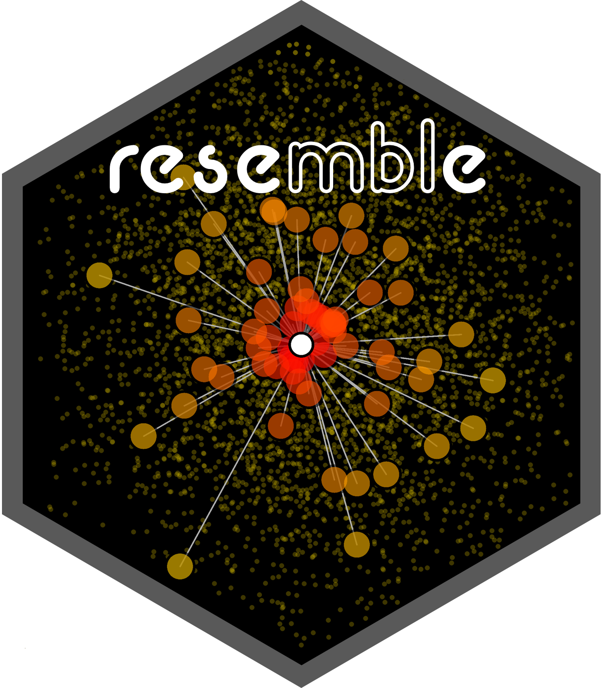

```{r setup, include = FALSE}
library(formatR)
knitr::opts_chunk$set(
  collapse = TRUE, eval.after = "fig.cap"
)
```

<em><p align="right"> Think Globally, Fit Locally [@saul2003think] </p></em>
```{r classdiagram, echo = FALSE, out.width = '20%', fig.align = 'right'}

```

# Introduction

Modeling spectral data has garnered wide interest in the last four decades. 
Spectroscopy is the study of the spectral response of a matrix (e.g. soil, 
plant material, seeds, etc.) when it interacts with electromagnetic radiation. 
This spectral response directly or indirectly relates to a wide range of 
compositional characteristics (chemical, physical or biological) of the matrix. 
Therefore, it is possible to develop empirical models that can accurately 
quantify properties of different matrices. In this respect, quantitative 
spectroscopy techniques are usually fast, non-destructive and cost-efficient in 
comparison to conventional laboratory methods used in the analyses of these 
matrices.  This has resulted in the development of comprehensive 
spectral databases for several agricultural products comprising large amounts 
of observations. The size of such databases increases *de facto* their 
complexity. To analyze large and complex spectral data, one must then resort 
numerical and statistical tools such as dimensionality reduction, and local 
spectroscopic modelling based on spectral dissimilarity concepts.    

The aim of the `resemble` package is to provide tools to efficiently and 
accurately extract meaningful quantitative information from large and complex 
spectral databases. The package contains functions for dimensionality reduction, 
spectral dissimilarity measurements, neighbour search, and local modeling. 
The core functionalities of the package include: 

* dimensionality reduction
* computation of dissimilarity measures
* evaluation of dissimilarity matrices
* spectral neighbour search
* fitting and predicting local spectroscopic models

# Example dataset

This vignette uses a soil spectroscopic dataset provided in the `prospectr`
package [@stevens2020introduction]. It is a soil spectral library used in the 
\sQuote{Chimiometrie 2006} challenge by @pierna2008soil. The library contains 
absorbance spectra of dried and sieved 825 soil observations/samples. These 
samples originate from agricultural fields collected from all over the Walloon 
region in Belgium. The dataset is in a data frame which is organized as follows:
 
* __Response variables__: 
  * ___Nt___ (Total Nitrogen in g/Kg of dry soil): A numerical variable (values 
      are available for 645 samples and missing for 180 samples).
  * ___Ciso___ (Carbon in g/100 g of dry soil): A numerical 
      variable (values are available for 732 and missing for 93 samples).
  * ___CEC___ (Cation Exchange Capacity in meq/100 g of dry soil): A numerical 
      variable (values are available for 447 and missing for 378 samples).
* __Predictor variables__: The predictor variables are in a matrix embedded in the
data frame, which can be accessed via `NIRSoil$spc`. These variables contain the
absorbance Near-Infrared (NIR) spectra of the samples recorded between the 
1100 nm and 2498 nm of the electromagnetic spectrum at 2 nm interval. Each 
column name in the matrix of spectra represent a specific wavelength (in nm).
* __Set__: this is a "binary" variable that indicates the 618 samples belong to the 
training subset (represented by 1) and the 207 samples that belong to the test 
subset (represented by 0). 

Load the necessary packages and data. 
```{r libraries, tidy = TRUE, message = FALSE}
library(resemble)
library(prospectr)
library(magrittr)
```

The dataset can be loaded into R as follows: 
```{r, tidy = FALSE, message = FALSE, results = 'hide'}
data(NIRsoil)
dim(NIRsoil)
str(NIRsoil)
```

# Spectra pre-processing
This step aims at improving the signal quality of the spectra for quantitative
analysis. In this respect, the following standard methods are applied using the 
package `prospectr` [@stevens2020introduction]: 

1. Scatter correction using the standard normal variate method
[@barnes1989standard].
2. First derivative using Savitsky-Golay filtering [@Savitzky1964]. 

```{r NIRsoil, tidy = FALSE, message = FALSE}
# obtain a numeric vector of the wavelengths at which spectra is recorded 
wavs <- NIRsoil$spc %>% colnames() %>% as.numeric()

# pre-process the spectra
poly_order <- 1
window <- 5
diff_order <- 1

NIRsoil$spc_p <- NIRsoil$spc %>% 
  standardNormalVariate() %>% 
  savitzkyGolay(p = poly_order, w = window, m = diff_order)
```

For more explicit examples, the `NIRSoil` data is split into training and 
testing subsets: 

```{r}
# training dataset
training  <- NIRsoil[NIRsoil$train == 1, ]
testing  <- NIRsoil[NIRsoil$train == 0, ]
```

Note that in the resemble package we follow the notation provided by 
@ramirez2013spectrum, i.e.: 

* __Training observations__:

  * `Xr` stands for the matrix of predictor variables in the reference/training 
set (spectral data for calibration).

  * `Yr` stands for the response variable(s) in the reference/training set 
(dependent variable for calibration).In the context of this package, `Yr` is 
also referred as to "___side information___", which is a variable or set of 
variables that are associated to the training observations that can also be used 
to support or guide optimization during modeling but that not necessarily are 
part of the input of such models. For example, we will see in latter sections 
that `Yr` can be used in Principal Component Analysis to help to decide how 
many components are optimal.


* __Testing observations__:

  * `Xu` stands for the matrix of predictor variables in the unknown/test 
set (spectral data for validation/esting).

  * `Yu` stands for the response variable(s) in the unknown/test set (dependent 
variable for calibration).

# Dimensionality reduction
When conducting exploratory analysis of spectral data, we are immediately 
burdened with the issue of high dimensionality. It is such that we may be 
dealing with (using NIR spectra data as an example) hundreds to thousands of 
individual wavelengths for each spectrum. When one wants to investigate patterns 
in the data, spectral similarities and differences, or detect spectral outliers, 
it is necessary to reduce the dimension of the spectra while retaining important 
information. 

Principal component (PC) analysis and Partial Least Squares (PLS) decomposition 
methods assume that the meaningful structure the data intrinsically lies on 
a lower dimensional space. Both methods attempt to find a projection matrix 
that projects or converts the original variables onto a new and less complex 
space represented by few variables. These new variables mimic the original 
variability across observations. These two methods can be considered as the 
standard ones for dimensionality reduction in many fields of spectroscopic 
analysis. 

The difference between PC and PLS is that in the first the objective is to 
find few new variables (which are orthogonal) that capture as much of the 
original data variance while in the latter the objective is to find few new 
variables that maximize their variance with respect to a set of one or more 
external variables (e.g. response variables or side information variables). 

## Methods
In the `resemble` package PC analysis and PLS decomposition are available 
through the `ortho_projection()` function which offers the following algorithms:

* `"pca"`: the standard method for PC analysis based on the singular value 
decomposition algorithm.

* `"pca.nipals"`: this algorithm uses the non-linear iterative partial 
least squares algorithm [NIPALS, @wold1975soft] for the purpose of PC analysis.

* `"pls"`: Here, PLS decomposition also uses the NIPALS algorithm, but in this 
case it makes use of ___side information___, which can be a variable or set of 
variables that are associated to the training observations and that are used to
project the data. In this case, the variance between the projected variables and 
the ___side information___ variable(s) is maximized. 

The PC analysis of the training spectra can be executed as follows:
```{r, results = 'hide'}
# principal component (pc) analysis with the default 
# method (singular value decomposition) 
pca_tr <- ortho_projection(Xr = training$spc_p,
                           method = "pca")

pca_tr
```

plot the `ortho_projection` object:

```{r plotpcsvariance, fig.cap = "Cumulative explained variance of the principal components (left) and individual contribution the the explained variance for each of the components (right).",  fig.cap.style = "Image Caption", fig.align = "center", fig.width = 7, fig.height = 3}
plot(pca_tr)
```

The code above shows that in this dataset, `r pca_tr$n_components` components 
are required to explain around `r round(100 * sum(pca_tr$variance[2,]), 0)`% of 
the original variance found in the spectra (Figure \@ref(fig:plotpcsvariance)).

Equivalent results can be obtained by using the NIPALS algorithm:
```{r, results = 'hide'}
# principal component (pc) analysis with the default 
# method (singular value decomposition) 
pca_nipals_tr <- ortho_projection(Xr = training$spc_p,
                                  method = "pca.nipals")

pca_nipals_tr
```

The advantage of the NIPALS algorithm is that it can be faster than SVD when 
only few components are required.

For a PLS decomposition the `method` argument is set to `"pls"`. In this case, 
side information (`Yr`) is required. In the following example, the side 
information used is the Total Carbon (`Ciso`):
```{r, results = 'hide', eval = FALSE}
# Partial Least Squares decomposition using 
# Total carbon as side information
# (this might take some seconds)
pls_tr <- ortho_projection(Xr = training$spc_p[!is.na(training$Ciso),],
                           Yr = training$Ciso[!is.na(training$Ciso)],
                           method = "pls")
pls_tr
```

By default the `ortho_projection()` function retains all the first components 
that, alone, account for at least 1% of the original variance of data. In 
the following section we will see that the function also offers additional 
options that might be more convenient for choosing the number of components.

## Selection of the components/dimensions

Those options can be specified using the 
`pc_selection` argument. The following options are all the ones available for 
that purpose:

### _Single component explained variance-based selection_, `"var"` (default option): 
Those components that alone explain more than a given amount of the original 
spectral variance are retained. Example:

```{r, results = 'hide', eval = FALSE}
# This retains components that anlone explain at more than 5% of the original
# variation in training$spc_p
var_sel <-  list(method = "var", value = 0.05)
pca_tr_minvar5 <- ortho_projection(Xr = training$spc_p,
                                   method = "pca", 
                                   pc_selection = var_sel)

pca_tr_minvar5
```


### _Cumulative variance-based selection_, `"cumvar"`: 
Only the first components that together explain at least a given amount of the 
original variance are retained. Example:
```{r, results = 'hide', eval = FALSE}
# This retains components that together explain at least 95% of the original
# variation in training$spc_p
cumvar_sel <-  list(method = "cumvar", value = 0.90)

pca_tr_cumvar95 <- ortho_projection(Xr = training$spc_p,
                                    method = "pca", 
                                    pc_selection = cumvar_sel)

pca_tr_cumvar95
```

### _Optimal component selection_ `"opc"`: 
This is a more sophisticated method in which the selection of the components is 
based on the side information concept presented in @ramirez2013spectrum. First 
let be $P$ a sequence of retained components (so that $P = 1, 2, ...,k$). At 
each iteration, the function computes a dissimilarity matrix retaining $p_i$ 
components. The values in this side information variable are compared against 
the side information values of their most spectrally similar observations.
The optimal number of components retrieved by the function is the one that 
minimizes the root mean squared differences (RMSD) in the case of continuous
variables, or maximizes the kappa index in the case of categorical variables.
The RMSD is calucated as follows:

\begin{equation}
j(i) = NN(xr_i, Xr^{\{-i\}})
\end{equation}

\begin{equation}
RMSD = \sqrt{\frac{1}{m} \sum_{i=1}^n {(y_i - y_{j(i)})^2}}
\end{equation}

where $j(i) = NN(xr_i, Xr^{\{-i\}})$ represents a function to obtain the index 
of the nearest neighbor observation found in $Xr$ (excluding the $i$th 
observation) for $xr_i$, $y_i$ is the value of the side variable of the $i$th 
observation, $y_{j(i)}$ is the value of the side variable of the nearest 
neighbor of the $i$th observation and $m$ is the total number of observations. 
Note that for the `"opc"` method `Yr` is required (i.e. the side information of 
the observations). Type `help(sim_eval)` in the `R` console to get more details 
on how the RMSD and kappa are calculated in the function.

The rationale behind the `"opc"` method is based on the assumption that the 
closer two observations are in terms of their explanatory variables (`Xr`), the 
closer they may be in terms of their side information (`Yr`).


```{r, results = 'hide'}
# This uses optimal component selection
# variation in training$spc_p
optimal_sel <-  list(method = "opc", value = 40)
pca_tr_opc <- ortho_projection(Xr = training$spc_p,
                               Yr = training$Ciso,
                               method = "pca", 
                               pc_selection = optimal_sel)
pca_tr_opc
```
In the example above, `r pca_tr_opc$n_components` components are required to 
represent the space in which the overall Total Carbon difference between each 
sample and its corresponding nearest neighbor is minimized. The following graph 
shows how the RMSD varies as a function of the number of components 
(Figure \@ref(fig:pcrmsd)):
```{r pcrmsd, fig.cap = "Root mean squared difference between the samples and their corresponding nearest neighbors (for Total Carbon as side finormation) found by using dissimilarity matrices computed with different number of PCs.", fig.id = "plot_pcs_opc", fig.cap.style = "Image Caption", fig.align = "center", fig.width = 5, fig.height = 4}
plot(pca_tr_opc)
```

The following code exemplifies how the RMSD is calculated (only for the `r pca_tr_opc$n_components`th component, Figure \@ref(fig:rmsdscatter)): 
```{r rmsdscatter, fig.cap = paste("Comparison between each sample and its corresponding nearest neighbor (in terms of  Total Carbon) when ", pca_tr_opc$n_components, "are used for dissimilarity matrix computations."), fig.id = "plot_pcs_opc2", fig.cap.style = "Image Caption", fig.align = "center", fig.width = 4, fig.height = 4}
# compute the dissimilarity matrix using all the retained scores
pc_diss <- f_diss(pca_tr_opc$scores, diss_method = "mahalanobis")
# get the nearest neighbor for each sample
nearest_n <- apply(pc_diss, MARGIN = 1, FUN = function(x) order(x)[2])
# compute the RMSD
rmsd <- sqrt(mean((training$Ciso - training$Ciso[nearest_n])^2, na.rm = TRUE))
rmsd
# the RSMD for all the components is already available in 
# ...$opc_evaluation
pca_tr_opc$opc_evaluation[pca_tr_opc$n_components, , drop = FALSE]
plot(training$Ciso, 
     training$Ciso[nearest_n], 
     xlab = "Ciso, %", ylab = "Ciso of the nearest neighbor, %",
     col = "#0080FF80", pch = 16)
grid()
```

### _Manual selection_, `"manual"`: 
The user explicitly defines how many components to retrieve. Example:

```{r, results = 'hide'}
# This uses manual component selection 
manual_sel <-  list(method = "manual", value = 9)
pca_tr_manual <- ortho_projection(Xr = training$spc_p,
                                  method = "pca", 
                                  pc_selection = manual_sel)
pca_tr_manual

pls_tr_manual <- ortho_projection(Xr = training$spc_p,
                                  Yr = training$Ciso,
                                  method = "pls", 
                                  pc_selection = manual_sel)
pls_tr_manual
```


## Using projection/dimension reduction models on new data

Both PC and PLS methods generate projection matrices that can be used to project 
new observations onto the new lower dimensional score space they were built for. 
In the case of PC analysis this projection matrix is equivalent to the transposed 
matrix of loadings. The `predict` method along with a projection model can be 
used to project new data:

```{r, results = 'hide'}
optimal_sel <-  list(method = "opc", value = 40)
pls_tr_opc <- ortho_projection(Xr = training$spc_p,
                               Yr = training$Ciso,
                               method = "pls", 
                               pc_selection = optimal_sel,
                               scale = TRUE)
# the pls projection matrix
pls_tr_opc$projection_mat

pls_projected <- predict(pls_tr_opc, newdata = testing$spc_p)

pca_tr_opc <- ortho_projection(Xr = training$spc_p,
                               Yr = training$Ciso,
                               method = "pca", 
                               pc_selection = optimal_sel,
                               scale = TRUE)
# the pca projection matrix
t(pca_tr_opc$X_loadings)

pca_projected <- predict(pca_tr_opc, newdata = testing$spc_p)
```

## Projecting two separate datasets in one single run

The `ortho_projection` function allows to project two separate datasets in one 
run. For example, training and testing data can be passed to the function as 
follows:
```{r, results = 'hide', eval = FALSE}
optimal_sel <-  list(method = "opc", value = 40)
pca_tr_ts <- ortho_projection(Xr = training$spc_p,
                              Xu = testing$spc_p,
                              Yr = training$Ciso,
                              method = "pca", 
                              pc_selection = optimal_sel,
                              scale = TRUE)
plot(pca_tr_ts)
```
In the above code for PC analyisis, `training` and `testing` datasets are pooled 
together and then projected. For the `opc` selection method, the dissimilarity 
matrices are built only for the `training` data and for the observations with 
available side information (Total Carbon). These dissimilarity matrices are used 
only to find the optimal number of PCs. Note that `Xr` and `Yr` refer to the 
same observations. Also note that the optimal number of PCs might not be the same 
as when `testing` is not passed to the `Xu` argument since the PC projection 
model is built from different number of observations.

In the case of PLS, the observations used for projection necessarily have to 
have side information available, therefore the missing values in `Yr` are hold 
out during the projection model building. For these samples, the final projection 
matrix is use to project them into the PLS space. 

```{r, results = 'hide', eval = FALSE}
optimal_sel <-  list(method = "opc", value = 40)
pls_tr_ts <- ortho_projection(Xr = training$spc_p,
                              Xu = testing$spc_p,
                              Yr = training$Ciso,
                              method = "pls", 
                              pc_selection = optimal_sel,
                              scale = TRUE)

# the same pls projection model can be obtained with:
pls_tr_ts2 <- ortho_projection(Xr = training$spc_p[!is.na(training$Ciso),],
                               Yr = training$Ciso[!is.na(training$Ciso)],
                               method = "pls", 
                               pc_selection = optimal_sel,
                               scale = TRUE)

identical(pls_tr_ts$projection_mat, pls_tr_ts2$projection_mat)
```

## Using more than one variable as side information
The `ortho_projection` function allows to pass more than one variable to `Yr` 
(side information):

```{r, results = 'hide', eval = FALSE}
optimal_sel <-  list(method = "opc", value = 40)
pls_multi_yr <- ortho_projection(Xr = training$spc_p,
                                 Xu = testing$spc_p,
                                 Yr = training[, c("Ciso", "Nt", "CEC")],
                                 method = "pls", 
                                 pc_selection = optimal_sel,
                                 scale = TRUE)
plot(pls_multi_yr)
```

In the above code for PLS projections using multivariate side information, the
PLS2 method (based on the NIPALS algorithm) is used [See wold1983multivariate]. 
The optimal component selection (`opc`) also uses the multiple variables passed 
to `Yr`, the RMSD is computed for each of the variables. Each RMSD is then 
standardized and the final RMSD used for optimization is an average of them. 
For the example above, this data can be accessed as follows:

```{r, results = 'hide', eval = FALSE}
pls_multi_yr$opc_evaluation
```

For PC analysis multivariate side information is also allowed for the `opc`
method. Alternatively, a categorical variable can also be used as side 
information for the `opc`. In that case, the kappa index is used instead of the 
RMSD. 

# Computing dissimilarity matrices
Similarity/dissimilarity measures between objects are often estimated by means 
of distance measurements, the closer two objects are to one another, the higher 
the similarity between them. Dissimilarity or distance measures are useful for 
a number of applications, for example for outlier detection or nearest neighbors 
search. 

The `dissimilarity()` function is the main function for measuring dissimilarities 
between observations. It is basically a wrapper to other existing dissimilarity 
functions wthin the package (see `fdiss()`, `cor_diss()`, `sid()` and 
`ortho_diss()`). It allows to compute dissimilarities between:

 * all the observations in a single matrix.
 
 * observations in a matrix against observations in a second matrix.

The dissimilarity methods available in `dissimilarity()` are as follows (see 
`diss_method` argument):

* `"pca"`: Mahalanobis distance computed on the matrix of scores of a Principal 
Component (PC) projection of `Xr` (and `Xu` if provided). PC projection is done 
using the singular value decomposition (SVD) algorithm. Type `help(ortho_diss)` 
for more details on the function called by this method.

* `"pca.nipals"`: Mahalanobis distance computed on the matrix of scores of a 
PC projection of `Xr` (and `Xu` if provided). PC projection is done 
using the non-linear iterative partial least squares (NIPALS) algorithm. 
Type `help(ortho_diss)` in the `R` console for more details on the function 
called by this method.

* `"pls"`: Mahalanobis distance computed on the matrix of scores of a partial 
least squares projection of `Xr` (and `Xu` if provided). In this case, `Yr` is 
always required. Type `help(ortho_diss)` in the `R` console for more details on 
the function called by this method.

* `"cor"`: correlation dissimilarity which is based on the coefficient between 
observations. Type `help(cor_diss)` in the `R` console for more details on the 
function called by this method.

* `"euclid"`: Euclidean distance between observations. Type `help(f_diss)` in 
the `R` console for more details on the function called by this method.

* `"cosine"`: Cosine distance between observations. Type `help(f_diss)` in the 
`R` console for more details on the function called by this method.

* `"sid"`: spectral information divergence between observations. Type 
`help(sid)` in the `R` console for more details on the function called by this 
method.

## Dissimilarity measured on orthogonal spaces
In this package, the orthogonal space dissimilarities refer to dissimilarity 
measures performed either in the PC space or in the PLS space. 

Since we can assume that the meaningful structure the data lies on a lower 
dimensional space, we can also assume that this lower dimensional space is 
optimal to measure the dissimilarity between observations [@ramirez2013distance].

To measure the dissimilarity between observations ($x_i$ and $x_j$), the 
Mahalanobis distance is computed on their corresponding projected score vectors 
($t_i$ and $t_j$) found in the matrix of scores ($\mathrm T$):

$$D(x_i,x_j) = D(t_i,t_j) = \sqrt{\frac{1}{p}(t_i - t_j) C^{-1}(t_i - t_j)'}$$
where $p$ is the number of components used, $C^{-1}$ is the inverse of the 
covariance matrix computed from the matrix of projected variables for all 
the observations $\mathrm T$. Since the projected variables are 
orthogonal to each other, the resulting $C^{-1}$ would be equivalent to a
diagonal matrix with the variance of each $\mathrm T$ column in its main 
diagonal. Therefore, for this case of orthogonal spaces, the Mahalanobis 
distance is equivalent to the Euclidean distance applied on the variance-scaled 
$\mathrm T$ [@de2000mahalanobis].

To compute orthogonal dissimilarities in the `resemble` package, the 
`dissimilarity()` function can be used as follows:
```{r, results = 'hide', eval = FALSE}
# For PC dissimilarity using the default settings
pcd <- dissimilarity(Xr = training$spc_p,
                     diss_method = "pca")
dim(pcd$dissimilarity)

# For PC dissimilarity using the optimized component selection method
pcd2 <- dissimilarity(Xr = training$spc_p,
                      diss_method = "pca.nipals",
                      Yr = training$Ciso,
                      pc_selection = list("opc", 20),
                      return_projection = TRUE)
dim(pcd2$dissimilarity)
pcd2$dissimilarity
pcd2$projection # The projection used to compute the dissimilarity matrix

# For PLS dissimilarity
plsd <- dissimilarity(Xr = training$spc_p,
                      diss_method = "pls",
                      Yr = training$Ciso,
                      pc_selection = list("opc", 20),
                      return_projection = TRUE)
dim(plsd$dissimilarity)
plsd$dissimilarity
plsd$projection # The projection used to compute the dissimilarity matrix
```

To compute the correlation dissimilarity between training and testing 
observations:
```{r, results = 'hide', eval = TRUE}
# For PC dissimilarity using the optimized component selection method
pcd_tr_ts <- dissimilarity(Xr = training$spc_p,
                           Xu = testing$spc_p,
                           diss_method = "pca.nipals",
                           Yr = training$Ciso,
                           pc_selection = list("opc", 20))
dim(pcd_tr_ts$dissimilarity)

# For PLS dissimilarity
plsd_tr_ts <- dissimilarity(Xr = training$spc_p,
                            Xu = testing$spc_p,
                            diss_method = "pls",
                            Yr = training$Ciso,
                            pc_selection = list("opc", 20))
dim(plsd_tr_ts$dissimilarity)
```
In this last two examples, matrices of `r nrow(plsd_tr_ts$dissimilarity)` rows 
and `r ncol(plsd_tr_ts$dissimilarity)` columns are retrieved. The rows are the 
same as the rows in the training dataset while the columns are the same as the 
rows in the testing dataset. The dissimilarity between the $i$th observation in 
the training dataset and the $j$th observation in the tetsing dataset is stored 
in the $i$th row and the $j$th column of the resulting dissimilarity matrices.


### Combine k-nearest neighbors and dissimilarity measures in the orthogonal space

It is also possible to measure the dissimilarity between observations in a 
localized fashion. In this case, first a global dissimilarity matrix is 
computed. Then, by using this matrix for each target observation, a given set of 
k-nearest neighbors are identified. These neighbors (together with the target 
observation) are projected (from the original data space) onto a (local) 
orthogonal space (using the same parameters specified in the function). In this 
projected space the Mahalanobis distance between the target observation and its 
neighbors is recomputed. A missing value is assigned to the observations that do 
not belong to this set of neighbors (non-neighbor observations). In this case 
the dissimilarity matrix cannot be considered as a distance metric since it does 
not necessarily satisfies the symmetry condition for distance matrices 
(i.e. given two observations $x_i$ and $x_j$, the local
dissimilarity, $d$, between them is relative since generally
$d(x_i, x_j) \neq d(x_j, x_i)$). 

For computing this type of localized dissimilarity matrix, two arguments need to 
be passed to the `dissimilarity()` function: `.local` and `pre_k`. These are 
not formal arguments of the function, however, they are passed to 
the `ortho_diss` function which is used by the `dissimilarity()` function for 
computing the dissimilarities in the orthogonal spaces. 

Here are some two examples on how to perform localized dissimilarity 
computations: 

```{r localdiss, eval = TRUE}
# For localized PC dissimilarity using the optimized component selection method
# set the number of neighbors to retain
knn <- 200
local_pcd_tr_ts <- dissimilarity(Xr = training$spc_p,
                                 Xu = testing$spc_p,
                                 diss_method = "pca",
                                 Yr = training$Ciso,
                                 pc_selection = list("opc", 20),
                                 .local = TRUE, 
                                 pre_k = knn)
dim(local_pcd_tr_ts$dissimilarity)

# For PLS dissimilarity
local_plsd_tr_ts <- dissimilarity(Xr = training$spc_p,
                                  Xu = testing$spc_p,
                                  diss_method = "pls",
                                  Yr = training$Ciso,
                                  pc_selection = list("opc", 20),
                                  .local = TRUE, 
                                  pre_k = knn)
dim(local_plsd_tr_ts$dissimilarity)

# check the dissimilarity scores between the first two 
# observations in the testing dataset and the first 10 
# observations in the training dataset
local_plsd_tr_ts$dissimilarity[1:10, 1:2]

```

## Correlation dissimilarity 
Correlation dissimilarity is based on the Pearson's *r* correlation coefficient 
between observations. The value of Pearson's *r* varies between -1 and 1. A 
correlation of 1 indicates between two observations would indicate that they 
might have identical characteristics (i.e. they are can be considered as highly 
similar). A value of -1, conversely, would indicate that the two observations 
are strongly negatively correlated (i.e. the two observations are highly 
dissimilar). The correlation dissimilarity ($cd$) implemented in the package 
scales the values between 0 (highest dissimilarity) and 1 (highest similarity). 
The $cd$ between two observations $\mathbf{x}_{i}$ and $\mathbf{x}_{j}$ is 
thus described by:

$$cd(\mathbf{x}_{i}, \mathbf{x}_{j}) = \frac{1}{2} 1 - r(\mathbf{x}_{i}, \mathbf{x}_{j})$$

Note that $cd$ cannot be considered as a distance metric since it does not 
satisfy the axiom of identity of indiscernibles. Therefore we prefer the use of 
the term dissimilarity.

The following code demonstrates how to compute the coerrelation dissimilarity 
between all observations in the training dataset:
```{r, results = 'hide', eval = FALSE}
cd_tr <- dissimilarity(Xr = training$spc_p, diss_method = "cor")
dim(cd_tr$dissimilarity)
cd_tr$dissimilarity
```

To compute the correlation dissimilarity between training and testing 
observations:
```{r, results = 'hide', eval = TRUE}
cd_tr_ts <- dissimilarity(Xr = training$spc_p,
                          Xu = testing$spc_p,
                          diss_method = "cor")
dim(cd_tr_ts$dissimilarity)
cd_tr_ts$dissimilarity
```

Alternatively, the correlation dissimilarity can be computed using a moving 
window. In this respect, a winow size term $w$ is introduced to the original 
$cd$ equation:

$$cd(x_i, x_j; w) = \frac{1}{2 w}\sum_{k=1}^{p-w}1 - cor(x_{i,\{k:k+w\}}, x_{j,\{k:k+w\}})$$

In this case, the correlation dissimilarity is computed by averaging 
the moving window correlation measures. The introduction of the window term
increases the computational cost in comparison to the simple correlation 
dissimilarity. The moving window correlation dissimilarity can be computed by 
setting the `diss_method` argument to `"cor"` and passing a window size value to 
the `ws` argument as follows:

```{r, results = 'hide', eval = FALSE}
# a moving window correlation dissimilarity between training and testing
# using a window size of 51 spectral data points
cd_mw <- dissimilarity(Xr = training$spc_p,
                       Xu = testing$spc_p,
                       diss_method = "cor",
                       ws = 51)
cd_mw$dissimilarity
```


## Euclidean dissimilarity 

In the computation of the Euclidean dissimilarity, each feature has equal 
significance. Hence, correlated variables which may represent irrelevant 
features, may have a disproportional influence on the final dissimilarity 
measurement [brereton2003chemometrics]. Therefore, it is not recommended to 
use this measure directly on the raw data. To compute the dissimilarity between 
two obsverations $x_i$ and $x_j$ the package uses the following equation:

$$D(x_i,x_j) = \sqrt{\frac{1}{d}(x_i - x_j) (x_i - x_j)'}$$
With the `dissimilarity()` function the Euclidean dissimilarity can be computed
as follows:
```{r, results = 'hide', eval = FALSE}
# compute the dissimilarity between all the training observations 
ed <- dissimilarity(Xr = training$spc_p, diss_method = "euclid")
ed$dissimilarity
```

The `dist()` function in the `R``stats` package can also be used to compute 
Euclidean distances, however the `resemble` implementation tends to be faster 
(especially for very large matrices):
```{r, results = 'hide', eval = FALSE}
# compute the dissimilarity between all the training observations 
pre_time_resemble <- proc.time()
ed_resemble <- dissimilarity(Xr = training$spc_p, diss_method = "euclid")
post_time_resemble <- proc.time()
post_time_resemble - pre_time_resemble

pre_time_stats <- proc.time()
ed_stats <- dist(training$spc_p, method = "euclid")
post_time_stats <- proc.time()
post_time_stats - pre_time_stats

# scale the results of dist() based on the number of input columns
ed_stats_tr <- sqrt((as.matrix(ed_stats)^2)/ncol(training$spc_p))
ed_stats_tr[1:2, 1:3]

# compare resemble and R stats results of Euclidean distances
ed_resemble$dissimilarity[1:2, 1:3]
```
In the above code it can be seen that the results of the `dist()` require 
scaling based on the number of input variables. This means that, by default, 
the results of the `dist()` tend to increase with the number of input 
variables. This is an effect that is already accounted for in the implementation 
of `resemble`.

Another advantage of the Euclidean dissimilarity in `resemble` over the one in 
`R` `stats` is that the one in `resemble` allows the computation of the 
dissimilarities between observations in two matrices:

```{r, results = 'hide', eval = FALSE}
# compute the dissimilarity between the training and testing observations 
ed_tr_ts <- dissimilarity(Xr = training$spc_p,
                          Xu = testing$spc_p, 
                          diss_method = "euclid")
```


## Cosine dissimilarity 
This dissimilarity metric is also known as the "Spectral Angle Mapper" which has 
been extensively applied in remote sensing as a tool for unsupervised 
classification and spectral similarity analysis. The cosine dissimilarity
between two observations ($x_i$ and $x_j$) is calculated as:

$$D (x_i, x_j) = cos^{-1} \tfrac{\sum_{k=1}^{d} x_{i,k} x_{j,k} } {\sqrt{\sum_{k=1}^{d} x_{i,k}^2} \sqrt{\sum_{k=1}^{d} x_{j,k}^2}}$$
where $d$ is the number of variables. 

With the `dissimilarity()` function the Euclidean dissimilarity can be computed
as follows:
```{r, results = 'hide', eval = FALSE}
# compute the dissimilarity between the training and testing observations 
cosine_tr_ts <- dissimilarity(Xr = training$spc_p,
                              Xu = testing$spc_p, 
                              diss_method = "cosine")
dim(cosine_tr_ts$dissimilarity)
cosine_tr_ts$dissimilarity
```

## Spectral information divergence
The spectral information divergence [SID, @chang2000information] indicates how 
dissimilar are two observations based on their probability distributions. To 
account for the discrepancy between the distributions of two observations 
($x_i$ and $x_j$), the SID method uses the Kullback-Leibler divergence [$kl$, @kullback1951information] measure. Since the $kl$ is a non-symmetric measure, 
i.e. $kl (x_i, x_j) \neq kl(x_j, x_i)$, the dissimilarity between $x_i$ and 
$x_j$ based on this method is computed as:

$$D(x_i, x_j) = kl (x_i, x_j) + kl (x_j, x_i)$$

The following code can be sued to compute the SID between the training and 
testing observations:
```{r, results = 'hide', eval = FALSE}
sid_tr_ts <- dissimilarity(Xr = training$spc_p,
                           Xu = testing$spc_p, 
                           diss_method = "sid")
dim(sid_tr_ts$dissimilarity)
sid_tr_ts$dissimilarity
```
See the `sid()` function in the `resemble` package for more details. 

## Comparing the dissimilarity measures using the nearest neighbor method

Here the different methods to measure dissimilarity between spectra are 
compared in terms of their ability to retrieve observations (first nearest 
neighbor or closest observation) with similar Total Carbon ("Ciso"). This 
indicates how well the spectral similarity between observations reflect their 
compositional similarity.


Compute a dissimilarty matrix for `training$spc_p` using the different methods:
```{r, results = 'hide', eval = TRUE}
# PC dissimilarity with default settings (variance-based 
# of components)
pcad <- dissimilarity(training$spc_p, diss_method = "pca")

# PLS dissimilarity with default settings (variance-based 
# of components)
plsd <- dissimilarity(training$spc_p, diss_method = "pls", Yr = training$Ciso)

# PC dissimilarity with optimal selection of components
opc_sel <- list("opc", 30)
o_pcad <- dissimilarity(training$spc_p,
                        diss_method = "pca",
                        Yr = training$Ciso,
                        pc_selection = opc_sel)

# PLS dissimilarity with optimal selection of components
o_plsd <- dissimilarity(training$spc_p,
                        diss_method = "pls",
                        Yr = training$Ciso,
                        pc_selection = opc_sel)

# Correlation dissimilarity 
cd <- dissimilarity(training$spc_p, diss_method = "cor")

# Moving window correlation dissimilarity 
mcd <- dissimilarity(training$spc_p, diss_method = "cor", ws = 51)

# Euclidean dissimilarity 
ed <- dissimilarity(training$spc_p, diss_method = "euclid")

# Cosine dissimilarity 
cosd <- dissimilarity(training$spc_p, diss_method = "cosine")

# Spectral information divergence/dissimilarity 
sinfd <- dissimilarity(training$spc_p, diss_method = "sid")
```


Use the `sim_eval` function with each dissimilarity matrix to find the closest 
observation  to each observation and compare them in terms of the `Ciso` 
variable:

```{r, results = 'hide', eval = TRUE}
Ciso <- as.matrix(training$Ciso)
ev <- NULL
ev[["pcad"]] <- sim_eval(pcad$dissimilarity, side_info = Ciso)
ev[["plsd"]] <- sim_eval(plsd$dissimilarity, side_info = Ciso)
ev[["o_pcad"]] <- sim_eval(o_pcad$dissimilarity, side_info = Ciso)
ev[["o_plsd"]] <- sim_eval(o_plsd$dissimilarity, side_info = Ciso)
ev[["cd"]] <- sim_eval(cd$dissimilarity, side_info = Ciso)
ev[["mcd"]] <- sim_eval(mcd$dissimilarity, side_info = Ciso)
ev[["ed"]] <- sim_eval(ed$dissimilarity, side_info = Ciso)
ev[["cosd"]] <- sim_eval(cosd$dissimilarity, side_info = Ciso)
ev[["sinfd"]] <- sim_eval(sinfd$dissimilarity, side_info = Ciso)
```


```{r, results = 'hide', eval = TRUE, echo = FALSE}
fig_cap <- paste("Comparison between observations and their corresponding 
                 nearest neighbor (1-NN)","observation in terms of Tocal Carbon (Ciso). The 1-NNs",
                 "are retrieved with the", 
                 "following dissimilarity merics:",
                 "pcad: PC dissimilarity with default settings (variance-based of components);",
                 "plsd: PLS dissimilarity with default settings (variance-based of components);",
                 "o_pcad: PC dissimilarity with optimal selection of components;",  
                 "o_plsd: PLS dissimilarity with optimal selection of components;",  
                 "cd: Correlation dissimilarity;",  
                 "mcd: Moving window correlation dissimilarity;",  
                 "ed: Euclidean dissimilarity;",  
                 "sinfd: Spectral information divergence/dissimilarity")
```
Table \@ref(tab:tcomparisons) and Figure \@ref(fig:pcomparisons) show the 
results of the comparisons between the Total Carbon of the observations and the 
Total Carbon of their most similar samples (1-NN) according to the dissimilarity 
method used. In the example, the spectral dissimilarity matrices that best reflect the 
compositions similarity are those built with the 
_pls with optimized component selection_ (`o_plsd`) and 
_pca with optimized component selection_ (`o_pcad`).

```{r results = 'hide', eval = TRUE}
comparisons <- lapply(names(ev), 
                      FUN = function(x, label) {
                        irmsd <- round(x[[label]]$eval[1], 2)
                        ir <- round(x[[label]]$eval[2], 2)
                        if (label %in% c("o_pcad", "o_plsd")) {
                          label <- paste0("**", label, "**")
                          irmsd <- paste0("**", irmsd, "**")
                          ir <- paste0("**", ir, "**")
                        }
                        
                        data.frame(Measure = label, 
                                   RMSD = irmsd, 
                                   r =  ir)
                      },
                      x = ev)
comparisons
```

```{r tcomparisons, eval = TRUE, echo = FALSE}
knitr::kable(do.call("rbind", comparisons), 
             caption = paste("Root mean squared difference (RMSD)",
                             "and correlation coefficients",
                             "for between the observations and their", 
                             "corrresponding closest observations", 
                             "retrieved with the different dissimilarity 
                             methods"), 
             format = "simple", digits = 2, align = "l", padding = 2)
```

```{r pcomparisons, fig.cap = paste(fig_cap), fig.cap.style = "Image Caption", fig.align = "center", fig.width = 8, fig.height = 8}
op <- par()
par(mfrow = c(3, 3), pch = 16, mar = c(4,4,4,4))
p <- sapply(names(ev), 
            FUN = function(x, label, labs = c("Ciso (1-NN), %", "Ciso, %")) {
              xy <- x[[label]]$first_nn[,2:1]
              plot(xy, xlab = labs[1], ylab = labs[2], col = "#0080FF80")
              title(label)
              grid(col= "#80808080", lty = 1)
              abline(0, 1, col = "red")
              
            },
            x = ev)
```

```{r, results = 'hide', eval = FALSE}
## reset the graphical parameters
par(op)
```


# References

